# Procesverslag
Markdown is een simpele manier om HTML te schrijven.  
Markdown cheat cheet: [Hulp bij het schrijven van Markdown](https://github.com/adam-p/markdown-here/wiki/Markdown-Cheatsheet).

Nb. De standaardstructuur en de spartaanse opmaak van de README.md zijn helemaal prima. Het gaat om de inhoud van je procesverslag. Besteedt de tijd voor pracht en praal aan je website.

Nb. Door *open* toe te voegen aan een *details* element kun je deze standaard open zetten. Fijn om dat steeds voor de relevante stuk(ken) te doen.


## Jij

<details open>
  <summary>uitwerken voor kick-off werkgroep</summary>

  ### Auteur:
  Tristan Brattinga

  #### Je startniveau:
  Rood

  #### Je focus:
  Responsiveness & surface plane
 
</details>


## Je website

<details open>
  <summary>uitwerken voor kick-off werkgroep</summary>

  ### Je opdracht:
  Nike
  https://www.nike.com/nl/

  #### Screenshot(s) van de eerste pagina (small screen): 
  Nike home page  
  
  

  #### Screenshot(s) van de tweede pagina (small screen):
  Nike products page
  
  
 
</details>


## Toegankelijkheidstest 1/2 (week 1)

<details>
  <summary>uitwerken na test in 2<sup>e</sup> werkgroep</summary>

  ### Bevindingen
  Lijst met je bevindingen die in de test naar voren kwamen:

  - Sommige beperkingen zijn niet zo erg op het web, maar sommige zijn bijna niet mee te werken. Bij het missen van een vinger of een hand is het nog redelijk makkelijk, maar wanneer je richting blindheid of motoriek gaat wordt het gelijk een stuk lastiger.
  - Tabben door de website gaat heel gemakkelijk en duidelijk.
  - Het is niet mogelijk om met mijn screenreader door de heading-levels heen te gaan. Dit is niet goed voor mensen die een screen-reader moeten gebruiken. Ondanks dat de heading levels 
  - Links naar andere pagina's zijn duidelijk voor de gebruiker. Er kan wat gedaan worden met de gegeven informatie. aria labels zijn nuttig gebruikt.
  - De focus state is heel duidelijk te zien. Nergens is er een issue met contrast. Slechtzienden zullen hier weinig tot geen moeite mee hebben.
  - Er zijn weinig tot geen animaties op de website waardoor het voor de meerderheid van de gebruikers fijn te gebruiken is. Een prefers-reduced motion toepassing is niet per se nodig.
  - Mensen met verschillende soorten kleurenblindheid kunnen nog heel goed van de Nike website gebruik maken. De kleuren zijn vooral wit, zwart, grijs. Verder hebben afbeeldingen veel kleuren, maar niet storend.
  - Doordat de kleuren voornamelijk bestaan uit wit, zwart en grijs, zijn de contrasten prima om mee te werken. Bij het aanzetten van de verhoogde contrast instelling, is er niet een duidelijk verschil, omdat het contrast al relatief hoog ligt.
  - De nike website passeert bijna alle checks van de WCAG checklist.

</details>


## Breakdownschets (week 1)

<details>
  <summary>uitwerken na afloop 3<sup>e</sup> werkgroep</summary>

  ### de hele pagina: 
  

  ### dynamisch deel (bijv menu): 
  

</details>


## Voortgang 1 (30 november)

<details>
  <summary>uitwerken voor 1<sup>e</sup> voortgang</summary>

  ### Stand van zaken
  Doordat ik al veel ervaring heb met front-end development en ook al werkzaam ben als frontender, ben ik al heel ver voor de eerste week. Ik heb eerst al mijn basis HTML voor de eerste pagina opgebouwd aan de hand van mijn breakdown schets. Ik heb de dynamische gedeeltes zoals het mobiele menu, dropdown menu en filter sidebar nog even achterwege gelaten. Ik wilde deze componenten pas later integreren als nice to have's. Waarschijnlijk met hoe erg ik voor loop zal ik dit snel oppakken. Het begin proces van mijn website verliep allemaal heel makkelijk en zonder problemen. Het enige waar ik af en toe een beetje over twijfel is wanneer iets een article, section of figure is. Dit is een puntje wat ik tijdens mijn gesprek zal gaan vragen als feedback op mijn code. Semantiek is misschien het enige waar ik af en toe een beetje moeite mee heb. Verder gaat alle techniek, logica en organistie hartstikke goed. Ik werk zelf al heel lang en veel met git en github dus dit was voor mij ook helemaal geen moeite. Ik heb bij mijn eerste voortgangsgesprek zeventien commits gemaakt. Een aantal blocks van mijn code op dit moment:

<details>
  <summary><strong>HTML</strong></summary>
  
  ``` html
  <!DOCTYPE html>
<html lang="nl">

<head>
    <meta charset="UTF-8">
    <meta content="jouw naam" name="author">
    <meta content="width=device-width, initial-scale=1" name="viewport">

    <title>Nike</title>

    <link href="styles/style.css" rel="stylesheet">
</head>

<body>
<header>
    <!--TOP BAR-->
    <section>
        <ul>
            <li>
                <svg fill="#111" height="24px" viewBox="0 0 26 32" width="24px">
                    <path
                        d="M14.4 5.52v-.08q0-.56.36-1t.92-.44 1 .36.48.96-.36 1-.96.4l-.24.08.08.12-.08.44-.16 1.28q.08.08.08.16l-.16.8q-.08.16-.16.24l-.08.32q-.16.64-.28 1.04t-.2.64V12q-.08.4-.12.64t-.28.8q-.16.32 0 1.04l.08.08q0 .24.2.56t.2.56q.08 1.6-.24 2.72l.16.48q.96.48.56 1.04l.4.16q.96.48 1.36.84t.8.76q.32.08.48.24l.24.08q1.68 1.12 3.36 2.72l.32.24v.08l-.08.16.24.16h.08q.24.16.32.16h.08q.08 0 .16-.08l.16-.08q.16-.16.32-.24h.32q.08 0 0 .08l-.32.16-.4.48h.56l.56.08q.24-.08.4-.16l.4-.24q.24-.08.48.16h.08q.08.08-.08.24l-.96.88q-.4.32-.72.4l-1.04.72q-.08.08-.16 0l-.24-.32-.16-.32-.2-.28-.24-.32-.2-.24-.16-.2-.32-.24q-.16 0-.32-.08l-1.04-.8q-.24 0-.56-.24-1.2-1.04-1.6-1.28l-.48-.32-.96-.16q-.48-.08-1.28-.48l-.64-.32q-.64-.32-.88-.32l-.32-.16q-.32-.08-.48-.16l-.16-.16q-.16 0-.32.08l-1.6.8-2 .88q-.8.64-1.52 1.04l-.88.4-1.36.96q-.16.16-.32 0l-.16.16q-.24.08-.32.08l-.32.16v.16h-.16l-.16.24q-.16.32-.32.36t-.2.12-.08.12l-.16.16-.24.16-.36-.04-.48.08-.32.08q-.4.08-.64-.12t-.4-.6q-.16-.24.16-.4l.08-.08q.08-.08.24-.08h.48L1.6 26l.32-.08q0-.16.08-.24.08-.08.24-.08v-.08q-.08-.16-.08-.32-.08-.16-.04-.24t.08-.08h.04l.08.24q.08.4.24.24l.08-.16q.08-.16.24-.16l.16.16.16-.16-.08-.08q0-.08.08-.08l.32-.32q.4-.48.96-.88 1.12-.88 2.4-1.36.4-.4.88-.4.32-.56.96-1.2.56-.4.8-.56.16-.32.4-.32H10l.16-.16q.16-.08.24-.16v-.4q0-.4.08-.64t.4-.24l.32-.32q-.16-.32-.16-.72h-.08q-.16-.24-.16-.48-.24-.4-.32-.64h-.24q-.08.24-.4.32l-.08.16q-.32.56-.56.84t-.88.68q-.4.4-.56.88-.08.24 0 .48l-.08.16h.08q0 .16.08.16h.08q.16.08.16.2t-.24.08-.36-.16-.2-.12l-.24.24q-.16.24-.32.2t-.08-.12l.08-.08q.08-.16 0-.16l-.64.16q-.08.08-.2 0t.04-.16l.4-.16q0-.08-.08-.08-.32.16-.64.08l-.4-.08-.08-.08q0-.08.08-.08.32.08.8-.08l.56-.24.64-.72.08-.16q.32-.64.68-1.16t.76-.84l.08-.32q.16-.32.32-.56t.4-.64l.24-.32q.32-.48.72-.48l.24-.24q.08-.08.08-.24l.16-.16-.08-.08q-.48-.4-.48-.72-.08-.56.36-.96t.88-.36.68.28l.16.16q.08 0 .08.08l.32.16v.24q.16.16.16.24.16-.24.48-.56l.4-1.28q0-.32.16-.64l.16-.24v-.16l.24-.96h.16l.24-.96q.08-.24 0-.56l-.32-.8z"></path>
                </svg>
            </li>
            <li>
                <svg fill="#111" height="24px" viewBox="0 0 39 33" width="24px">
                    <path
                        d="M10.94 25.626l-4.236-5.501L.201 22.28l3.734-5.756L.11 10.777l6.59 2.031 4.026-5.474.14 6.785 6.64 2.175-6.594 2.446.028 6.886zm.824 7.239l13.952-16.393L11.806.107h11.697l14.871 16.389-14.8 16.369h-11.81z"></path>
                </svg>
            </li>
        </ul>
        <ul>
            <li><a href="#">Zoek een store</a></li>
            <li><a href="#">Help</a></li>
            <li><a href="#">Join us</a></li>
            <li><a href="#">Log in</a></li>
        </ul>
    </section>
    <nav>
        <ul>
            <li>
                <svg fill="none" height="21" viewBox="0 0 58 21" width="58" xmlns="http://www.w3.org/2000/svg">
                    <path clip-rule="evenodd"
                          d="M57.8806 0.0689087L15.9637 17.8495C12.4738 19.3302 9.53801 20.0689 7.17214 20.0689C4.51015 20.0689 2.57096 19.1296 1.38007 17.2541C-0.164269 14.8341 0.510783 10.943 3.16004 6.83535C4.73304 4.43446 6.73272 2.23099 8.68146 0.123041C8.22293 0.868145 4.1758 7.60274 8.60185 10.7742C9.47751 11.4111 10.7225 11.7231 12.2541 11.7231C13.4832 11.7231 14.8938 11.5225 16.4446 11.1181L57.8806 0.0689087Z"
                          fill="black"
                          fill-rule="evenodd" />
                </svg>
            </li>
            <li>
                <ul>
                    <li>Nieuw en uitgelicht</li>
                    <li>Heren</li>
                    <li>Dames</li>
                    <li>Kinderen</li>
                    <li>Sale</li>
                </ul>
            </li>
            <li>
                <ul>
                    <li>
                        <label for="searchBar"></label>
                        <input id="searchBar" placeholder="Zoek" type="text">
                    </li>
                    <li>
                        <svg aria-hidden="true" class="pre-nav-design-icon" fill="none" focusable="false" height="24px"
                             role="img" viewBox="0 0 24 24" width="24px">
                            <path
                                d="M16.794 3.75c1.324 0 2.568.516 3.504 1.451a4.96 4.96 0 010 7.008L12 20.508l-8.299-8.299a4.96 4.96 0 010-7.007A4.923 4.923 0 017.205 3.75c1.324 0 2.568.516 3.504 1.451l.76.76.531.531.53-.531.76-.76a4.926 4.926 0 013.504-1.451"
                                stroke="currentColor"
                                stroke-width="1.5"></path>
                        </svg>
                    </li>
                    <li>
                        <svg aria-hidden="true" class="pre-nav-design-icon" fill="none" focusable="false" height="24px"
                             role="img" viewBox="0 0 24 24" width="24px">
                            <path
                                d="M8.25 8.25V6a2.25 2.25 0 012.25-2.25h3a2.25 2.25 0 110 4.5H3.75v8.25a3.75 3.75 0 003.75 3.75h9a3.75 3.75 0 003.75-3.75V8.25H17.5"
                                stroke="currentColor"
                                stroke-width="1.5"></path>
                        </svg>
                    </li>
                </ul>
        </ul>
    </nav>
</header>
<main>
    <section class="infoSlider">
        <div>
            <ul>
                <li>
                    <p>Voor de winter</p>
                    <p>Bereid je voor op kou en regen</p>
                </li>
                <li>
                    <p>Shop alle nieuwe producten</p>
                    <p><a href="#">Shop</a></p>
                </li>
                <li>
                    <p>Gratis verzending en retourneren</p>
                    <p>Nike members krijgen gratis verzending en kunnen binnen 60 dagen gratis retourneren. Meer info
                        Join Us</p>
                </li>
            </ul>
        </div>

    </section>
    <section class="hero">
        <article>
            <figure>
                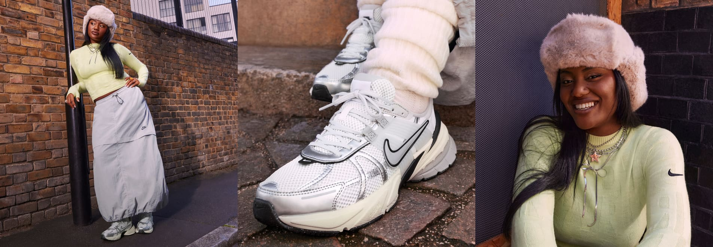
                <figcaption>
                    <h1>Geef met gevoel</h1>
                    <p>Het perfecte cadeau is iets wat ze in beweging brengt.</p>
                    <button>Shop</button>
                    <button>Shop gear voor kids</button>
                </figcaption>
            </figure>
        </article>
    </section>
    <section class="productSlider">
        <ul>
            <li>
                <h2>Trending deze week</h2></li>
            <li>
                <ul>
                    <li>
                        <svg aria-hidden="true" fill="none" focusable="false" height="24px" role="img"
                             viewBox="0 0 24 24"
                             width="24px">
                            <path d="M15.525 18.966L8.558 12l6.967-6.967" stroke="currentColor"
                                  stroke-width="1.5"></path>
                        </svg>
                    </li>
                    <li>
                        <svg aria-hidden="true" fill="none" focusable="false" height="24px" role="img"
                             viewBox="0 0 24 24"
                             width="24px">
                            <path d="M8.474 18.966L15.44 12 8.474 5.033" stroke="currentColor"
                                  stroke-width="1.5"></path>
                        </svg>
                    </li>
                </ul>
            </li>
        </ul>
        <ul>
            <li>
                <a href="#">
                    <figure>
                        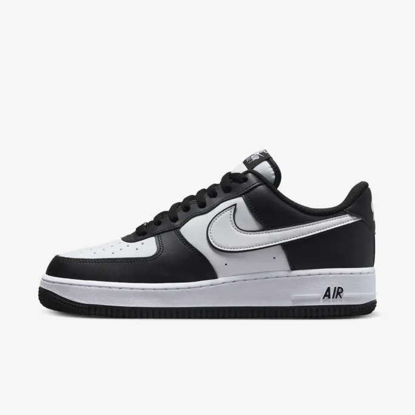
                        <figcaption>
                            <p>Nike Air Force 1 '07</p>
                            <p>Herenschoenen</p>
                            <p>€ 119,99</p>
                        </figcaption>
                    </figure>
                </a>
            </li>
            <li>
                <a href="#">
                    <figure>
                        
                        <figcaption>
                            <p>Nike Air Force 1 '07</p>
                            <p>Herenschoenen</p>
                            <p>€ 119,99</p>
                        </figcaption>
                    </figure>
                </a>
            </li>
            <li>
                <a href="#">
                    <figure>
                        
                        <figcaption>
                            <p>Nike Air Force 1 '07</p>
                            <p>Herenschoenen</p>
                            <p>€ 119,99</p>
                        </figcaption>
                    </figure>
                </a>
            </li>
            <li>
                <a href="#">
                    <figure>
                        
                        <figcaption>
                            <p>Nike Air Force 1 '07</p>
                            <p>Herenschoenen</p>
                            <p>€ 119,99</p>
                        </figcaption>
                    </figure>
                </a>
            </li>
            <li>
                <a href="#">
                    <figure>
                        
                        <figcaption>
                            <p>Nike Air Force 1 '07</p>
                            <p>Herenschoenen</p>
                            <p>€ 119,99</p>
                        </figcaption>
                    </figure>
                </a>
            </li>
            <li>
                <a href="#">
                    <figure>
                        
                        <figcaption>
                            <p>Nike Air Force 1 '07</p>
                            <p>Herenschoenen</p>
                            <p>€ 119,99</p>
                        </figcaption>
                    </figure>
                </a>
            </li>
        </ul>
    </section>
    <section class="sexCategories">
        <h2>Ontdek meer cadeaus</h2>
        <ul>
            <li>
                <article>
                    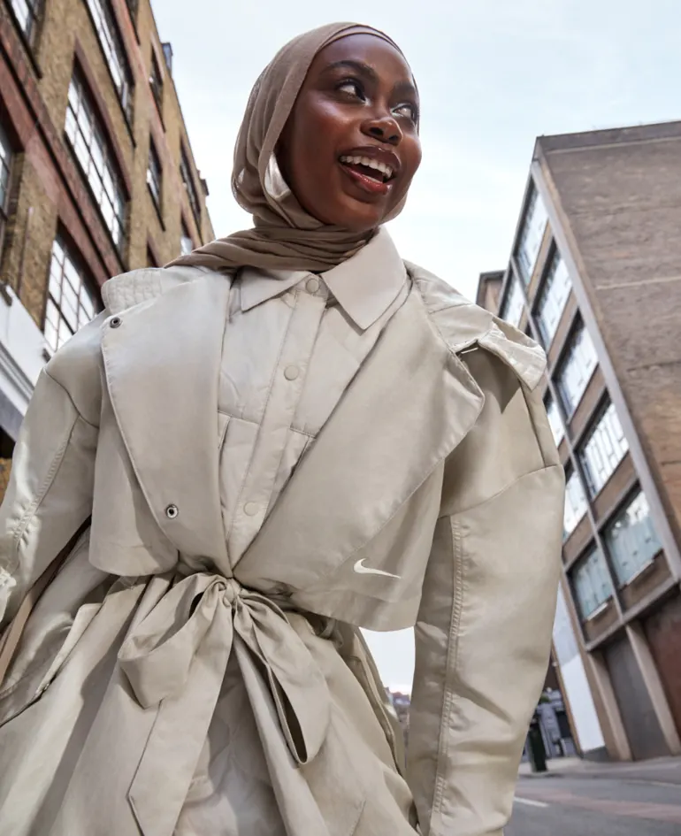
                    <button>Dames</button>
                </article>
            </li>
            <li>
                <article>
                    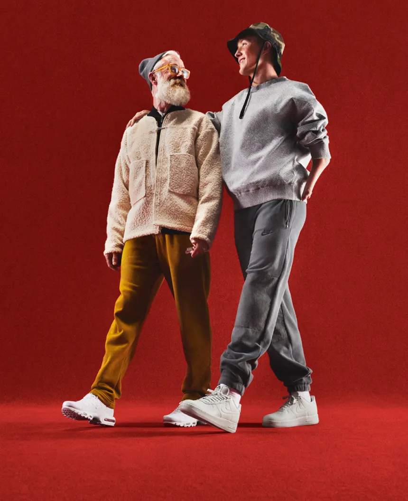
                    <button>Heren</button>

                </article>
            </li>
            <li>
                <article>
                    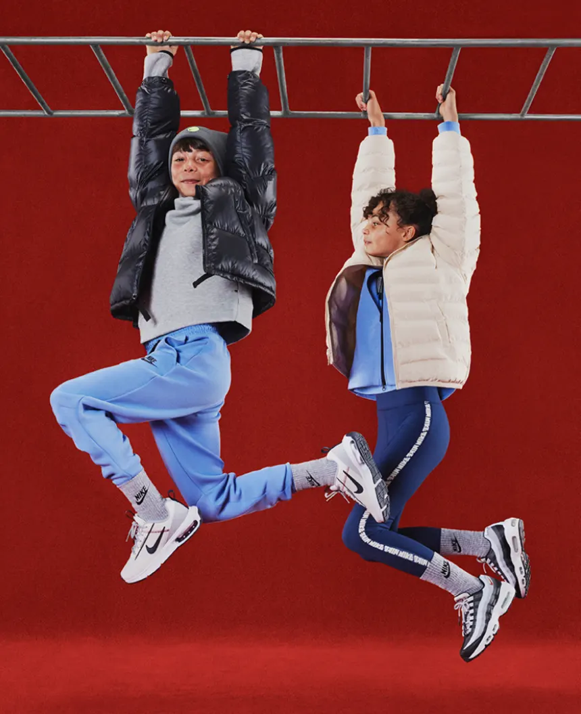
                    <button>Kids</button>
                </article>
            </li>
        </ul>
    </section>
    <section class="sportCategories">
        <ul>
            <li>
                <h2>Shop op sport</h2>
            </li>
            <li>
                <ul>
                    <li>
                        <svg aria-hidden="true" fill="none" focusable="false" height="24px" role="img"
                             viewBox="0 0 24 24"
                             width="24px">
                            <path d="M15.525 18.966L8.558 12l6.967-6.967" stroke="currentColor"
                                  stroke-width="1.5"></path>
                        </svg>
                    </li>
                    <li>
                        <svg aria-hidden="true" fill="none" focusable="false" height="24px" role="img"
                             viewBox="0 0 24 24"
                             width="24px">
                            <path d="M8.474 18.966L15.44 12 8.474 5.033" stroke="currentColor"
                                  stroke-width="1.5"></path>
                        </svg>
                    </li>
                </ul>
            </li>
        </ul>
        <ul>
            <li>
                <a href="#">
                    
                </a>
            </li>
            <li>
                <a href="#">
                    
                </a>
            </li>
            <li>
                <a href="#">
                    
                </a>
            </li>
            <li>
                <a href="#">
                    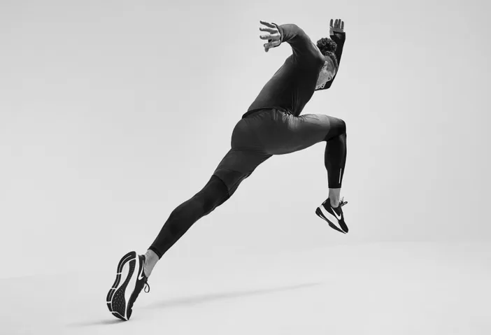
                </a>
            </li>
            <li>
                <a href="#">
                    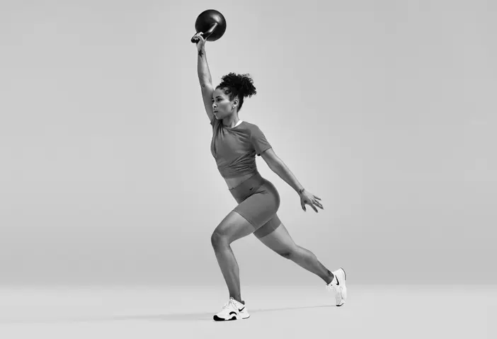
                </a>
            </li>
            <li>
                <a href="#">
                    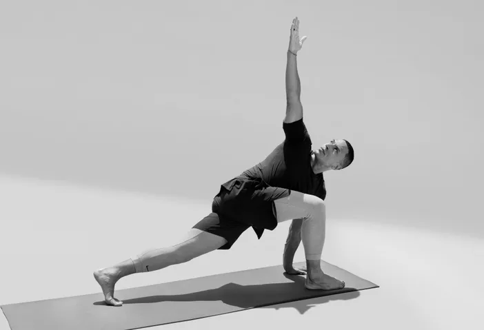
                </a>
            </li>
            <li>
                <a href="#">
                    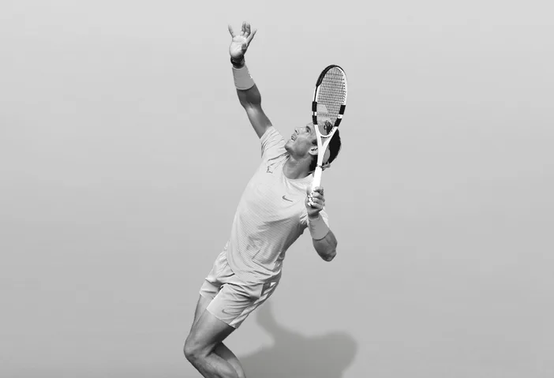
                </a>
            </li>
            <li>
                <a href="#">
                    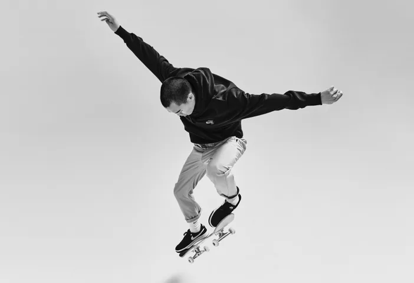
                </a>
            </li>
        </ul>
    </section>
    <section class="appCards">
        <figure>
            
            <figcaption>
                <p>Het beste van nike</p>
                <button>Nike app</button>
            </figcaption>
        </figure>
        <figure>
            
            <figcaption>
                <h3>Het beste van nike</h3>
                <button>Nike app</button>
            </figcaption>
        </figure>
    </section>
</main>
<footer>
    <!--    <ul>-->
    <!--        <li>Cadeaubonnen</li>-->
    <!--        <li>Zoek een store</li>-->
    <!--        <li>Nike journal</li>-->
    <!--        <li>Word member</li>-->
    <!--        <li>Studentenkorting</li>-->
    <!--        <li>Feedback</li>-->
    <!--        <li>Promotiecodes</li>-->
    <!--        <li>Promotiecodes</li>-->
    <!--    </ul>-->
    <!--    <ul>-->
    <!--        <li>Help</li>-->
    <!--        <li>Bestelstatus</li>-->
    <!--        <li>Verzending en levering</li>-->
    <!--        <li>Retourzending</li>-->
    <!--        <li>Betaalmethodes</li>-->
    <!--        <li>Contact</li>-->
    <!--        <li>Nike promotiecodes hulp</li>-->
    <!--    </ul>-->
    <!--    <ul>-->
    <!--        <li>Over Nike</li>-->
    <!--        <li>Nieuws</li>-->
    <!--        <li>Werken bij Nike</li>-->
    <!--        <li>Investeerders</li>-->
    <!--        <li>Duurzaamheid</li>-->
    <!--    </ul>-->
    <!--    <ul>-->
    <!--        <li>Join us</li>-->
    <!--        <li>Nike App</li>-->
    <!--        <li>Nike Run Club</li>-->
    <!--        <li>Nike Training Cklub</li>-->
    <!--        <li>SNKRS</li>-->
    <!--    </ul>-->
</footer>


<script defer src="scripts/script.js"></script>
</body>

</html>
  ``` 
</details>
<details>
  <summary><strong>CSS</strong></summary>

  ``` css
  *, *::after, *::before {
    box-sizing: border-box;
    margin: 0;
    padding: 0;
    scroll-behavior: smooth;
}

/*********************/
/* CUSTOM PROPERTIES */
/*********************/
:root {
    --color-text: #111;
    --color-background: #eee;
    --nike-grey: #F5F5F5;
    --shadow1: #e5e5e5;
    --footer-black: #111111FF;
    --text-lightgrey: #707072
}

/****************/
/* GENERIC STYLING */
/****************/

body {
    font-family: "Helvetica", sans-serif;
    height: auto;
}

h2 {
    font-size: 24px;
}

ul {
    list-style-type: none;
}

p {
    font-size: 16px;
    line-height: 16px;
}

li {
    font-size: 16px;
    line-height: 16px;
}

a {
    text-decoration: none;
    color: black;
}

svg:hover {
    opacity: 0.6;
}

/****************/
/* BUTTON STYLING */
/****************/

button {
    background-color: white;
    border-radius: 999px;
    border: none;
    color: black;
    padding: 6px 20px;
    font-size: 16px;
    line-height: 24px;
    font-weight: 500;
}

/****************/
/* HEADER STYLING */
/****************/

header section {
    display: flex;
    justify-content: space-between;
    max-height: 60px;
    padding: 7px 40px;
    background-color: var(--nike-grey);
}

header section ul {
    display: flex;
    gap: 10px;
}

header section ul li {
    display: flex;
    justify-content: center;
    align-items: center;
    font-size: 12px;
    color: var(--color-text);
    font-weight: 500;
}

header section ul li a {
    font-size: 12px;
    color: var(--color-text);
    font-weight: 500;
}

header section ul:last-of-type li:nth-child(2) {
    padding: 0 10px;
    border-left: solid black 1px;
    border-right: solid black 1px;
}

header nav > ul {
    width: 100%;
    display: flex;
    align-items: center;
    justify-content: space-between;
    padding: 12px 40px;
}

header nav > ul > * {
    width: 33%;
}

header nav ul li ul {
    display: flex;
    justify-content: center;
    align-items: center;
    gap: 20px;
}

header nav ul li:nth-child(3) ul {
    display: flex;
    justify-content: end;
}

header nav input {
    background-color: var(--nike-grey);
    border: none;
    border-radius: 20px;
    padding: 11px 20px;
    height: 40px;
}

#searchBar {
    padding-left: 30px;
    background-image: url('../images/searchIcon.svg');
    background-repeat: no-repeat;
    background-size: 24px 24px;
    background-position: 5px center;
}

/****************/
/* INFO SLIDER STYLING */
/****************/

.infoSlider {
    position: relative;
    width: 100%;
    max-height: 58px;
    overflow: hidden;
    display: flex;
    justify-content: center;
    background-color: var(--nike-grey);
    padding: 13px 0;
    box-shadow: inset 0 -1px 0 0 var(--shadow1);
}

.infoSlider div {
    display: flex;
    width: 100%;
    transition: transform 0.5s ease-in-out;
    overflow: hidden;
}

.infoSlider ul {
    display: flex;
    width: 100%;
    transition: transform 0.5s ease-in-out;
}

.infoSlider ul li {
    min-width: 100%;
    box-sizing: border-box;
}

.infoSlider p {
    text-align: center;
}

.infoSlider p:last-child {
    font-size: 12px;
}

/*.infoSlider {*/


/*.infoSlider article {*/
/*    width: 100%;*/
/*    text-align: center;*/
/*}*/

/*.infoSlider article p:last-of-type {*/
/*    font-size: 12px;*/
/*}*/

/****************/
/* HERO STYLING */
/****************/

.hero {
    margin-top: 48px;
}

.hero figure img {
    max-width: 100%;
    height: auto;
}

.hero figure {
    position: relative;
}

.hero figure figcaption {
    color: white;
    position: absolute;
    bottom: 40px;
    left: 40px;
}

/****************/
/* PRODUCT SLIDER STYLING */
/****************/

.productSlider {
    display: flex;
    flex-direction: column;
    gap: 20px;
    margin: 60px 0;
    padding: 40px;

}

.productSlider ul {
    display: flex;
    gap: 20px;
    overflow: auto;
}

.productSlider img {
    max-width: 350px;
    aspect-ratio: 1/1;
}

.productSlider ul li a figure {
    display: flex;
    flex-direction: column;
    gap: 10px;
    padding-bottom: 40px;
}

.productSlider figure p:nth-child(2) {
    color: var(--text-lightgrey)
}


.productSlider ul:first-of-type {
    display: flex;
    justify-content: space-between;
    align-items: center;
}

.productSlider ul li ul {
    display: flex;
    gap: 10px;
}

.productSlider ul li ul li {
    display: flex;
    justify-content: center;
    align-items: center;
    background-color: #E5E5E5;
    width: 48px;
    height: 48px;
    border-radius: 999px;
}

.productSlider::-webkit-scrollbar {
    height: 2px;
}

.productSlider::-webkit-scrollbar-thumb {
    height: 2px;
    background: #000000;
}

.productSlider::-webkit-scrollbar-track {
    width: 2px;
    background: #FFF;
}

/****************/
/* SEX CATEGORY STYLING */
/****************/

.sexCategories {
    display: flex;
    flex-direction: column;
    padding: 0 40px;
    gap: 40px;
}

.sexCategories ul {
    display: flex;
    gap: 20px;
}

.sexCategories ul article {
    position: relative;
}

.sexCategories ul article button {
    position: absolute;
    bottom: 40px;
    left: 40px;
}


.sexCategories ul article img {
    max-width: 100%; /* Set maximum width to 100% of the container */
    height: auto; /* Maintain aspect ratio */
}

/****************/
/* SPORT CATEGORY SLIDER STYLING */
/****************/

.sportCategories {
    display: flex;
    flex-direction: column;
    gap: 20px;
    margin: 60px 0;
    padding: 40px;

}

.sportCategories ul {
    display: flex;
    gap: 20px;
    overflow: auto;
}

.sportCategories img {
    max-width: 400px;
    aspect-ratio: 3/2;
}

.sportCategories ul li a figure {
    display: flex;
    flex-direction: column;
    gap: 10px;
    padding-bottom: 40px;
}

.sportCategories figure p:nth-child(2) {
    color: var(--text-lightgrey)
}


.sportCategories ul:first-of-type {
    display: flex;
    justify-content: space-between;
    align-items: center;
}

.sportCategories ul li ul {
    display: flex;
    gap: 10px;
}

.sportCategories ul li ul li {
    display: flex;
    justify-content: center;
    align-items: center;
    background-color: #E5E5E5;
    width: 48px;
    height: 48px;
    border-radius: 999px;
}

.sportCategories::-webkit-scrollbar {
    height: 2px;
}

.sportCategories::-webkit-scrollbar-thumb {
    height: 2px;
    background: #000000;
}

.sportCategories::-webkit-scrollbar-track {
    width: 2px;
    background: #FFF;
}

/****************/
/* APP CARD STYLING */
/****************/

.appCards {
    display: flex;
    padding: 0 40px;
    gap: 20px;
}

.appCards figure {
    position: relative;
}

.appCards figure figcaption {
    color: white;
    position: absolute;
    bottom: 40px;
    left: 40px;
}


.appCards figure img {
    max-width: 100%; /* Set maximum width to 100% of the container */
    height: auto; /* Maintain aspect ratio */
}

/****************/
/* FOOTER STYLING */
/****************/

footer {
    display: flex;
    gap: 20px;
    color: white;
    background-color: var(--footer-black);
    padding: 40px;
}
  ```
</details>
<details>
  <summary><strong>JS</strong></summary>
  
  ``` javascript
  const slider = document.querySelector('.infoSlider>div>ul');

  let currentIndex = 0;

  const nextSlide = () => {
    currentIndex = (currentIndex + 1) % slider.children.length;
    updateSlider();
  }

  const updateSlider = () => {
    const translateValue = -currentIndex * 100 + '%';
    slider.style.transition = 'transform 0.6s';
    slider.style.transform = 'translateX(' + translateValue + ')';
  }

  setInterval(nextSlide, 6000);
});
  ```
</details>

  ### Verslag van meeting
  Mijn eerste voortgangsgesprek verliep heel soepel en was heel snel klaar. Ik heb mijn website doorgenomen met medestudent/student-assistent/vriend Quinten Kok. Ik heb hem leren kennen tijdens blok Tech in jaar 2. Wij kunnen het erg goed vinden en hij was zeer onder de indruk van mijn progressie met de website en überhaupt mijn kennis van front-end dev. Wij hebben samen de html, css en javascript doorgenomen en dit zag er allemaal top uit. Hij zei dat ik goed voor lag op schema en dat mijn html netjes opgebouwd en goed ingesprongen is. Ook qua semantiek zit ik in de goede richting alleen moet ik ervoor zorgen dat ik, wat ik zelf ook al dacht, goed moet opletten wanneer je een figure, article of section gebruikt. Ik dacht dat er bepaalde restricties op section en article gebruik zat, maar deze mogen op wat voor manier dan ook met elkaar worden gebruikt. Een voorbeeld hiervan:

  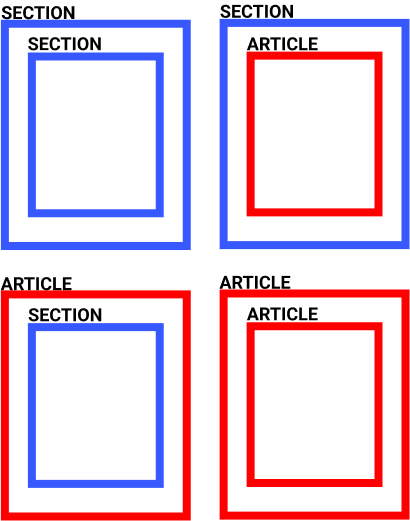

  Hieronder zijn screenshots te zien van de huidige staat van mijn website:

  
</details>


## Voortgang 2 (14 december)

<details>
  <summary>uitwerken voor 2<sup>e</sup> voortgang</summary>

  ### Stand van zaken
  Bij mijn tweede voortgangsgesprek ben ik niet heel veel verder gekomen dan ik bij mijn eerste gesprek was. Als je de foto's vergelijkt met de eerste week zit er bijna geen verschil in de eerste pagina. Ik ben eigenlijk alleen begonnen aan het opzetten van mijn tweede pagina. Ik heb hier en daar misschien wat kleine tweaks gemaakt aan de eerste pagina. Ook heb ik wat javascript toegevoegd voor de functionaliteit van de tweede pagina. Omdat ik al best ver ben gekomen in de eerste paar weken, heb ik mijn website een beetje laten liggen en er niet super veel tijd aan besteed. Verder is mijn code nog in orde en ietsjes uitgebreider. Ik moet na deze weken weer wat meer tijd aan mijn website besteden. Hieronder mijn code op dit moment:

  <details>
    <summary><strong>HTML</strong></summary>
    <details>
      <summary>Page 1:</summary>

```html

<!DOCTYPE html>
<html lang="nl">

<head>
  <meta charset="UTF-8">
  <meta content="jouw naam" name="author">
  <meta content="width=device-width, initial-scale=1" name="viewport">

  <title>Nike</title>

  <link href="styles/style.css" rel="stylesheet">
</head>

<body>
<header>
  <!--TOP BAR-->
  <section>
    <ul>
      <li>
        <svg fill="#111" height="24px" viewBox="0 0 26 32" width="24px">
          <path
                  d="M14.4 5.52v-.08q0-.56.36-1t.92-.44 1 .36.48.96-.36 1-.96.4l-.24.08.08.12-.08.44-.16 1.28q.08.08.08.16l-.16.8q-.08.16-.16.24l-.08.32q-.16.64-.28 1.04t-.2.64V12q-.08.4-.12.64t-.28.8q-.16.32 0 1.04l.08.08q0 .24.2.56t.2.56q.08 1.6-.24 2.72l.16.48q.96.48.56 1.04l.4.16q.96.48 1.36.84t.8.76q.32.08.48.24l.24.08q1.68 1.12 3.36 2.72l.32.24v.08l-.08.16.24.16h.08q.24.16.32.16h.08q.08 0 .16-.08l.16-.08q.16-.16.32-.24h.32q.08 0 0 .08l-.32.16-.4.48h.56l.56.08q.24-.08.4-.16l.4-.24q.24-.08.48.16h.08q.08.08-.08.24l-.96.88q-.4.32-.72.4l-1.04.72q-.08.08-.16 0l-.24-.32-.16-.32-.2-.28-.24-.32-.2-.24-.16-.2-.32-.24q-.16 0-.32-.08l-1.04-.8q-.24 0-.56-.24-1.2-1.04-1.6-1.28l-.48-.32-.96-.16q-.48-.08-1.28-.48l-.64-.32q-.64-.32-.88-.32l-.32-.16q-.32-.08-.48-.16l-.16-.16q-.16 0-.32.08l-1.6.8-2 .88q-.8.64-1.52 1.04l-.88.4-1.36.96q-.16.16-.32 0l-.16.16q-.24.08-.32.08l-.32.16v.16h-.16l-.16.24q-.16.32-.32.36t-.2.12-.08.12l-.16.16-.24.16-.36-.04-.48.08-.32.08q-.4.08-.64-.12t-.4-.6q-.16-.24.16-.4l.08-.08q.08-.08.24-.08h.48L1.6 26l.32-.08q0-.16.08-.24.08-.08.24-.08v-.08q-.08-.16-.08-.32-.08-.16-.04-.24t.08-.08h.04l.08.24q.08.4.24.24l.08-.16q.08-.16.24-.16l.16.16.16-.16-.08-.08q0-.08.08-.08l.32-.32q.4-.48.96-.88 1.12-.88 2.4-1.36.4-.4.88-.4.32-.56.96-1.2.56-.4.8-.56.16-.32.4-.32H10l.16-.16q.16-.08.24-.16v-.4q0-.4.08-.64t.4-.24l.32-.32q-.16-.32-.16-.72h-.08q-.16-.24-.16-.48-.24-.4-.32-.64h-.24q-.08.24-.4.32l-.08.16q-.32.56-.56.84t-.88.68q-.4.4-.56.88-.08.24 0 .48l-.08.16h.08q0 .16.08.16h.08q.16.08.16.2t-.24.08-.36-.16-.2-.12l-.24.24q-.16.24-.32.2t-.08-.12l.08-.08q.08-.16 0-.16l-.64.16q-.08.08-.2 0t.04-.16l.4-.16q0-.08-.08-.08-.32.16-.64.08l-.4-.08-.08-.08q0-.08.08-.08.32.08.8-.08l.56-.24.64-.72.08-.16q.32-.64.68-1.16t.76-.84l.08-.32q.16-.32.32-.56t.4-.64l.24-.32q.32-.48.72-.48l.24-.24q.08-.08.08-.24l.16-.16-.08-.08q-.48-.4-.48-.72-.08-.56.36-.96t.88-.36.68.28l.16.16q.08 0 .08.08l.32.16v.24q.16.16.16.24.16-.24.48-.56l.4-1.28q0-.32.16-.64l.16-.24v-.16l.24-.96h.16l.24-.96q.08-.24 0-.56l-.32-.8z"></path>
        </svg>
      </li>
      <li>
        <svg fill="#111" height="24px" viewBox="0 0 39 33" width="24px">
          <path
                  d="M10.94 25.626l-4.236-5.501L.201 22.28l3.734-5.756L.11 10.777l6.59 2.031 4.026-5.474.14 6.785 6.64 2.175-6.594 2.446.028 6.886zm.824 7.239l13.952-16.393L11.806.107h11.697l14.871 16.389-14.8 16.369h-11.81z"></path>
        </svg>
      </li>
    </ul>
    <ul>
      <li><a href="#">Zoek een store</a></li>
      <li><a href="#">Help</a></li>
      <li><a href="#">Join us</a></li>
      <li><a href="#">Log in</a></li>
    </ul>
  </section>
  <nav>
    <ul>
      <li>
        <a href="index.html">
          <svg fill="none" height="21" viewBox="0 0 58 21" width="58" xmlns="http://www.w3.org/2000/svg">
            <path clip-rule="evenodd"
                  d="M57.8806 0.0689087L15.9637 17.8495C12.4738 19.3302 9.53801 20.0689 7.17214 20.0689C4.51015 20.0689 2.57096 19.1296 1.38007 17.2541C-0.164269 14.8341 0.510783 10.943 3.16004 6.83535C4.73304 4.43446 6.73272 2.23099 8.68146 0.123041C8.22293 0.868145 4.1758 7.60274 8.60185 10.7742C9.47751 11.4111 10.7225 11.7231 12.2541 11.7231C13.4832 11.7231 14.8938 11.5225 16.4446 11.1181L57.8806 0.0689087Z"
                  fill="black"
                  fill-rule="evenodd" />
          </svg>
        </a>
      </li>
      <li>
        <ul>
          <li><a href="products.html">Nieuw en uitgelicht</a></li>
          <li><a href="products.html">Heren</a></li>
          <li><a href="products.html">Dames</a></li>
          <li><a href="products.html">Kinderen</a</li>
          <li><a href="products.html">Sale</a></li>
        </ul>
      </li>
      <li>
        <ul>
          <li>
            <form>
              <label for="searchBar"></label>
              <input id="searchBar" placeholder="Zoek" type="text">
            </form>
          </li>
          <li>
            <svg aria-hidden="true" class="pre-nav-design-icon" fill="none" focusable="false" height="24px"
                 role="img" viewBox="0 0 24 24" width="24px">
              <path
                      d="M16.794 3.75c1.324 0 2.568.516 3.504 1.451a4.96 4.96 0 010 7.008L12 20.508l-8.299-8.299a4.96 4.96 0 010-7.007A4.923 4.923 0 017.205 3.75c1.324 0 2.568.516 3.504 1.451l.76.76.531.531.53-.531.76-.76a4.926 4.926 0 013.504-1.451"
                      stroke="currentColor"
                      stroke-width="1.5"></path>
            </svg>
          </li>
          <li>
            <svg aria-hidden="true" class="pre-nav-design-icon" fill="none" focusable="false" height="24px"
                 role="img" viewBox="0 0 24 24" width="24px">
              <path
                      d="M8.25 8.25V6a2.25 2.25 0 012.25-2.25h3a2.25 2.25 0 110 4.5H3.75v8.25a3.75 3.75 0 003.75 3.75h9a3.75 3.75 0 003.75-3.75V8.25H17.5"
                      stroke="currentColor"
                      stroke-width="1.5"></path>
            </svg>
          </li>
        </ul>
    </ul>
  </nav>
</header>
<main>
  <section class="infoSlider">
    <div>
      <ul>
        <li>
          <p>Voor de winter</p>
          <p>Bereid je voor op kou en regen</p>
        </li>
        <li>
          <p>Shop alle nieuwe producten</p>
          <p><a href="#">Shop</a></p>
        </li>
        <li>
          <p>Gratis verzending en retourneren</p>
          <p>Nike members krijgen gratis verzending en kunnen binnen 60 dagen gratis retourneren. Meer info
            Join Us</p>
        </li>
      </ul>
    </div>

  </section>
  <section class="hero">
    <article>
      <figure>
        
        <figcaption>
          <h1>Geef met gevoel</h1>
          <p>Het perfecte cadeau is iets wat ze in beweging brengt.</p>
          <button>Shop</button>
          <button>Shop gear voor kids</button>
        </figcaption>
      </figure>
    </article>
  </section>
  <section class="productSlider">
    <ul>
      <li>
        <h2>Trending deze week</h2></li>
      <li>
        <ul>
          <li>
            <button>
              <svg aria-hidden="true" fill="none" focusable="false" height="24px" role="img"
                   viewBox="0 0 24 24"
                   width="24px">
                <path d="M15.525 18.966L8.558 12l6.967-6.967" stroke="currentColor"
                      stroke-width="1.5"></path>
              </svg>
            </button>
          </li>
          <li>
            <button>
              <svg aria-hidden="true" fill="none" focusable="false" height="24px" role="img"
                   viewBox="0 0 24 24"
                   width="24px">
                <path d="M8.474 18.966L15.44 12 8.474 5.033" stroke="currentColor"
                      stroke-width="1.5"></path>
              </svg>
            </button>
          </li>
        </ul>
      </li>
    </ul>
    <ul>
      <li>
        <a href="#">
          <figure>
            
            <figcaption>
              <p>Nike Air Force 1 '07</p>
              <p>Herenschoenen</p>
              <p>€ 119,99</p>
            </figcaption>
          </figure>
        </a>
      </li>
      <li>
        <a href="#">
          <figure>
            
            <figcaption>
              <p>Nike Air Force 1 '07</p>
              <p>Herenschoenen</p>
              <p>€ 119,99</p>
            </figcaption>
          </figure>
        </a>
      </li>
      <li>
        <a href="#">
          <figure>
            
            <figcaption>
              <p>Nike Air Force 1 '07</p>
              <p>Herenschoenen</p>
              <p>€ 119,99</p>
            </figcaption>
          </figure>
        </a>
      </li>
      <li>
        <a href="#">
          <figure>
            
            <figcaption>
              <p>Nike Air Force 1 '07</p>
              <p>Herenschoenen</p>
              <p>€ 119,99</p>
            </figcaption>
          </figure>
        </a>
      </li>
      <li>
        <a href="#">
          <figure>
            
            <figcaption>
              <p>Nike Air Force 1 '07</p>
              <p>Herenschoenen</p>
              <p>€ 119,99</p>
            </figcaption>
          </figure>
        </a>
      </li>
      <li>
        <a href="#">
          <figure>
            
            <figcaption>
              <p>Nike Air Force 1 '07</p>
              <p>Herenschoenen</p>
              <p>€ 119,99</p>
            </figcaption>
          </figure>
        </a>
      </li>
    </ul>
  </section>
  <section class="sexCategories">
    <h2>Ontdek meer cadeaus</h2>
    <ul>
      <li>
        <article>
          
          <button>Dames</button>
        </article>
      </li>
      <li>
        <article>
          
          <button>Heren</button>

        </article>
      </li>
      <li>
        <article>
          
          <button>Kids</button>
        </article>
      </li>
    </ul>
  </section>
  <section class="sportCategories">
    <ul>
      <li>
        <h2>Shop op sport</h2>
      </li>
      <li>
        <ul>
          <li>
            <svg aria-hidden="true" fill="none" focusable="false" height="24px" role="img"
                 viewBox="0 0 24 24"
                 width="24px">
              <path d="M15.525 18.966L8.558 12l6.967-6.967" stroke="currentColor"
                    stroke-width="1.5"></path>
            </svg>
          </li>
          <li>
            <svg aria-hidden="true" fill="none" focusable="false" height="24px" role="img"
                 viewBox="0 0 24 24"
                 width="24px">
              <path d="M8.474 18.966L15.44 12 8.474 5.033" stroke="currentColor"
                    stroke-width="1.5"></path>
            </svg>
          </li>
        </ul>
      </li>
    </ul>
    <ul>
      <li>
        <a href="#">
          
        </a>
      </li>
      <li>
        <a href="#">
          
        </a>
      </li>
      <li>
        <a href="#">
          
        </a>
      </li>
      <li>
        <a href="#">
          
        </a>
      </li>
      <li>
        <a href="#">
          
        </a>
      </li>
      <li>
        <a href="#">
          
        </a>
      </li>
      <li>
        <a href="#">
          
        </a>
      </li>
      <li>
        <a href="#">
          
        </a>
      </li>
    </ul>
  </section>
  <section class="appCards">
    <figure>
      
      <figcaption>
        <p>Het beste van nike</p>
        <button>Nike app</button>
      </figcaption>
    </figure>
    <figure>
      
      <figcaption>
        <h3>Het beste van nike</h3>
        <button>Nike app</button>
      </figcaption>
    </figure>
  </section>
</main>
<footer>
  <!--    <ul>-->
  <!--        <li>Cadeaubonnen</li>-->
  <!--        <li>Zoek een store</li>-->
  <!--        <li>Nike journal</li>-->
  <!--        <li>Word member</li>-->
  <!--        <li>Studentenkorting</li>-->
  <!--        <li>Feedback</li>-->
  <!--        <li>Promotiecodes</li>-->
  <!--        <li>Promotiecodes</li>-->
  <!--    </ul>-->
  <!--    <ul>-->
  <!--        <li>Help</li>-->
  <!--        <li>Bestelstatus</li>-->
  <!--        <li>Verzending en levering</li>-->
  <!--        <li>Retourzending</li>-->
  <!--        <li>Betaalmethodes</li>-->
  <!--        <li>Contact</li>-->
  <!--        <li>Nike promotiecodes hulp</li>-->
  <!--    </ul>-->
  <!--    <ul>-->
  <!--        <li>Over Nike</li>-->
  <!--        <li>Nieuws</li>-->
  <!--        <li>Werken bij Nike</li>-->
  <!--        <li>Investeerders</li>-->
  <!--        <li>Duurzaamheid</li>-->
  <!--    </ul>-->
  <!--    <ul>-->
  <!--        <li>Join us</li>-->
  <!--        <li>Nike App</li>-->
  <!--        <li>Nike Run Club</li>-->
  <!--        <li>Nike Training Cklub</li>-->
  <!--        <li>SNKRS</li>-->
  <!--    </ul>-->
</footer>


<script defer src="scripts/script.js"></script>
</body>

</html>
  ```
  </details>

<details>
  <summary>Page 2:</summary>

  ```html
  <!DOCTYPE html>
<html lang="nl">

<head>
  <meta charset="UTF-8">
  <meta content="jouw naam" name="author">
  <meta content="width=device-width, initial-scale=1" name="viewport">

  <title>Nike</title>

  <link href="styles/style.css" rel="stylesheet">
</head>

<body>
<header>
  <!--TOP BAR-->
  <section>
    <ul>
      <li>
        <svg fill="#111" height="24px" viewBox="0 0 26 32" width="24px">
          <path
                  d="M14.4 5.52v-.08q0-.56.36-1t.92-.44 1 .36.48.96-.36 1-.96.4l-.24.08.08.12-.08.44-.16 1.28q.08.08.08.16l-.16.8q-.08.16-.16.24l-.08.32q-.16.64-.28 1.04t-.2.64V12q-.08.4-.12.64t-.28.8q-.16.32 0 1.04l.08.08q0 .24.2.56t.2.56q.08 1.6-.24 2.72l.16.48q.96.48.56 1.04l.4.16q.96.48 1.36.84t.8.76q.32.08.48.24l.24.08q1.68 1.12 3.36 2.72l.32.24v.08l-.08.16.24.16h.08q.24.16.32.16h.08q.08 0 .16-.08l.16-.08q.16-.16.32-.24h.32q.08 0 0 .08l-.32.16-.4.48h.56l.56.08q.24-.08.4-.16l.4-.24q.24-.08.48.16h.08q.08.08-.08.24l-.96.88q-.4.32-.72.4l-1.04.72q-.08.08-.16 0l-.24-.32-.16-.32-.2-.28-.24-.32-.2-.24-.16-.2-.32-.24q-.16 0-.32-.08l-1.04-.8q-.24 0-.56-.24-1.2-1.04-1.6-1.28l-.48-.32-.96-.16q-.48-.08-1.28-.48l-.64-.32q-.64-.32-.88-.32l-.32-.16q-.32-.08-.48-.16l-.16-.16q-.16 0-.32.08l-1.6.8-2 .88q-.8.64-1.52 1.04l-.88.4-1.36.96q-.16.16-.32 0l-.16.16q-.24.08-.32.08l-.32.16v.16h-.16l-.16.24q-.16.32-.32.36t-.2.12-.08.12l-.16.16-.24.16-.36-.04-.48.08-.32.08q-.4.08-.64-.12t-.4-.6q-.16-.24.16-.4l.08-.08q.08-.08.24-.08h.48L1.6 26l.32-.08q0-.16.08-.24.08-.08.24-.08v-.08q-.08-.16-.08-.32-.08-.16-.04-.24t.08-.08h.04l.08.24q.08.4.24.24l.08-.16q.08-.16.24-.16l.16.16.16-.16-.08-.08q0-.08.08-.08l.32-.32q.4-.48.96-.88 1.12-.88 2.4-1.36.4-.4.88-.4.32-.56.96-1.2.56-.4.8-.56.16-.32.4-.32H10l.16-.16q.16-.08.24-.16v-.4q0-.4.08-.64t.4-.24l.32-.32q-.16-.32-.16-.72h-.08q-.16-.24-.16-.48-.24-.4-.32-.64h-.24q-.08.24-.4.32l-.08.16q-.32.56-.56.84t-.88.68q-.4.4-.56.88-.08.24 0 .48l-.08.16h.08q0 .16.08.16h.08q.16.08.16.2t-.24.08-.36-.16-.2-.12l-.24.24q-.16.24-.32.2t-.08-.12l.08-.08q.08-.16 0-.16l-.64.16q-.08.08-.2 0t.04-.16l.4-.16q0-.08-.08-.08-.32.16-.64.08l-.4-.08-.08-.08q0-.08.08-.08.32.08.8-.08l.56-.24.64-.72.08-.16q.32-.64.68-1.16t.76-.84l.08-.32q.16-.32.32-.56t.4-.64l.24-.32q.32-.48.72-.48l.24-.24q.08-.08.08-.24l.16-.16-.08-.08q-.48-.4-.48-.72-.08-.56.36-.96t.88-.36.68.28l.16.16q.08 0 .08.08l.32.16v.24q.16.16.16.24.16-.24.48-.56l.4-1.28q0-.32.16-.64l.16-.24v-.16l.24-.96h.16l.24-.96q.08-.24 0-.56l-.32-.8z"></path>
        </svg>
      </li>
      <li>
        <svg fill="#111" height="24px" viewBox="0 0 39 33" width="24px">
          <path
                  d="M10.94 25.626l-4.236-5.501L.201 22.28l3.734-5.756L.11 10.777l6.59 2.031 4.026-5.474.14 6.785 6.64 2.175-6.594 2.446.028 6.886zm.824 7.239l13.952-16.393L11.806.107h11.697l14.871 16.389-14.8 16.369h-11.81z"></path>
        </svg>
      </li>
    </ul>
    <ul>
      <li><a href="#">Zoek een store</a></li>
      <li><a href="#">Help</a></li>
      <li><a href="#">Join us</a></li>
      <li><a href="#">Log in</a></li>
    </ul>
  </section>
  <nav>
    <ul>
      <li>
        <a href="index.html">
          <svg fill="none" height="21" viewBox="0 0 58 21" width="58" xmlns="http://www.w3.org/2000/svg">
            <path clip-rule="evenodd"
                  d="M57.8806 0.0689087L15.9637 17.8495C12.4738 19.3302 9.53801 20.0689 7.17214 20.0689C4.51015 20.0689 2.57096 19.1296 1.38007 17.2541C-0.164269 14.8341 0.510783 10.943 3.16004 6.83535C4.73304 4.43446 6.73272 2.23099 8.68146 0.123041C8.22293 0.868145 4.1758 7.60274 8.60185 10.7742C9.47751 11.4111 10.7225 11.7231 12.2541 11.7231C13.4832 11.7231 14.8938 11.5225 16.4446 11.1181L57.8806 0.0689087Z"
                  fill="black"
                  fill-rule="evenodd" />
          </svg>
        </a>
      </li>
      <li>
        <ul>
          <li>Nieuw en uitgelicht</li>
          <li>Heren</li>
          <li>Dames</li>
          <li>Kinderen</li>
          <li>Sale</li>
        </ul>
      </li>
      <li>
        <ul>
          <li>
            <label for="searchBar"></label>
            <input id="searchBar" placeholder="Zoek" type="text">
          </li>
          <li>
            <svg aria-hidden="true" class="pre-nav-design-icon" fill="none" focusable="false" height="24px"
                 role="img" viewBox="0 0 24 24" width="24px">
              <path
                      d="M16.794 3.75c1.324 0 2.568.516 3.504 1.451a4.96 4.96 0 010 7.008L12 20.508l-8.299-8.299a4.96 4.96 0 010-7.007A4.923 4.923 0 017.205 3.75c1.324 0 2.568.516 3.504 1.451l.76.76.531.531.53-.531.76-.76a4.926 4.926 0 013.504-1.451"
                      stroke="currentColor"
                      stroke-width="1.5"></path>
            </svg>
          </li>
          <li>
            <svg aria-hidden="true" class="pre-nav-design-icon" fill="none" focusable="false" height="24px"
                 role="img" viewBox="0 0 24 24" width="24px">
              <path
                      d="M8.25 8.25V6a2.25 2.25 0 012.25-2.25h3a2.25 2.25 0 110 4.5H3.75v8.25a3.75 3.75 0 003.75 3.75h9a3.75 3.75 0 003.75-3.75V8.25H17.5"
                      stroke="currentColor"
                      stroke-width="1.5"></path>
            </svg>
          </li>
        </ul>
    </ul>
  </nav>
</header>
<main>
  <section class="infoSlider">
    <div>
      <ul>
        <li>
          <p>Voor de winter</p>
          <p>Bereid je voor op kou en regen</p>
        </li>
        <li>
          <p>Shop alle nieuwe producten</p>
          <p><a href="#">Shop</a></p>
        </li>
        <li>
          <p>Gratis verzending en retourneren</p>
          <p>Nike members krijgen gratis verzending en kunnen binnen 60 dagen gratis retourneren. Meer info
            Join Us</p>
        </li>
      </ul>
    </div>

  </section>
  <section class="productHeader">
    <h1>Sneakers voor heren (735)</h1>
    <ul>
      <li>
        <p>Verberg filters</p>
        <svg aria-hidden="true" class="icon-filter-ds" fill="none" focusable="false" height="24px"
             role="img" viewBox="0 0 24 24" width="24px">
          <path d="M21 8.25H10m-5.25 0H3" stroke="currentColor" stroke-width="1.5"></path>
          <path clip-rule="evenodd" d="M7.5 6v0a2.25 2.25 0 100 4.5 2.25 2.25 0 000-4.5z"
                stroke="currentColor"
                stroke-width="1.5"></path>
          <path d="M3 15.75h10.75m5 0H21" stroke="currentColor" stroke-width="1.5"></path>
          <path clip-rule="evenodd" d="M16.5 13.5v0a2.25 2.25 0 100 4.5 2.25 2.25 0 000-4.5z"
                stroke="currentColor" stroke-width="1.5"></path>
        </svg>
      </li>
      <li>
        <p>Sorteer op:</p>
        <svg fill="none" height="7" viewBox="0 0 12 7" width="12" xmlns="http://www.w3.org/2000/svg">
          <path
                  d="M11.354 1.35403L6.35403 6.35403C6.30759 6.40052 6.25245 6.4374 6.19175 6.46256C6.13105 6.48772 6.06599 6.50067 6.00028 6.50067C5.93457 6.50067 5.86951 6.48772 5.80881 6.46256C5.74811 6.4374 5.69296 6.40052 5.64653 6.35403L0.646528 1.35403C0.552708 1.26021 0.5 1.13296 0.5 1.00028C0.5 0.867596 0.552708 0.740348 0.646528 0.646528C0.740348 0.552707 0.867596 0.5 1.00028 0.5C1.13296 0.5 1.26021 0.552707 1.35403 0.646528L6.00028 5.2934L10.6465 0.646528C10.693 0.600073 10.7481 0.563222 10.8088 0.538081C10.8695 0.51294 10.9346 0.5 11.0003 0.5C11.066 0.5 11.131 0.51294 11.1917 0.538081C11.2524 0.563222 11.3076 0.600073 11.354 0.646528C11.4005 0.692983 11.4373 0.748133 11.4625 0.80883C11.4876 0.869526 11.5006 0.934581 11.5006 1.00028C11.5006 1.06598 11.4876 1.13103 11.4625 1.19173C11.4373 1.25242 11.4005 1.30757 11.354 1.35403Z"
                  fill="black" />
        </svg>

      </li>
    </ul>
  </section>
  <section class="productGrid">
    <aside>
      <ul>
        <li>Lifestyle</li>
        <li>Lifestyle</li>
        <li>Lifestyle</li>
        <li>Lifestyle</li>
        <li>Lifestyle</li>
        <li>Lifestyle</li>
        <li>Lifestyle</li>
        <li>Lifestyle</li>
        <li>Lifestyle</li>
        <li>Lifestyle</li>
      </ul>
      <ul>
        <li>
          <label for="filter1">Sale en aanbiedingen</label>
          <input id="filter1" type="checkbox"/>
        </li>
      </ul>
    </aside>
    <section>
      <article>
        
        <p>Bestseller</p>
        <h2>Nike Air Force 1 Low Retro</h2>
        <h3>Herenschoenen</h3>
        <p>1 kleur</p>
        <p>€104,97</p>
      </article>
      <article>
        
        <p>Bestseller</p>
        <h2>Nike Air Force 1 Low Retro</h2>
        <h3>Herenschoenen</h3>
        <p>1 kleur</p>
        <p>€104,97</p>
      </article>
      <article>
        
        <p>Bestseller</p>
        <h2>Nike Air Force 1 Low Retro</h2>
        <h3>Herenschoenen</h3>
        <p>1 kleur</p>
        <p>€104,97</p>
      </article>
      <article>
        
        <p>Bestseller</p>
        <h2>Nike Air Force 1 Low Retro</h2>
        <h3>Herenschoenen</h3>
        <p>1 kleur</p>
        <p>€104,97</p>
      </article>
    </section>
  </section>
</main>
<footer>
</footer>


<script defer src="scripts/script.js"></script>
</body>

</html>
  ```

</details>
</details>
  <details>
  <summary><strong>CSS</strong></summary>

  ```css
  *, *::after, *::before {
    box-sizing: border-box;
    margin: 0;
    padding: 0;
    scroll-behavior: smooth;
}

/*********************/
/* CUSTOM PROPERTIES */
/*********************/
:root {
    --color-text: #111;
    --color-background: #eee;
    --nike-grey: #F5F5F5;
    --shadow1: #e5e5e5;
    --footer-black: #111111FF;
    --text-lightgrey: #707072;
    --product-bestseller: #9E3500;
}

/****************/
/* GENERIC STYLING */
/****************/

body {
    font-family: "Helvetica", sans-serif;
    height: auto;
}

section {
    padding: 0 48px;
}

h2 {
    font-size: 24px;
}

ul {
    list-style-type: none;
}

p {
    font-size: 16px;
    line-height: 16px;
}

li {
    font-size: 16px;
    line-height: 16px;
}

a {
    text-decoration: none;
    color: black;
}

svg:hover {
    opacity: 0.6;
}

/****************/
/* BUTTON STYLING */
/****************/

button {
    background-color: white;
    border-radius: 999px;
    border: none;
    color: black;
    padding: 6px 20px;
    font-size: 16px;
    line-height: 24px;
    font-weight: 500;
    cursor: pointer;
}

/****************/
/* HEADER STYLING */
/****************/

header section {
    display: flex;
    justify-content: space-between;
    max-height: 60px;
    padding: 7px 48px;
    background-color: var(--nike-grey);
}

header section ul {
    display: flex;
    gap: 10px;
}

header section ul li {
    display: flex;
    justify-content: center;
    align-items: center;
    font-size: 12px;
    color: var(--color-text);
    font-weight: 500;
}

header section ul li a {
    font-size: 12px;
    color: var(--color-text);
    font-weight: 500;
}

header section ul:last-of-type li:nth-child(2) {
    padding: 0 10px;
    border-left: solid black 1px;
    border-right: solid black 1px;
}

header nav > ul {
    width: 100%;
    display: flex;
    align-items: center;
    justify-content: space-between;
    padding: 12px 48px;
}

header nav > ul > * {
    width: 33%;
}

header nav ul li ul {
    display: flex;
    justify-content: center;
    align-items: center;
    gap: 20px;
}

header nav ul li:nth-child(3) ul {
    display: flex;
    justify-content: end;
}

header nav input {
    background-color: var(--nike-grey);
    border: none;
    border-radius: 20px;
    padding: 11px 20px;
    height: 40px;
}

#searchBar {
    padding-left: 30px;
    background-image: url('../images/searchIcon.svg');
    background-repeat: no-repeat;
    background-size: 24px 24px;
    background-position: 5px center;
}

/****************/
/* INFO SLIDER STYLING */
/****************/

.infoSlider {
    position: relative;
    width: 100%;
    max-height: 58px;
    overflow: hidden;
    display: flex;
    justify-content: center;
    background-color: var(--nike-grey);
    padding: 13px 0;
    box-shadow: inset 0 -1px 0 0 var(--shadow1);
}

.infoSlider div {
    display: flex;
    width: 100%;
    transition: transform 0.5s ease-in-out;
    overflow: hidden;
}

.infoSlider ul {
    display: flex;
    width: 100%;
    transition: transform 0.5s ease-in-out;
}

.infoSlider ul li {
    min-width: 100%;
    box-sizing: border-box;
}

.infoSlider p {
    text-align: center;
}

.infoSlider p:last-child {
    font-size: 12px;
}

/*.infoSlider {*/


/*.infoSlider article {*/
/*    width: 100%;*/
/*    text-align: center;*/
/*}*/

/*.infoSlider article p:last-of-type {*/
/*    font-size: 12px;*/
/*}*/

/****************/
/* HERO STYLING */
/****************/

.hero {
    margin-top: 48px;
    padding: 0
}

.hero figure img {
    max-width: 100%;
    height: auto;
}

.hero figure {
    position: relative;
}

.hero figure figcaption {
    color: white;
    position: absolute;
    bottom: 40px;
    left: 40px;
}

/****************/
/* PRODUCT SLIDER STYLING */
/****************/

.productSlider {
    display: flex;
    flex-direction: column;
    gap: 20px;
    margin: 60px 0;
    padding: 40px;

}

.productSlider ul {
    display: flex;
    gap: 20px;
    overflow: auto;
}

.productSlider img {
    max-width: 350px;
    aspect-ratio: 1/1;
}

.productSlider ul li a figure {
    display: flex;
    flex-direction: column;
    gap: 10px;
    padding-bottom: 40px;
}

.productSlider figure p:nth-child(2) {
    color: var(--text-lightgrey)
}


.productSlider ul:first-of-type {
    display: flex;
    justify-content: space-between;
    align-items: center;
}

.productSlider ul li ul {
    display: flex;
    gap: 10px;
}

.productSlider ul li ul li button {
    display: flex;
    justify-content: center;
    align-items: center;
    background-color: #E5E5E5;
    width: 48px;
    height: 48px;
    border-radius: 999px;
    padding: 0;
}

.productSlider ul li ul li button:hover {
    transition-property: all;
    transition-timing-function: cubic-bezier(0.4, 0, 0.2, 1);
    transition-duration: 300ms;
    background-color: #CACACB;
}

.productSlider::-webkit-scrollbar {
    height: 2px;
}

.productSlider::-webkit-scrollbar-thumb {
    height: 2px;
    background: #000000;
}

.productSlider::-webkit-scrollbar-track {
    width: 2px;
    background: #FFF;
}

/****************/
/* SEX CATEGORY STYLING */
/****************/

.sexCategories {
    display: flex;
    flex-direction: column;
    padding: 0 40px;
    gap: 40px;
}

.sexCategories ul {
    display: flex;
    gap: 20px;
}

.sexCategories ul article {
    position: relative;
}

.sexCategories ul article button {
    position: absolute;
    bottom: 40px;
    left: 40px;
}


.sexCategories ul article img {
    max-width: 100%; /* Set maximum width to 100% of the container */
    height: auto; /* Maintain aspect ratio */
}

/****************/
/* SPORT CATEGORY SLIDER STYLING */
/****************/

.sportCategories {
    display: flex;
    flex-direction: column;
    gap: 20px;
    margin: 60px 0;
    padding: 40px;

}

.sportCategories ul {
    display: flex;
    gap: 20px;
    overflow: auto;
}

.sportCategories img {
    max-width: 400px;
    aspect-ratio: 3/2;
}

.sportCategories ul li a figure {
    display: flex;
    flex-direction: column;
    gap: 10px;
    padding-bottom: 40px;
}

.sportCategories figure p:nth-child(2) {
    color: var(--text-lightgrey)
}


.sportCategories ul:first-of-type {
    display: flex;
    justify-content: space-between;
    align-items: center;
}

.sportCategories ul li ul {
    display: flex;
    gap: 10px;
}

.sportCategories ul li ul li {
    display: flex;
    justify-content: center;
    align-items: center;
    background-color: #E5E5E5;
    width: 48px;
    height: 48px;
    border-radius: 999px;
}

.sportCategories::-webkit-scrollbar {
    height: 2px;
}

.sportCategories::-webkit-scrollbar-thumb {
    height: 2px;
    background: #000000;
}

.sportCategories::-webkit-scrollbar-track {
    width: 2px;
    background: #FFF;
}

/****************/
/* APP CARD STYLING */
/****************/

.appCards {
    display: flex;
    padding: 0 40px;
    gap: 20px;
}

.appCards figure {
    position: relative;
}

.appCards figure figcaption {
    color: white;
    position: absolute;
    bottom: 40px;
    left: 40px;
}


.appCards figure img {
    max-width: 100%; /* Set maximum width to 100% of the container */
    height: auto; /* Maintain aspect ratio */
}

/****************/
/* FOOTER STYLING */
/****************/

footer {
    display: flex;
    gap: 20px;
    color: white;
    background-color: var(--footer-black);
    padding: 40px;
}

/******************************** PAGE 2 STYLING ***************************/

/*************************/
/*  PRODUCT HEADER STYLING */
/*************************/

.productHeader {
    display: flex;
    background-color: white;
    position: sticky;
    top: 0;
    justify-content: space-between;
    padding: 20px 48px;
    transition: font-size 200ms ease;
}

.productHeader ul {
    display: flex;
    gap: 10px;
}

.productHeader ul li {
    display: flex;
    align-items: center;
    gap: 10px;
}

.productHeader.sticky h1 {
    font-size: 16px;
    transition-property: transform;
    transition-timing-function: cubic-bezier(0.4, 0, 0.2, 1);
    transition-duration: 200ms;
}

/*************************/
/*  PRODUCT GRID STYLING */
/*************************/

.productGrid {
    display: flex;
    justify-content: space-between;
    gap: 60px;
}

.productGrid aside {
    width: 212px;
}

.productGrid ul {
    padding-bottom: 50px;
}

.productGrid input {
    padding-bottom: 50px;
}

.productGrid ul:first-of-type li {
    font-size: 20px;
    font-weight: 500;
    padding: 10px 0;
}

.productGrid section {
    display: grid;
    grid-template-columns: 1fr 1fr 1fr;
    column-gap: 20px;
    row-gap: 40px;
}

.productGrid article img {
    max-width: 100%;
    height: auto;
}

.productGrid article p:first-of-type {
    color: var(--product-bestseller);
    font-weight: 500;
}

.productGrid article p:last-of-type::after {
    content: '€149,99';
    opacity: 0.5;
    text-decoration-line: line-through;
    padding-left: 10px;
}

/*************************/
/*  MOBILE STYLING */
/*************************/

@media  {
    
}
  ```
  
</details>
  <details>
    <summary><strong>JS</strong></summary>

   ```javascript
const slider = document.querySelector('.infoSlider>div>ul')
let currentIndex = 0

function nextSlide() {
  currentIndex = (currentIndex + 1) % slider.children.length
  updateSlider()
}

function updateSlider() {
  const translateValue    = -currentIndex * 100 + '%'
  slider.style.transition = 'transform 0.6s'
  slider.style.transform  = 'translateX(' + translateValue + ')'
}

setInterval(nextSlide, 6000)

const stickyBar = document.querySelector('.productHeader')

const handleScrollDirection = () => {
  const currentPosition = window.scrollY

  if (currentPosition >= 164) {
    stickyBar.classList.add('sticky')
  } else {
    stickyBar.classList.remove('sticky')
  }
}

window.addEventListener('scroll', handleScrollDirection)
   ```
  </details>

  ### Verslag van meeting
  Ik ben heel goed op weg met mijn website. Er zijn niet echt puntjes aan te merken op mijn progressie en mijn gebruikte technieken. Mijn HTML ziet er netjes uit. Het enige waar ik op moet letten is, waar ik de juiste headings moet gebruiken. Op de originele nike website zijn de headings niet logisch opgebouwd en worden soms de verkeerde teksten verkozen tot een heading level. Hier moet ik dus niet vanuit gaan. Ik moet zelf goed nadenken welke tekst het meeste heeft te vertellen als een heading level. Ik moet nog wel een flinke stap gaan maken met responsiveness, want hier heb ik nog niks aan gedaan. Hieronder de screenshots van de huidige staat van mijn twee pagina's:
  
  

  ***

  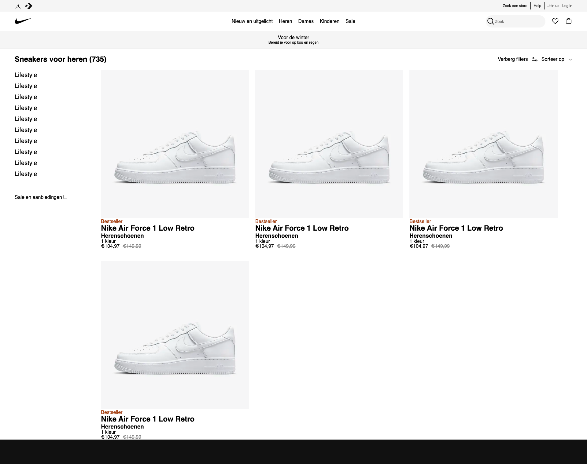

</details>


## Toegankelijkheidstest 2/2 (week 4)

<details>
  <summary>uitwerken na test in 9<sup>e</sup> werkgroep</summary>

  ### Bevindingen
  Lijst met je bevindingen die in de test naar voren kwamen (geef ook aan wat er verbeterd is):

</details>


## Voortgang 3 (week 4)

<details>
  <summary>uitwerken voor 3<sup>e</sup> voortgang</summary>

  ### Stand van zaken
  Mijn website, al zeg ik het zelf, ziet er heel nice uit. Je zou bijna niet het verschil zien met de echte nike website :stuck_out_tongue_winking_eye:

  ### Verslag van meeting

  - Mijn code ziet er netjes ingesprongen en opgebouwd uit.
  - Ik moet nog iedere section van een heading voorzien. Dit is verplicht voor een section.
  - Ik wist niet dat je geen pixels mocht gebruiken, maar alleen rem of em. Ik moet nu zorgen dat al mijn pixel units worden omgezet in rem of em.
  - Ik moet nog best wat responsiveness toevoegen
  - Voor een eventuele extra uitdaging kan ik kijken naar een CSS-only slider i.p.v. gebruik te maken van Javascript.

</details>


## Eindgesprek (week 5)

<details>
  <summary>uitwerken voor eindgesprek</summary>

  ### Je uitkomst - karakteristiek screenshots:
  


  ### Dit ging goed/Heb ik geleerd: 
  Korte omschrijving met plaatjes

  


  ### Dit was lastig/Is niet gelukt:
  Korte omschrijving met plaatjes

  
</details>


## Bronnenlijst

<details open>
  <summary>continu bijhouden terwijl je werkt</summary>
  1. https://www.seeratawan.me/blog/why-you-should-move-from-px-to-rem-in-css/#:~:text=However%2C%20if%20you%20size%20text,based%20on%20each%20user's%20needs.)https://www.seeratawan.me/blog/why-you-should-move-from-px-to-rem-in-css/#:~:text=However%2C%20if%20you%20size%20text,based%20on%20each%20user's%20needs.
  2. https://stackoverflow.com/questions/7549561/difference-between-section-vs-article-elements-in-html

</details>
