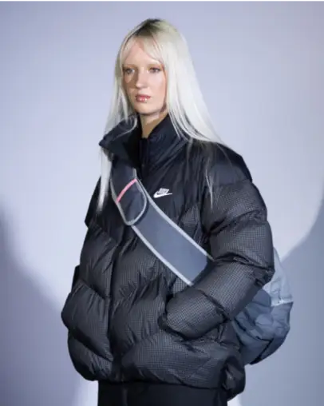
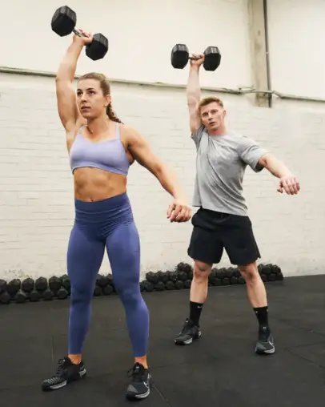
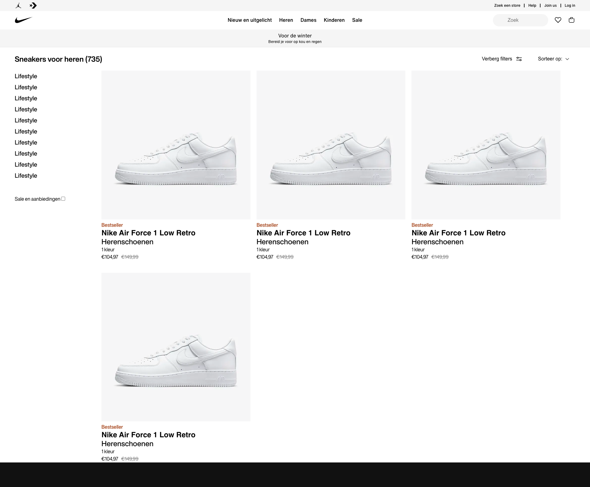

# Procesverslag
Markdown is een simpele manier om HTML te schrijven.  
Markdown cheat cheet: [Hulp bij het schrijven van Markdown](https://github.com/adam-p/markdown-here/wiki/Markdown-Cheatsheet).

Nb. De standaardstructuur en de spartaanse opmaak van de README.md zijn helemaal prima. Het gaat om de inhoud van je procesverslag. Besteedt de tijd voor pracht en praal aan je website.

Nb. Door *open* toe te voegen aan een *details* element kun je deze standaard open zetten. Fijn om dat steeds voor de relevante stuk(ken) te doen.


## Jij

<details open>
  <summary>uitwerken voor kick-off werkgroep</summary>

  ### Auteur:
  Tristan Brattinga

  #### Je startniveau:
  Rood

  #### Je focus:
  Responsiveness & surface plane
 
</details>


## Je website

<details open>
  <summary>uitwerken voor kick-off werkgroep</summary>

  ### Je opdracht:
  Nike
  https://www.nike.com/nl/

  #### Screenshot(s) van de eerste pagina (small screen): 
  Nike home page  
  
  

  #### Screenshot(s) van de tweede pagina (small screen):
  Nike products page
  
  
 
</details>


## Toegankelijkheidstest 1/2 (week 1)

<details>
  <summary>uitwerken na test in 2<sup>e</sup> werkgroep</summary>

  ### Bevindingen
  Lijst met je bevindingen die in de test naar voren kwamen:

  - Sommige beperkingen zijn niet zo erg op het web, maar sommige zijn bijna niet mee te werken. Bij het missen van een vinger of een hand is het nog redelijk makkelijk, maar wanneer je richting blindheid of motoriek gaat wordt het gelijk een stuk lastiger.
  - Tabben door de website gaat heel gemakkelijk en duidelijk.
  - Het is niet mogelijk om met mijn screenreader door de heading-levels heen te gaan. Dit is niet goed voor mensen die een screen-reader moeten gebruiken. Ondanks dat de heading levels 
  - Links naar andere pagina's zijn duidelijk voor de gebruiker. Er kan wat gedaan worden met de gegeven informatie. aria labels zijn nuttig gebruikt.
  - De focus state is heel duidelijk te zien. Nergens is er een issue met contrast. Slechtzienden zullen hier weinig tot geen moeite mee hebben.
  - Er zijn weinig tot geen animaties op de website waardoor het voor de meerderheid van de gebruikers fijn te gebruiken is. Een prefers-reduced motion toepassing is niet per se nodig.
  - Mensen met verschillende soorten kleurenblindheid kunnen nog heel goed van de Nike website gebruik maken. De kleuren zijn vooral wit, zwart, grijs. Verder hebben afbeeldingen veel kleuren, maar niet storend.
  - Doordat de kleuren voornamelijk bestaan uit wit, zwart en grijs, zijn de contrasten prima om mee te werken. Bij het aanzetten van de verhoogde contrast instelling, is er niet een duidelijk verschil, omdat het contrast al relatief hoog ligt.
  - De nike website passeert bijna alle checks van de WCAG checklist.

</details>


## Breakdownschets (week 1)

<details>
  <summary>uitwerken na afloop 3<sup>e</sup> werkgroep</summary>

  ### de hele pagina: 
  

  ### dynamisch deel (bijv menu): 
  

</details>


## Voortgang 1 (30 november)

<details>
  <summary>uitwerken voor 1<sup>e</sup> voortgang</summary>

  ### Stand van zaken
  Doordat ik al veel ervaring heb met front-end development en ook al werkzaam ben als frontender, ben ik al heel ver voor de eerste week. Ik heb eerst al mijn basis HTML voor de eerste pagina opgebouwd aan de hand van mijn breakdown schets. Ik heb de dynamische gedeeltes zoals het mobiele menu, dropdown menu en filter sidebar nog even achterwege gelaten. Ik wilde deze componenten pas later integreren als nice to have's. Waarschijnlijk met hoe erg ik voor loop zal ik dit snel oppakken. Het begin proces van mijn website verliep allemaal heel makkelijk en zonder problemen. Het enige waar ik af en toe een beetje over twijfel is wanneer iets een article, section of figure is. Dit is een puntje wat ik tijdens mijn gesprek zal gaan vragen als feedback op mijn code. Semantiek is misschien het enige waar ik af en toe een beetje moeite mee heb. Verder gaat alle techniek, logica en organistie hartstikke goed. Ik werk zelf al heel lang en veel met git en github dus dit was voor mij ook helemaal geen moeite. Ik heb bij mijn eerste voortgangsgesprek zeventien commits gemaakt. Een aantal blocks van mijn code op dit moment:

<details>
  <summary><strong>HTML</strong></summary>
  
  ``` html
  <!DOCTYPE html>
<html lang="nl">

<head>
    <meta charset="UTF-8">
    <meta content="jouw naam" name="author">
    <meta content="width=device-width, initial-scale=1" name="viewport">

    <title>Nike</title>

    <link href="styles/style.css" rel="stylesheet">
</head>

<body>
<header>
    <!--TOP BAR-->
    <section>
        <ul>
            <li>
                <svg fill="#111" height="24px" viewBox="0 0 26 32" width="24px">
                    <path
                        d="M14.4 5.52v-.08q0-.56.36-1t.92-.44 1 .36.48.96-.36 1-.96.4l-.24.08.08.12-.08.44-.16 1.28q.08.08.08.16l-.16.8q-.08.16-.16.24l-.08.32q-.16.64-.28 1.04t-.2.64V12q-.08.4-.12.64t-.28.8q-.16.32 0 1.04l.08.08q0 .24.2.56t.2.56q.08 1.6-.24 2.72l.16.48q.96.48.56 1.04l.4.16q.96.48 1.36.84t.8.76q.32.08.48.24l.24.08q1.68 1.12 3.36 2.72l.32.24v.08l-.08.16.24.16h.08q.24.16.32.16h.08q.08 0 .16-.08l.16-.08q.16-.16.32-.24h.32q.08 0 0 .08l-.32.16-.4.48h.56l.56.08q.24-.08.4-.16l.4-.24q.24-.08.48.16h.08q.08.08-.08.24l-.96.88q-.4.32-.72.4l-1.04.72q-.08.08-.16 0l-.24-.32-.16-.32-.2-.28-.24-.32-.2-.24-.16-.2-.32-.24q-.16 0-.32-.08l-1.04-.8q-.24 0-.56-.24-1.2-1.04-1.6-1.28l-.48-.32-.96-.16q-.48-.08-1.28-.48l-.64-.32q-.64-.32-.88-.32l-.32-.16q-.32-.08-.48-.16l-.16-.16q-.16 0-.32.08l-1.6.8-2 .88q-.8.64-1.52 1.04l-.88.4-1.36.96q-.16.16-.32 0l-.16.16q-.24.08-.32.08l-.32.16v.16h-.16l-.16.24q-.16.32-.32.36t-.2.12-.08.12l-.16.16-.24.16-.36-.04-.48.08-.32.08q-.4.08-.64-.12t-.4-.6q-.16-.24.16-.4l.08-.08q.08-.08.24-.08h.48L1.6 26l.32-.08q0-.16.08-.24.08-.08.24-.08v-.08q-.08-.16-.08-.32-.08-.16-.04-.24t.08-.08h.04l.08.24q.08.4.24.24l.08-.16q.08-.16.24-.16l.16.16.16-.16-.08-.08q0-.08.08-.08l.32-.32q.4-.48.96-.88 1.12-.88 2.4-1.36.4-.4.88-.4.32-.56.96-1.2.56-.4.8-.56.16-.32.4-.32H10l.16-.16q.16-.08.24-.16v-.4q0-.4.08-.64t.4-.24l.32-.32q-.16-.32-.16-.72h-.08q-.16-.24-.16-.48-.24-.4-.32-.64h-.24q-.08.24-.4.32l-.08.16q-.32.56-.56.84t-.88.68q-.4.4-.56.88-.08.24 0 .48l-.08.16h.08q0 .16.08.16h.08q.16.08.16.2t-.24.08-.36-.16-.2-.12l-.24.24q-.16.24-.32.2t-.08-.12l.08-.08q.08-.16 0-.16l-.64.16q-.08.08-.2 0t.04-.16l.4-.16q0-.08-.08-.08-.32.16-.64.08l-.4-.08-.08-.08q0-.08.08-.08.32.08.8-.08l.56-.24.64-.72.08-.16q.32-.64.68-1.16t.76-.84l.08-.32q.16-.32.32-.56t.4-.64l.24-.32q.32-.48.72-.48l.24-.24q.08-.08.08-.24l.16-.16-.08-.08q-.48-.4-.48-.72-.08-.56.36-.96t.88-.36.68.28l.16.16q.08 0 .08.08l.32.16v.24q.16.16.16.24.16-.24.48-.56l.4-1.28q0-.32.16-.64l.16-.24v-.16l.24-.96h.16l.24-.96q.08-.24 0-.56l-.32-.8z"></path>
                </svg>
            </li>
            <li>
                <svg fill="#111" height="24px" viewBox="0 0 39 33" width="24px">
                    <path
                        d="M10.94 25.626l-4.236-5.501L.201 22.28l3.734-5.756L.11 10.777l6.59 2.031 4.026-5.474.14 6.785 6.64 2.175-6.594 2.446.028 6.886zm.824 7.239l13.952-16.393L11.806.107h11.697l14.871 16.389-14.8 16.369h-11.81z"></path>
                </svg>
            </li>
        </ul>
        <ul>
            <li><a href="#">Zoek een store</a></li>
            <li><a href="#">Help</a></li>
            <li><a href="#">Join us</a></li>
            <li><a href="#">Log in</a></li>
        </ul>
    </section>
    <nav>
        <ul>
            <li>
                <svg fill="none" height="21" viewBox="0 0 58 21" width="58" xmlns="http://www.w3.org/2000/svg">
                    <path clip-rule="evenodd"
                          d="M57.8806 0.0689087L15.9637 17.8495C12.4738 19.3302 9.53801 20.0689 7.17214 20.0689C4.51015 20.0689 2.57096 19.1296 1.38007 17.2541C-0.164269 14.8341 0.510783 10.943 3.16004 6.83535C4.73304 4.43446 6.73272 2.23099 8.68146 0.123041C8.22293 0.868145 4.1758 7.60274 8.60185 10.7742C9.47751 11.4111 10.7225 11.7231 12.2541 11.7231C13.4832 11.7231 14.8938 11.5225 16.4446 11.1181L57.8806 0.0689087Z"
                          fill="black"
                          fill-rule="evenodd" />
                </svg>
            </li>
            <li>
                <ul>
                    <li>Nieuw en uitgelicht</li>
                    <li>Heren</li>
                    <li>Dames</li>
                    <li>Kinderen</li>
                    <li>Sale</li>
                </ul>
            </li>
            <li>
                <ul>
                    <li>
                        <label for="searchBar"></label>
                        <input id="searchBar" placeholder="Zoek" type="text">
                    </li>
                    <li>
                        <svg aria-hidden="true" class="pre-nav-design-icon" fill="none" focusable="false" height="24px"
                             role="img" viewBox="0 0 24 24" width="24px">
                            <path
                                d="M16.794 3.75c1.324 0 2.568.516 3.504 1.451a4.96 4.96 0 010 7.008L12 20.508l-8.299-8.299a4.96 4.96 0 010-7.007A4.923 4.923 0 017.205 3.75c1.324 0 2.568.516 3.504 1.451l.76.76.531.531.53-.531.76-.76a4.926 4.926 0 013.504-1.451"
                                stroke="currentColor"
                                stroke-width="1.5"></path>
                        </svg>
                    </li>
                    <li>
                        <svg aria-hidden="true" class="pre-nav-design-icon" fill="none" focusable="false" height="24px"
                             role="img" viewBox="0 0 24 24" width="24px">
                            <path
                                d="M8.25 8.25V6a2.25 2.25 0 012.25-2.25h3a2.25 2.25 0 110 4.5H3.75v8.25a3.75 3.75 0 003.75 3.75h9a3.75 3.75 0 003.75-3.75V8.25H17.5"
                                stroke="currentColor"
                                stroke-width="1.5"></path>
                        </svg>
                    </li>
                </ul>
        </ul>
    </nav>
</header>
<main>
    <section class="infoSlider">
        <div>
            <ul>
                <li>
                    <p>Voor de winter</p>
                    <p>Bereid je voor op kou en regen</p>
                </li>
                <li>
                    <p>Shop alle nieuwe producten</p>
                    <p><a href="#">Shop</a></p>
                </li>
                <li>
                    <p>Gratis verzending en retourneren</p>
                    <p>Nike members krijgen gratis verzending en kunnen binnen 60 dagen gratis retourneren. Meer info
                        Join Us</p>
                </li>
            </ul>
        </div>

    </section>
    <section class="hero">
        <article>
            <figure>
                
                <figcaption>
                    <h1>Geef met gevoel</h1>
                    <p>Het perfecte cadeau is iets wat ze in beweging brengt.</p>
                    <button>Shop</button>
                    <button>Shop gear voor kids</button>
                </figcaption>
            </figure>
        </article>
    </section>
    <section class="productSlider">
        <ul>
            <li>
                <h2>Trending deze week</h2></li>
            <li>
                <ul>
                    <li>
                        <svg aria-hidden="true" fill="none" focusable="false" height="24px" role="img"
                             viewBox="0 0 24 24"
                             width="24px">
                            <path d="M15.525 18.966L8.558 12l6.967-6.967" stroke="currentColor"
                                  stroke-width="1.5"></path>
                        </svg>
                    </li>
                    <li>
                        <svg aria-hidden="true" fill="none" focusable="false" height="24px" role="img"
                             viewBox="0 0 24 24"
                             width="24px">
                            <path d="M8.474 18.966L15.44 12 8.474 5.033" stroke="currentColor"
                                  stroke-width="1.5"></path>
                        </svg>
                    </li>
                </ul>
            </li>
        </ul>
        <ul>
            <li>
                <a href="#">
                    <figure>
                        
                        <figcaption>
                            <p>Nike Air Force 1 '07</p>
                            <p>Herenschoenen</p>
                            <p>€ 119,99</p>
                        </figcaption>
                    </figure>
                </a>
            </li>
            <li>
                <a href="#">
                    <figure>
                        
                        <figcaption>
                            <p>Nike Air Force 1 '07</p>
                            <p>Herenschoenen</p>
                            <p>€ 119,99</p>
                        </figcaption>
                    </figure>
                </a>
            </li>
            <li>
                <a href="#">
                    <figure>
                        
                        <figcaption>
                            <p>Nike Air Force 1 '07</p>
                            <p>Herenschoenen</p>
                            <p>€ 119,99</p>
                        </figcaption>
                    </figure>
                </a>
            </li>
            <li>
                <a href="#">
                    <figure>
                        
                        <figcaption>
                            <p>Nike Air Force 1 '07</p>
                            <p>Herenschoenen</p>
                            <p>€ 119,99</p>
                        </figcaption>
                    </figure>
                </a>
            </li>
            <li>
                <a href="#">
                    <figure>
                        
                        <figcaption>
                            <p>Nike Air Force 1 '07</p>
                            <p>Herenschoenen</p>
                            <p>€ 119,99</p>
                        </figcaption>
                    </figure>
                </a>
            </li>
            <li>
                <a href="#">
                    <figure>
                        
                        <figcaption>
                            <p>Nike Air Force 1 '07</p>
                            <p>Herenschoenen</p>
                            <p>€ 119,99</p>
                        </figcaption>
                    </figure>
                </a>
            </li>
        </ul>
    </section>
    <section class="sexCategories">
        <h2>Ontdek meer cadeaus</h2>
        <ul>
            <li>
                <article>
                    
                    <button>Dames</button>
                </article>
            </li>
            <li>
                <article>
                    
                    <button>Heren</button>

                </article>
            </li>
            <li>
                <article>
                    
                    <button>Kids</button>
                </article>
            </li>
        </ul>
    </section>
    <section class="sportCategories">
        <ul>
            <li>
                <h2>Shop op sport</h2>
            </li>
            <li>
                <ul>
                    <li>
                        <svg aria-hidden="true" fill="none" focusable="false" height="24px" role="img"
                             viewBox="0 0 24 24"
                             width="24px">
                            <path d="M15.525 18.966L8.558 12l6.967-6.967" stroke="currentColor"
                                  stroke-width="1.5"></path>
                        </svg>
                    </li>
                    <li>
                        <svg aria-hidden="true" fill="none" focusable="false" height="24px" role="img"
                             viewBox="0 0 24 24"
                             width="24px">
                            <path d="M8.474 18.966L15.44 12 8.474 5.033" stroke="currentColor"
                                  stroke-width="1.5"></path>
                        </svg>
                    </li>
                </ul>
            </li>
        </ul>
        <ul>
            <li>
                <a href="#">
                    
                </a>
            </li>
            <li>
                <a href="#">
                    
                </a>
            </li>
            <li>
                <a href="#">
                    
                </a>
            </li>
            <li>
                <a href="#">
                    
                </a>
            </li>
            <li>
                <a href="#">
                    
                </a>
            </li>
            <li>
                <a href="#">
                    
                </a>
            </li>
            <li>
                <a href="#">
                    
                </a>
            </li>
            <li>
                <a href="#">
                    
                </a>
            </li>
        </ul>
    </section>
    <section class="appCards">
        <figure>
            
            <figcaption>
                <p>Het beste van nike</p>
                <button>Nike app</button>
            </figcaption>
        </figure>
        <figure>
            
            <figcaption>
                <h3>Het beste van nike</h3>
                <button>Nike app</button>
            </figcaption>
        </figure>
    </section>
</main>
<footer>
    <!--    <ul>-->
    <!--        <li>Cadeaubonnen</li>-->
    <!--        <li>Zoek een store</li>-->
    <!--        <li>Nike journal</li>-->
    <!--        <li>Word member</li>-->
    <!--        <li>Studentenkorting</li>-->
    <!--        <li>Feedback</li>-->
    <!--        <li>Promotiecodes</li>-->
    <!--        <li>Promotiecodes</li>-->
    <!--    </ul>-->
    <!--    <ul>-->
    <!--        <li>Help</li>-->
    <!--        <li>Bestelstatus</li>-->
    <!--        <li>Verzending en levering</li>-->
    <!--        <li>Retourzending</li>-->
    <!--        <li>Betaalmethodes</li>-->
    <!--        <li>Contact</li>-->
    <!--        <li>Nike promotiecodes hulp</li>-->
    <!--    </ul>-->
    <!--    <ul>-->
    <!--        <li>Over Nike</li>-->
    <!--        <li>Nieuws</li>-->
    <!--        <li>Werken bij Nike</li>-->
    <!--        <li>Investeerders</li>-->
    <!--        <li>Duurzaamheid</li>-->
    <!--    </ul>-->
    <!--    <ul>-->
    <!--        <li>Join us</li>-->
    <!--        <li>Nike App</li>-->
    <!--        <li>Nike Run Club</li>-->
    <!--        <li>Nike Training Cklub</li>-->
    <!--        <li>SNKRS</li>-->
    <!--    </ul>-->
</footer>


<script defer src="scripts/script.js"></script>
</body>

</html>
  ``` 
</details>
<details>
  <summary><strong>CSS</strong></summary>

  ``` css
  *, *::after, *::before {
    box-sizing: border-box;
    margin: 0;
    padding: 0;
    scroll-behavior: smooth;
}

/*********************/
/* CUSTOM PROPERTIES */
/*********************/
:root {
    --color-text: #111;
    --color-background: #eee;
    --nike-grey: #F5F5F5;
    --shadow1: #e5e5e5;
    --footer-black: #111111FF;
    --text-lightgrey: #707072
}

/****************/
/* GENERIC STYLING */
/****************/

body {
    font-family: "Helvetica", sans-serif;
    height: auto;
}

h2 {
    font-size: 24px;
}

ul {
    list-style-type: none;
}

p {
    font-size: 16px;
    line-height: 16px;
}

li {
    font-size: 16px;
    line-height: 16px;
}

a {
    text-decoration: none;
    color: black;
}

svg:hover {
    opacity: 0.6;
}

/****************/
/* BUTTON STYLING */
/****************/

button {
    background-color: white;
    border-radius: 999px;
    border: none;
    color: black;
    padding: 6px 20px;
    font-size: 16px;
    line-height: 24px;
    font-weight: 500;
}

/****************/
/* HEADER STYLING */
/****************/

header section {
    display: flex;
    justify-content: space-between;
    max-height: 60px;
    padding: 7px 40px;
    background-color: var(--nike-grey);
}

header section ul {
    display: flex;
    gap: 10px;
}

header section ul li {
    display: flex;
    justify-content: center;
    align-items: center;
    font-size: 12px;
    color: var(--color-text);
    font-weight: 500;
}

header section ul li a {
    font-size: 12px;
    color: var(--color-text);
    font-weight: 500;
}

header section ul:last-of-type li:nth-child(2) {
    padding: 0 10px;
    border-left: solid black 1px;
    border-right: solid black 1px;
}

header nav > ul {
    width: 100%;
    display: flex;
    align-items: center;
    justify-content: space-between;
    padding: 12px 40px;
}

header nav > ul > * {
    width: 33%;
}

header nav ul li ul {
    display: flex;
    justify-content: center;
    align-items: center;
    gap: 20px;
}

header nav ul li:nth-child(3) ul {
    display: flex;
    justify-content: end;
}

header nav input {
    background-color: var(--nike-grey);
    border: none;
    border-radius: 20px;
    padding: 11px 20px;
    height: 40px;
}

#searchBar {
    padding-left: 30px;
    background-image: url('../images/searchIcon.svg');
    background-repeat: no-repeat;
    background-size: 24px 24px;
    background-position: 5px center;
}

/****************/
/* INFO SLIDER STYLING */
/****************/

.infoSlider {
    position: relative;
    width: 100%;
    max-height: 58px;
    overflow: hidden;
    display: flex;
    justify-content: center;
    background-color: var(--nike-grey);
    padding: 13px 0;
    box-shadow: inset 0 -1px 0 0 var(--shadow1);
}

.infoSlider div {
    display: flex;
    width: 100%;
    transition: transform 0.5s ease-in-out;
    overflow: hidden;
}

.infoSlider ul {
    display: flex;
    width: 100%;
    transition: transform 0.5s ease-in-out;
}

.infoSlider ul li {
    min-width: 100%;
    box-sizing: border-box;
}

.infoSlider p {
    text-align: center;
}

.infoSlider p:last-child {
    font-size: 12px;
}

/*.infoSlider {*/


/*.infoSlider article {*/
/*    width: 100%;*/
/*    text-align: center;*/
/*}*/

/*.infoSlider article p:last-of-type {*/
/*    font-size: 12px;*/
/*}*/

/****************/
/* HERO STYLING */
/****************/

.hero {
    margin-top: 48px;
}

.hero figure img {
    max-width: 100%;
    height: auto;
}

.hero figure {
    position: relative;
}

.hero figure figcaption {
    color: white;
    position: absolute;
    bottom: 40px;
    left: 40px;
}

/****************/
/* PRODUCT SLIDER STYLING */
/****************/

.productSlider {
    display: flex;
    flex-direction: column;
    gap: 20px;
    margin: 60px 0;
    padding: 40px;

}

.productSlider ul {
    display: flex;
    gap: 20px;
    overflow: auto;
}

.productSlider img {
    max-width: 350px;
    aspect-ratio: 1/1;
}

.productSlider ul li a figure {
    display: flex;
    flex-direction: column;
    gap: 10px;
    padding-bottom: 40px;
}

.productSlider figure p:nth-child(2) {
    color: var(--text-lightgrey)
}


.productSlider ul:first-of-type {
    display: flex;
    justify-content: space-between;
    align-items: center;
}

.productSlider ul li ul {
    display: flex;
    gap: 10px;
}

.productSlider ul li ul li {
    display: flex;
    justify-content: center;
    align-items: center;
    background-color: #E5E5E5;
    width: 48px;
    height: 48px;
    border-radius: 999px;
}

.productSlider::-webkit-scrollbar {
    height: 2px;
}

.productSlider::-webkit-scrollbar-thumb {
    height: 2px;
    background: #000000;
}

.productSlider::-webkit-scrollbar-track {
    width: 2px;
    background: #FFF;
}

/****************/
/* SEX CATEGORY STYLING */
/****************/

.sexCategories {
    display: flex;
    flex-direction: column;
    padding: 0 40px;
    gap: 40px;
}

.sexCategories ul {
    display: flex;
    gap: 20px;
}

.sexCategories ul article {
    position: relative;
}

.sexCategories ul article button {
    position: absolute;
    bottom: 40px;
    left: 40px;
}


.sexCategories ul article img {
    max-width: 100%; /* Set maximum width to 100% of the container */
    height: auto; /* Maintain aspect ratio */
}

/****************/
/* SPORT CATEGORY SLIDER STYLING */
/****************/

.sportCategories {
    display: flex;
    flex-direction: column;
    gap: 20px;
    margin: 60px 0;
    padding: 40px;

}

.sportCategories ul {
    display: flex;
    gap: 20px;
    overflow: auto;
}

.sportCategories img {
    max-width: 400px;
    aspect-ratio: 3/2;
}

.sportCategories ul li a figure {
    display: flex;
    flex-direction: column;
    gap: 10px;
    padding-bottom: 40px;
}

.sportCategories figure p:nth-child(2) {
    color: var(--text-lightgrey)
}


.sportCategories ul:first-of-type {
    display: flex;
    justify-content: space-between;
    align-items: center;
}

.sportCategories ul li ul {
    display: flex;
    gap: 10px;
}

.sportCategories ul li ul li {
    display: flex;
    justify-content: center;
    align-items: center;
    background-color: #E5E5E5;
    width: 48px;
    height: 48px;
    border-radius: 999px;
}

.sportCategories::-webkit-scrollbar {
    height: 2px;
}

.sportCategories::-webkit-scrollbar-thumb {
    height: 2px;
    background: #000000;
}

.sportCategories::-webkit-scrollbar-track {
    width: 2px;
    background: #FFF;
}

/****************/
/* APP CARD STYLING */
/****************/

.appCards {
    display: flex;
    padding: 0 40px;
    gap: 20px;
}

.appCards figure {
    position: relative;
}

.appCards figure figcaption {
    color: white;
    position: absolute;
    bottom: 40px;
    left: 40px;
}


.appCards figure img {
    max-width: 100%; /* Set maximum width to 100% of the container */
    height: auto; /* Maintain aspect ratio */
}

/****************/
/* FOOTER STYLING */
/****************/

footer {
    display: flex;
    gap: 20px;
    color: white;
    background-color: var(--footer-black);
    padding: 40px;
}
  ```
</details>
<details>
  <summary><strong>JS</strong></summary>
  
  ``` javascript
  const slider = document.querySelector('.infoSlider>div>ul');

  let currentIndex = 0;

  const nextSlide = () => {
    currentIndex = (currentIndex + 1) % slider.children.length;
    updateSlider();
  }

  const updateSlider = () => {
    const translateValue = -currentIndex * 100 + '%';
    slider.style.transition = 'transform 0.6s';
    slider.style.transform = 'translateX(' + translateValue + ')';
  }

  setInterval(nextSlide, 6000);
});
  ```
</details>

  ### Verslag van meeting
  Mijn eerste voortgangsgesprek verliep heel soepel en was heel snel klaar. Ik heb mijn website doorgenomen met medestudent/student-assistent/vriend Quinten Kok. Ik heb hem leren kennen tijdens blok Tech in jaar 2. Wij kunnen het erg goed vinden en hij was zeer onder de indruk van mijn progressie met de website en überhaupt mijn kennis van front-end dev. Wij hebben samen de html, css en javascript doorgenomen en dit zag er allemaal top uit. Hij zei dat ik goed voor lag op schema en dat mijn html netjes opgebouwd en goed ingesprongen is. Ook qua semantiek zit ik in de goede richting alleen moet ik ervoor zorgen dat ik, wat ik zelf ook al dacht, goed moet opletten wanneer je een figure, article of section gebruikt. Ik dacht dat er bepaalde restricties op section en article gebruik zat, maar deze mogen op wat voor manier dan ook met elkaar worden gebruikt. Een voorbeeld hiervan:

  

  Hieronder zijn screenshots te zien van de huidige staat van mijn website:

  
</details>


## Voortgang 2 (14 december)

<details>
  <summary>uitwerken voor 2<sup>e</sup> voortgang</summary>

  ### Stand van zaken
  Bij mijn tweede voortgangsgesprek ben ik niet heel veel verder gekomen dan ik bij mijn eerste gesprek was. Als je de foto's vergelijkt met de eerste week zit er bijna geen verschil in de eerste pagina. Ik ben eigenlijk alleen begonnen aan het opzetten van mijn tweede pagina. Ik heb hier en daar misschien wat kleine tweaks gemaakt aan de eerste pagina. Ook heb ik wat javascript toegevoegd voor de functionaliteit van de tweede pagina. Omdat ik al best ver ben gekomen in de eerste paar weken, heb ik mijn website een beetje laten liggen en er niet super veel tijd aan besteed. Verder is mijn code nog in orde en ietsjes uitgebreider. Ik moet na deze weken weer wat meer tijd aan mijn website besteden. Hieronder mijn code op dit moment:

  <details>
    <summary><strong>HTML</strong></summary>
    <details>
      <summary>Page 1:</summary>

```html

<!DOCTYPE html>
<html lang="nl">

<head>
  <meta charset="UTF-8">
  <meta content="jouw naam" name="author">
  <meta content="width=device-width, initial-scale=1" name="viewport">

  <title>Nike</title>

  <link href="styles/style.css" rel="stylesheet">
</head>

<body>
<header>
  <!--TOP BAR-->
  <section>
    <ul>
      <li>
        <svg fill="#111" height="24px" viewBox="0 0 26 32" width="24px">
          <path
                  d="M14.4 5.52v-.08q0-.56.36-1t.92-.44 1 .36.48.96-.36 1-.96.4l-.24.08.08.12-.08.44-.16 1.28q.08.08.08.16l-.16.8q-.08.16-.16.24l-.08.32q-.16.64-.28 1.04t-.2.64V12q-.08.4-.12.64t-.28.8q-.16.32 0 1.04l.08.08q0 .24.2.56t.2.56q.08 1.6-.24 2.72l.16.48q.96.48.56 1.04l.4.16q.96.48 1.36.84t.8.76q.32.08.48.24l.24.08q1.68 1.12 3.36 2.72l.32.24v.08l-.08.16.24.16h.08q.24.16.32.16h.08q.08 0 .16-.08l.16-.08q.16-.16.32-.24h.32q.08 0 0 .08l-.32.16-.4.48h.56l.56.08q.24-.08.4-.16l.4-.24q.24-.08.48.16h.08q.08.08-.08.24l-.96.88q-.4.32-.72.4l-1.04.72q-.08.08-.16 0l-.24-.32-.16-.32-.2-.28-.24-.32-.2-.24-.16-.2-.32-.24q-.16 0-.32-.08l-1.04-.8q-.24 0-.56-.24-1.2-1.04-1.6-1.28l-.48-.32-.96-.16q-.48-.08-1.28-.48l-.64-.32q-.64-.32-.88-.32l-.32-.16q-.32-.08-.48-.16l-.16-.16q-.16 0-.32.08l-1.6.8-2 .88q-.8.64-1.52 1.04l-.88.4-1.36.96q-.16.16-.32 0l-.16.16q-.24.08-.32.08l-.32.16v.16h-.16l-.16.24q-.16.32-.32.36t-.2.12-.08.12l-.16.16-.24.16-.36-.04-.48.08-.32.08q-.4.08-.64-.12t-.4-.6q-.16-.24.16-.4l.08-.08q.08-.08.24-.08h.48L1.6 26l.32-.08q0-.16.08-.24.08-.08.24-.08v-.08q-.08-.16-.08-.32-.08-.16-.04-.24t.08-.08h.04l.08.24q.08.4.24.24l.08-.16q.08-.16.24-.16l.16.16.16-.16-.08-.08q0-.08.08-.08l.32-.32q.4-.48.96-.88 1.12-.88 2.4-1.36.4-.4.88-.4.32-.56.96-1.2.56-.4.8-.56.16-.32.4-.32H10l.16-.16q.16-.08.24-.16v-.4q0-.4.08-.64t.4-.24l.32-.32q-.16-.32-.16-.72h-.08q-.16-.24-.16-.48-.24-.4-.32-.64h-.24q-.08.24-.4.32l-.08.16q-.32.56-.56.84t-.88.68q-.4.4-.56.88-.08.24 0 .48l-.08.16h.08q0 .16.08.16h.08q.16.08.16.2t-.24.08-.36-.16-.2-.12l-.24.24q-.16.24-.32.2t-.08-.12l.08-.08q.08-.16 0-.16l-.64.16q-.08.08-.2 0t.04-.16l.4-.16q0-.08-.08-.08-.32.16-.64.08l-.4-.08-.08-.08q0-.08.08-.08.32.08.8-.08l.56-.24.64-.72.08-.16q.32-.64.68-1.16t.76-.84l.08-.32q.16-.32.32-.56t.4-.64l.24-.32q.32-.48.72-.48l.24-.24q.08-.08.08-.24l.16-.16-.08-.08q-.48-.4-.48-.72-.08-.56.36-.96t.88-.36.68.28l.16.16q.08 0 .08.08l.32.16v.24q.16.16.16.24.16-.24.48-.56l.4-1.28q0-.32.16-.64l.16-.24v-.16l.24-.96h.16l.24-.96q.08-.24 0-.56l-.32-.8z"></path>
        </svg>
      </li>
      <li>
        <svg fill="#111" height="24px" viewBox="0 0 39 33" width="24px">
          <path
                  d="M10.94 25.626l-4.236-5.501L.201 22.28l3.734-5.756L.11 10.777l6.59 2.031 4.026-5.474.14 6.785 6.64 2.175-6.594 2.446.028 6.886zm.824 7.239l13.952-16.393L11.806.107h11.697l14.871 16.389-14.8 16.369h-11.81z"></path>
        </svg>
      </li>
    </ul>
    <ul>
      <li><a href="#">Zoek een store</a></li>
      <li><a href="#">Help</a></li>
      <li><a href="#">Join us</a></li>
      <li><a href="#">Log in</a></li>
    </ul>
  </section>
  <nav>
    <ul>
      <li>
        <a href="index.html">
          <svg fill="none" height="21" viewBox="0 0 58 21" width="58" xmlns="http://www.w3.org/2000/svg">
            <path clip-rule="evenodd"
                  d="M57.8806 0.0689087L15.9637 17.8495C12.4738 19.3302 9.53801 20.0689 7.17214 20.0689C4.51015 20.0689 2.57096 19.1296 1.38007 17.2541C-0.164269 14.8341 0.510783 10.943 3.16004 6.83535C4.73304 4.43446 6.73272 2.23099 8.68146 0.123041C8.22293 0.868145 4.1758 7.60274 8.60185 10.7742C9.47751 11.4111 10.7225 11.7231 12.2541 11.7231C13.4832 11.7231 14.8938 11.5225 16.4446 11.1181L57.8806 0.0689087Z"
                  fill="black"
                  fill-rule="evenodd" />
          </svg>
        </a>
      </li>
      <li>
        <ul>
          <li><a href="products.html">Nieuw en uitgelicht</a></li>
          <li><a href="products.html">Heren</a></li>
          <li><a href="products.html">Dames</a></li>
          <li><a href="products.html">Kinderen</a</li>
          <li><a href="products.html">Sale</a></li>
        </ul>
      </li>
      <li>
        <ul>
          <li>
            <form>
              <label for="searchBar"></label>
              <input id="searchBar" placeholder="Zoek" type="text">
            </form>
          </li>
          <li>
            <svg aria-hidden="true" class="pre-nav-design-icon" fill="none" focusable="false" height="24px"
                 role="img" viewBox="0 0 24 24" width="24px">
              <path
                      d="M16.794 3.75c1.324 0 2.568.516 3.504 1.451a4.96 4.96 0 010 7.008L12 20.508l-8.299-8.299a4.96 4.96 0 010-7.007A4.923 4.923 0 017.205 3.75c1.324 0 2.568.516 3.504 1.451l.76.76.531.531.53-.531.76-.76a4.926 4.926 0 013.504-1.451"
                      stroke="currentColor"
                      stroke-width="1.5"></path>
            </svg>
          </li>
          <li>
            <svg aria-hidden="true" class="pre-nav-design-icon" fill="none" focusable="false" height="24px"
                 role="img" viewBox="0 0 24 24" width="24px">
              <path
                      d="M8.25 8.25V6a2.25 2.25 0 012.25-2.25h3a2.25 2.25 0 110 4.5H3.75v8.25a3.75 3.75 0 003.75 3.75h9a3.75 3.75 0 003.75-3.75V8.25H17.5"
                      stroke="currentColor"
                      stroke-width="1.5"></path>
            </svg>
          </li>
        </ul>
    </ul>
  </nav>
</header>
<main>
  <section class="infoSlider">
    <div>
      <ul>
        <li>
          <p>Voor de winter</p>
          <p>Bereid je voor op kou en regen</p>
        </li>
        <li>
          <p>Shop alle nieuwe producten</p>
          <p><a href="#">Shop</a></p>
        </li>
        <li>
          <p>Gratis verzending en retourneren</p>
          <p>Nike members krijgen gratis verzending en kunnen binnen 60 dagen gratis retourneren. Meer info
            Join Us</p>
        </li>
      </ul>
    </div>

  </section>
  <section class="hero">
    <article>
      <figure>
        
        <figcaption>
          <h1>Geef met gevoel</h1>
          <p>Het perfecte cadeau is iets wat ze in beweging brengt.</p>
          <button>Shop</button>
          <button>Shop gear voor kids</button>
        </figcaption>
      </figure>
    </article>
  </section>
  <section class="productSlider">
    <ul>
      <li>
        <h2>Trending deze week</h2></li>
      <li>
        <ul>
          <li>
            <button>
              <svg aria-hidden="true" fill="none" focusable="false" height="24px" role="img"
                   viewBox="0 0 24 24"
                   width="24px">
                <path d="M15.525 18.966L8.558 12l6.967-6.967" stroke="currentColor"
                      stroke-width="1.5"></path>
              </svg>
            </button>
          </li>
          <li>
            <button>
              <svg aria-hidden="true" fill="none" focusable="false" height="24px" role="img"
                   viewBox="0 0 24 24"
                   width="24px">
                <path d="M8.474 18.966L15.44 12 8.474 5.033" stroke="currentColor"
                      stroke-width="1.5"></path>
              </svg>
            </button>
          </li>
        </ul>
      </li>
    </ul>
    <ul>
      <li>
        <a href="#">
          <figure>
            
            <figcaption>
              <p>Nike Air Force 1 '07</p>
              <p>Herenschoenen</p>
              <p>€ 119,99</p>
            </figcaption>
          </figure>
        </a>
      </li>
      <li>
        <a href="#">
          <figure>
            
            <figcaption>
              <p>Nike Air Force 1 '07</p>
              <p>Herenschoenen</p>
              <p>€ 119,99</p>
            </figcaption>
          </figure>
        </a>
      </li>
      <li>
        <a href="#">
          <figure>
            
            <figcaption>
              <p>Nike Air Force 1 '07</p>
              <p>Herenschoenen</p>
              <p>€ 119,99</p>
            </figcaption>
          </figure>
        </a>
      </li>
      <li>
        <a href="#">
          <figure>
            
            <figcaption>
              <p>Nike Air Force 1 '07</p>
              <p>Herenschoenen</p>
              <p>€ 119,99</p>
            </figcaption>
          </figure>
        </a>
      </li>
      <li>
        <a href="#">
          <figure>
            
            <figcaption>
              <p>Nike Air Force 1 '07</p>
              <p>Herenschoenen</p>
              <p>€ 119,99</p>
            </figcaption>
          </figure>
        </a>
      </li>
      <li>
        <a href="#">
          <figure>
            
            <figcaption>
              <p>Nike Air Force 1 '07</p>
              <p>Herenschoenen</p>
              <p>€ 119,99</p>
            </figcaption>
          </figure>
        </a>
      </li>
    </ul>
  </section>
  <section class="sexCategories">
    <h2>Ontdek meer cadeaus</h2>
    <ul>
      <li>
        <article>
          
          <button>Dames</button>
        </article>
      </li>
      <li>
        <article>
          
          <button>Heren</button>

        </article>
      </li>
      <li>
        <article>
          
          <button>Kids</button>
        </article>
      </li>
    </ul>
  </section>
  <section class="sportCategories">
    <ul>
      <li>
        <h2>Shop op sport</h2>
      </li>
      <li>
        <ul>
          <li>
            <svg aria-hidden="true" fill="none" focusable="false" height="24px" role="img"
                 viewBox="0 0 24 24"
                 width="24px">
              <path d="M15.525 18.966L8.558 12l6.967-6.967" stroke="currentColor"
                    stroke-width="1.5"></path>
            </svg>
          </li>
          <li>
            <svg aria-hidden="true" fill="none" focusable="false" height="24px" role="img"
                 viewBox="0 0 24 24"
                 width="24px">
              <path d="M8.474 18.966L15.44 12 8.474 5.033" stroke="currentColor"
                    stroke-width="1.5"></path>
            </svg>
          </li>
        </ul>
      </li>
    </ul>
    <ul>
      <li>
        <a href="#">
          
        </a>
      </li>
      <li>
        <a href="#">
          
        </a>
      </li>
      <li>
        <a href="#">
          
        </a>
      </li>
      <li>
        <a href="#">
          
        </a>
      </li>
      <li>
        <a href="#">
          
        </a>
      </li>
      <li>
        <a href="#">
          
        </a>
      </li>
      <li>
        <a href="#">
          
        </a>
      </li>
      <li>
        <a href="#">
          
        </a>
      </li>
    </ul>
  </section>
  <section class="appCards">
    <figure>
      
      <figcaption>
        <p>Het beste van nike</p>
        <button>Nike app</button>
      </figcaption>
    </figure>
    <figure>
      
      <figcaption>
        <h3>Het beste van nike</h3>
        <button>Nike app</button>
      </figcaption>
    </figure>
  </section>
</main>
<footer>
  <!--    <ul>-->
  <!--        <li>Cadeaubonnen</li>-->
  <!--        <li>Zoek een store</li>-->
  <!--        <li>Nike journal</li>-->
  <!--        <li>Word member</li>-->
  <!--        <li>Studentenkorting</li>-->
  <!--        <li>Feedback</li>-->
  <!--        <li>Promotiecodes</li>-->
  <!--        <li>Promotiecodes</li>-->
  <!--    </ul>-->
  <!--    <ul>-->
  <!--        <li>Help</li>-->
  <!--        <li>Bestelstatus</li>-->
  <!--        <li>Verzending en levering</li>-->
  <!--        <li>Retourzending</li>-->
  <!--        <li>Betaalmethodes</li>-->
  <!--        <li>Contact</li>-->
  <!--        <li>Nike promotiecodes hulp</li>-->
  <!--    </ul>-->
  <!--    <ul>-->
  <!--        <li>Over Nike</li>-->
  <!--        <li>Nieuws</li>-->
  <!--        <li>Werken bij Nike</li>-->
  <!--        <li>Investeerders</li>-->
  <!--        <li>Duurzaamheid</li>-->
  <!--    </ul>-->
  <!--    <ul>-->
  <!--        <li>Join us</li>-->
  <!--        <li>Nike App</li>-->
  <!--        <li>Nike Run Club</li>-->
  <!--        <li>Nike Training Cklub</li>-->
  <!--        <li>SNKRS</li>-->
  <!--    </ul>-->
</footer>


<script defer src="scripts/script.js"></script>
</body>

</html>
  ```
  </details>

<details>
  <summary>Page 2:</summary>

  ```html
  <!DOCTYPE html>
<html lang="nl">

<head>
  <meta charset="UTF-8">
  <meta content="jouw naam" name="author">
  <meta content="width=device-width, initial-scale=1" name="viewport">

  <title>Nike</title>

  <link href="styles/style.css" rel="stylesheet">
</head>

<body>
<header>
  <!--TOP BAR-->
  <section>
    <ul>
      <li>
        <svg fill="#111" height="24px" viewBox="0 0 26 32" width="24px">
          <path
                  d="M14.4 5.52v-.08q0-.56.36-1t.92-.44 1 .36.48.96-.36 1-.96.4l-.24.08.08.12-.08.44-.16 1.28q.08.08.08.16l-.16.8q-.08.16-.16.24l-.08.32q-.16.64-.28 1.04t-.2.64V12q-.08.4-.12.64t-.28.8q-.16.32 0 1.04l.08.08q0 .24.2.56t.2.56q.08 1.6-.24 2.72l.16.48q.96.48.56 1.04l.4.16q.96.48 1.36.84t.8.76q.32.08.48.24l.24.08q1.68 1.12 3.36 2.72l.32.24v.08l-.08.16.24.16h.08q.24.16.32.16h.08q.08 0 .16-.08l.16-.08q.16-.16.32-.24h.32q.08 0 0 .08l-.32.16-.4.48h.56l.56.08q.24-.08.4-.16l.4-.24q.24-.08.48.16h.08q.08.08-.08.24l-.96.88q-.4.32-.72.4l-1.04.72q-.08.08-.16 0l-.24-.32-.16-.32-.2-.28-.24-.32-.2-.24-.16-.2-.32-.24q-.16 0-.32-.08l-1.04-.8q-.24 0-.56-.24-1.2-1.04-1.6-1.28l-.48-.32-.96-.16q-.48-.08-1.28-.48l-.64-.32q-.64-.32-.88-.32l-.32-.16q-.32-.08-.48-.16l-.16-.16q-.16 0-.32.08l-1.6.8-2 .88q-.8.64-1.52 1.04l-.88.4-1.36.96q-.16.16-.32 0l-.16.16q-.24.08-.32.08l-.32.16v.16h-.16l-.16.24q-.16.32-.32.36t-.2.12-.08.12l-.16.16-.24.16-.36-.04-.48.08-.32.08q-.4.08-.64-.12t-.4-.6q-.16-.24.16-.4l.08-.08q.08-.08.24-.08h.48L1.6 26l.32-.08q0-.16.08-.24.08-.08.24-.08v-.08q-.08-.16-.08-.32-.08-.16-.04-.24t.08-.08h.04l.08.24q.08.4.24.24l.08-.16q.08-.16.24-.16l.16.16.16-.16-.08-.08q0-.08.08-.08l.32-.32q.4-.48.96-.88 1.12-.88 2.4-1.36.4-.4.88-.4.32-.56.96-1.2.56-.4.8-.56.16-.32.4-.32H10l.16-.16q.16-.08.24-.16v-.4q0-.4.08-.64t.4-.24l.32-.32q-.16-.32-.16-.72h-.08q-.16-.24-.16-.48-.24-.4-.32-.64h-.24q-.08.24-.4.32l-.08.16q-.32.56-.56.84t-.88.68q-.4.4-.56.88-.08.24 0 .48l-.08.16h.08q0 .16.08.16h.08q.16.08.16.2t-.24.08-.36-.16-.2-.12l-.24.24q-.16.24-.32.2t-.08-.12l.08-.08q.08-.16 0-.16l-.64.16q-.08.08-.2 0t.04-.16l.4-.16q0-.08-.08-.08-.32.16-.64.08l-.4-.08-.08-.08q0-.08.08-.08.32.08.8-.08l.56-.24.64-.72.08-.16q.32-.64.68-1.16t.76-.84l.08-.32q.16-.32.32-.56t.4-.64l.24-.32q.32-.48.72-.48l.24-.24q.08-.08.08-.24l.16-.16-.08-.08q-.48-.4-.48-.72-.08-.56.36-.96t.88-.36.68.28l.16.16q.08 0 .08.08l.32.16v.24q.16.16.16.24.16-.24.48-.56l.4-1.28q0-.32.16-.64l.16-.24v-.16l.24-.96h.16l.24-.96q.08-.24 0-.56l-.32-.8z"></path>
        </svg>
      </li>
      <li>
        <svg fill="#111" height="24px" viewBox="0 0 39 33" width="24px">
          <path
                  d="M10.94 25.626l-4.236-5.501L.201 22.28l3.734-5.756L.11 10.777l6.59 2.031 4.026-5.474.14 6.785 6.64 2.175-6.594 2.446.028 6.886zm.824 7.239l13.952-16.393L11.806.107h11.697l14.871 16.389-14.8 16.369h-11.81z"></path>
        </svg>
      </li>
    </ul>
    <ul>
      <li><a href="#">Zoek een store</a></li>
      <li><a href="#">Help</a></li>
      <li><a href="#">Join us</a></li>
      <li><a href="#">Log in</a></li>
    </ul>
  </section>
  <nav>
    <ul>
      <li>
        <a href="index.html">
          <svg fill="none" height="21" viewBox="0 0 58 21" width="58" xmlns="http://www.w3.org/2000/svg">
            <path clip-rule="evenodd"
                  d="M57.8806 0.0689087L15.9637 17.8495C12.4738 19.3302 9.53801 20.0689 7.17214 20.0689C4.51015 20.0689 2.57096 19.1296 1.38007 17.2541C-0.164269 14.8341 0.510783 10.943 3.16004 6.83535C4.73304 4.43446 6.73272 2.23099 8.68146 0.123041C8.22293 0.868145 4.1758 7.60274 8.60185 10.7742C9.47751 11.4111 10.7225 11.7231 12.2541 11.7231C13.4832 11.7231 14.8938 11.5225 16.4446 11.1181L57.8806 0.0689087Z"
                  fill="black"
                  fill-rule="evenodd" />
          </svg>
        </a>
      </li>
      <li>
        <ul>
          <li>Nieuw en uitgelicht</li>
          <li>Heren</li>
          <li>Dames</li>
          <li>Kinderen</li>
          <li>Sale</li>
        </ul>
      </li>
      <li>
        <ul>
          <li>
            <label for="searchBar"></label>
            <input id="searchBar" placeholder="Zoek" type="text">
          </li>
          <li>
            <svg aria-hidden="true" class="pre-nav-design-icon" fill="none" focusable="false" height="24px"
                 role="img" viewBox="0 0 24 24" width="24px">
              <path
                      d="M16.794 3.75c1.324 0 2.568.516 3.504 1.451a4.96 4.96 0 010 7.008L12 20.508l-8.299-8.299a4.96 4.96 0 010-7.007A4.923 4.923 0 017.205 3.75c1.324 0 2.568.516 3.504 1.451l.76.76.531.531.53-.531.76-.76a4.926 4.926 0 013.504-1.451"
                      stroke="currentColor"
                      stroke-width="1.5"></path>
            </svg>
          </li>
          <li>
            <svg aria-hidden="true" class="pre-nav-design-icon" fill="none" focusable="false" height="24px"
                 role="img" viewBox="0 0 24 24" width="24px">
              <path
                      d="M8.25 8.25V6a2.25 2.25 0 012.25-2.25h3a2.25 2.25 0 110 4.5H3.75v8.25a3.75 3.75 0 003.75 3.75h9a3.75 3.75 0 003.75-3.75V8.25H17.5"
                      stroke="currentColor"
                      stroke-width="1.5"></path>
            </svg>
          </li>
        </ul>
    </ul>
  </nav>
</header>
<main>
  <section class="infoSlider">
    <div>
      <ul>
        <li>
          <p>Voor de winter</p>
          <p>Bereid je voor op kou en regen</p>
        </li>
        <li>
          <p>Shop alle nieuwe producten</p>
          <p><a href="#">Shop</a></p>
        </li>
        <li>
          <p>Gratis verzending en retourneren</p>
          <p>Nike members krijgen gratis verzending en kunnen binnen 60 dagen gratis retourneren. Meer info
            Join Us</p>
        </li>
      </ul>
    </div>

  </section>
  <section class="productHeader">
    <h1>Sneakers voor heren (735)</h1>
    <ul>
      <li>
        <p>Verberg filters</p>
        <svg aria-hidden="true" class="icon-filter-ds" fill="none" focusable="false" height="24px"
             role="img" viewBox="0 0 24 24" width="24px">
          <path d="M21 8.25H10m-5.25 0H3" stroke="currentColor" stroke-width="1.5"></path>
          <path clip-rule="evenodd" d="M7.5 6v0a2.25 2.25 0 100 4.5 2.25 2.25 0 000-4.5z"
                stroke="currentColor"
                stroke-width="1.5"></path>
          <path d="M3 15.75h10.75m5 0H21" stroke="currentColor" stroke-width="1.5"></path>
          <path clip-rule="evenodd" d="M16.5 13.5v0a2.25 2.25 0 100 4.5 2.25 2.25 0 000-4.5z"
                stroke="currentColor" stroke-width="1.5"></path>
        </svg>
      </li>
      <li>
        <p>Sorteer op:</p>
        <svg fill="none" height="7" viewBox="0 0 12 7" width="12" xmlns="http://www.w3.org/2000/svg">
          <path
                  d="M11.354 1.35403L6.35403 6.35403C6.30759 6.40052 6.25245 6.4374 6.19175 6.46256C6.13105 6.48772 6.06599 6.50067 6.00028 6.50067C5.93457 6.50067 5.86951 6.48772 5.80881 6.46256C5.74811 6.4374 5.69296 6.40052 5.64653 6.35403L0.646528 1.35403C0.552708 1.26021 0.5 1.13296 0.5 1.00028C0.5 0.867596 0.552708 0.740348 0.646528 0.646528C0.740348 0.552707 0.867596 0.5 1.00028 0.5C1.13296 0.5 1.26021 0.552707 1.35403 0.646528L6.00028 5.2934L10.6465 0.646528C10.693 0.600073 10.7481 0.563222 10.8088 0.538081C10.8695 0.51294 10.9346 0.5 11.0003 0.5C11.066 0.5 11.131 0.51294 11.1917 0.538081C11.2524 0.563222 11.3076 0.600073 11.354 0.646528C11.4005 0.692983 11.4373 0.748133 11.4625 0.80883C11.4876 0.869526 11.5006 0.934581 11.5006 1.00028C11.5006 1.06598 11.4876 1.13103 11.4625 1.19173C11.4373 1.25242 11.4005 1.30757 11.354 1.35403Z"
                  fill="black" />
        </svg>

      </li>
    </ul>
  </section>
  <section class="productGrid">
    <aside>
      <ul>
        <li>Lifestyle</li>
        <li>Lifestyle</li>
        <li>Lifestyle</li>
        <li>Lifestyle</li>
        <li>Lifestyle</li>
        <li>Lifestyle</li>
        <li>Lifestyle</li>
        <li>Lifestyle</li>
        <li>Lifestyle</li>
        <li>Lifestyle</li>
      </ul>
      <ul>
        <li>
          <label for="filter1">Sale en aanbiedingen</label>
          <input id="filter1" type="checkbox"/>
        </li>
      </ul>
    </aside>
    <section>
      <article>
        
        <p>Bestseller</p>
        <h2>Nike Air Force 1 Low Retro</h2>
        <h3>Herenschoenen</h3>
        <p>1 kleur</p>
        <p>€104,97</p>
      </article>
      <article>
        
        <p>Bestseller</p>
        <h2>Nike Air Force 1 Low Retro</h2>
        <h3>Herenschoenen</h3>
        <p>1 kleur</p>
        <p>€104,97</p>
      </article>
      <article>
        
        <p>Bestseller</p>
        <h2>Nike Air Force 1 Low Retro</h2>
        <h3>Herenschoenen</h3>
        <p>1 kleur</p>
        <p>€104,97</p>
      </article>
      <article>
        
        <p>Bestseller</p>
        <h2>Nike Air Force 1 Low Retro</h2>
        <h3>Herenschoenen</h3>
        <p>1 kleur</p>
        <p>€104,97</p>
      </article>
    </section>
  </section>
</main>
<footer>
</footer>


<script defer src="scripts/script.js"></script>
</body>

</html>
  ```

</details>
</details>
  <details>
  <summary><strong>CSS</strong></summary>

  ```css
  *, *::after, *::before {
    box-sizing: border-box;
    margin: 0;
    padding: 0;
    scroll-behavior: smooth;
}

/*********************/
/* CUSTOM PROPERTIES */
/*********************/
:root {
    --color-text: #111;
    --color-background: #eee;
    --nike-grey: #F5F5F5;
    --shadow1: #e5e5e5;
    --footer-black: #111111FF;
    --text-lightgrey: #707072;
    --product-bestseller: #9E3500;
}

/****************/
/* GENERIC STYLING */
/****************/

body {
    font-family: "Helvetica", sans-serif;
    height: auto;
}

section {
    padding: 0 48px;
}

h2 {
    font-size: 24px;
}

ul {
    list-style-type: none;
}

p {
    font-size: 16px;
    line-height: 16px;
}

li {
    font-size: 16px;
    line-height: 16px;
}

a {
    text-decoration: none;
    color: black;
}

svg:hover {
    opacity: 0.6;
}

/****************/
/* BUTTON STYLING */
/****************/

button {
    background-color: white;
    border-radius: 999px;
    border: none;
    color: black;
    padding: 6px 20px;
    font-size: 16px;
    line-height: 24px;
    font-weight: 500;
    cursor: pointer;
}

/****************/
/* HEADER STYLING */
/****************/

header section {
    display: flex;
    justify-content: space-between;
    max-height: 60px;
    padding: 7px 48px;
    background-color: var(--nike-grey);
}

header section ul {
    display: flex;
    gap: 10px;
}

header section ul li {
    display: flex;
    justify-content: center;
    align-items: center;
    font-size: 12px;
    color: var(--color-text);
    font-weight: 500;
}

header section ul li a {
    font-size: 12px;
    color: var(--color-text);
    font-weight: 500;
}

header section ul:last-of-type li:nth-child(2) {
    padding: 0 10px;
    border-left: solid black 1px;
    border-right: solid black 1px;
}

header nav > ul {
    width: 100%;
    display: flex;
    align-items: center;
    justify-content: space-between;
    padding: 12px 48px;
}

header nav > ul > * {
    width: 33%;
}

header nav ul li ul {
    display: flex;
    justify-content: center;
    align-items: center;
    gap: 20px;
}

header nav ul li:nth-child(3) ul {
    display: flex;
    justify-content: end;
}

header nav input {
    background-color: var(--nike-grey);
    border: none;
    border-radius: 20px;
    padding: 11px 20px;
    height: 40px;
}

#searchBar {
    padding-left: 30px;
    background-image: url('../images/searchIcon.svg');
    background-repeat: no-repeat;
    background-size: 24px 24px;
    background-position: 5px center;
}

/****************/
/* INFO SLIDER STYLING */
/****************/

.infoSlider {
    position: relative;
    width: 100%;
    max-height: 58px;
    overflow: hidden;
    display: flex;
    justify-content: center;
    background-color: var(--nike-grey);
    padding: 13px 0;
    box-shadow: inset 0 -1px 0 0 var(--shadow1);
}

.infoSlider div {
    display: flex;
    width: 100%;
    transition: transform 0.5s ease-in-out;
    overflow: hidden;
}

.infoSlider ul {
    display: flex;
    width: 100%;
    transition: transform 0.5s ease-in-out;
}

.infoSlider ul li {
    min-width: 100%;
    box-sizing: border-box;
}

.infoSlider p {
    text-align: center;
}

.infoSlider p:last-child {
    font-size: 12px;
}

/*.infoSlider {*/


/*.infoSlider article {*/
/*    width: 100%;*/
/*    text-align: center;*/
/*}*/

/*.infoSlider article p:last-of-type {*/
/*    font-size: 12px;*/
/*}*/

/****************/
/* HERO STYLING */
/****************/

.hero {
    margin-top: 48px;
    padding: 0
}

.hero figure img {
    max-width: 100%;
    height: auto;
}

.hero figure {
    position: relative;
}

.hero figure figcaption {
    color: white;
    position: absolute;
    bottom: 40px;
    left: 40px;
}

/****************/
/* PRODUCT SLIDER STYLING */
/****************/

.productSlider {
    display: flex;
    flex-direction: column;
    gap: 20px;
    margin: 60px 0;
    padding: 40px;

}

.productSlider ul {
    display: flex;
    gap: 20px;
    overflow: auto;
}

.productSlider img {
    max-width: 350px;
    aspect-ratio: 1/1;
}

.productSlider ul li a figure {
    display: flex;
    flex-direction: column;
    gap: 10px;
    padding-bottom: 40px;
}

.productSlider figure p:nth-child(2) {
    color: var(--text-lightgrey)
}


.productSlider ul:first-of-type {
    display: flex;
    justify-content: space-between;
    align-items: center;
}

.productSlider ul li ul {
    display: flex;
    gap: 10px;
}

.productSlider ul li ul li button {
    display: flex;
    justify-content: center;
    align-items: center;
    background-color: #E5E5E5;
    width: 48px;
    height: 48px;
    border-radius: 999px;
    padding: 0;
}

.productSlider ul li ul li button:hover {
    transition-property: all;
    transition-timing-function: cubic-bezier(0.4, 0, 0.2, 1);
    transition-duration: 300ms;
    background-color: #CACACB;
}

.productSlider::-webkit-scrollbar {
    height: 2px;
}

.productSlider::-webkit-scrollbar-thumb {
    height: 2px;
    background: #000000;
}

.productSlider::-webkit-scrollbar-track {
    width: 2px;
    background: #FFF;
}

/****************/
/* SEX CATEGORY STYLING */
/****************/

.sexCategories {
    display: flex;
    flex-direction: column;
    padding: 0 40px;
    gap: 40px;
}

.sexCategories ul {
    display: flex;
    gap: 20px;
}

.sexCategories ul article {
    position: relative;
}

.sexCategories ul article button {
    position: absolute;
    bottom: 40px;
    left: 40px;
}


.sexCategories ul article img {
    max-width: 100%; /* Set maximum width to 100% of the container */
    height: auto; /* Maintain aspect ratio */
}

/****************/
/* SPORT CATEGORY SLIDER STYLING */
/****************/

.sportCategories {
    display: flex;
    flex-direction: column;
    gap: 20px;
    margin: 60px 0;
    padding: 40px;

}

.sportCategories ul {
    display: flex;
    gap: 20px;
    overflow: auto;
}

.sportCategories img {
    max-width: 400px;
    aspect-ratio: 3/2;
}

.sportCategories ul li a figure {
    display: flex;
    flex-direction: column;
    gap: 10px;
    padding-bottom: 40px;
}

.sportCategories figure p:nth-child(2) {
    color: var(--text-lightgrey)
}


.sportCategories ul:first-of-type {
    display: flex;
    justify-content: space-between;
    align-items: center;
}

.sportCategories ul li ul {
    display: flex;
    gap: 10px;
}

.sportCategories ul li ul li {
    display: flex;
    justify-content: center;
    align-items: center;
    background-color: #E5E5E5;
    width: 48px;
    height: 48px;
    border-radius: 999px;
}

.sportCategories::-webkit-scrollbar {
    height: 2px;
}

.sportCategories::-webkit-scrollbar-thumb {
    height: 2px;
    background: #000000;
}

.sportCategories::-webkit-scrollbar-track {
    width: 2px;
    background: #FFF;
}

/****************/
/* APP CARD STYLING */
/****************/

.appCards {
    display: flex;
    padding: 0 40px;
    gap: 20px;
}

.appCards figure {
    position: relative;
}

.appCards figure figcaption {
    color: white;
    position: absolute;
    bottom: 40px;
    left: 40px;
}


.appCards figure img {
    max-width: 100%; /* Set maximum width to 100% of the container */
    height: auto; /* Maintain aspect ratio */
}

/****************/
/* FOOTER STYLING */
/****************/

footer {
    display: flex;
    gap: 20px;
    color: white;
    background-color: var(--footer-black);
    padding: 40px;
}

/******************************** PAGE 2 STYLING ***************************/

/*************************/
/*  PRODUCT HEADER STYLING */
/*************************/

.productHeader {
    display: flex;
    background-color: white;
    position: sticky;
    top: 0;
    justify-content: space-between;
    padding: 20px 48px;
    transition: font-size 200ms ease;
}

.productHeader ul {
    display: flex;
    gap: 10px;
}

.productHeader ul li {
    display: flex;
    align-items: center;
    gap: 10px;
}

.productHeader.sticky h1 {
    font-size: 16px;
    transition-property: transform;
    transition-timing-function: cubic-bezier(0.4, 0, 0.2, 1);
    transition-duration: 200ms;
}

/*************************/
/*  PRODUCT GRID STYLING */
/*************************/

.productGrid {
    display: flex;
    justify-content: space-between;
    gap: 60px;
}

.productGrid aside {
    width: 212px;
}

.productGrid ul {
    padding-bottom: 50px;
}

.productGrid input {
    padding-bottom: 50px;
}

.productGrid ul:first-of-type li {
    font-size: 20px;
    font-weight: 500;
    padding: 10px 0;
}

.productGrid section {
    display: grid;
    grid-template-columns: 1fr 1fr 1fr;
    column-gap: 20px;
    row-gap: 40px;
}

.productGrid article img {
    max-width: 100%;
    height: auto;
}

.productGrid article p:first-of-type {
    color: var(--product-bestseller);
    font-weight: 500;
}

.productGrid article p:last-of-type::after {
    content: '€149,99';
    opacity: 0.5;
    text-decoration-line: line-through;
    padding-left: 10px;
}

/*************************/
/*  MOBILE STYLING */
/*************************/

@media  {
    
}
  ```
  
</details>
  <details>
    <summary><strong>JS</strong></summary>

   ```javascript
const slider = document.querySelector('.infoSlider>div>ul')
let currentIndex = 0

function nextSlide() {
  currentIndex = (currentIndex + 1) % slider.children.length
  updateSlider()
}

function updateSlider() {
  const translateValue    = -currentIndex * 100 + '%'
  slider.style.transition = 'transform 0.6s'
  slider.style.transform  = 'translateX(' + translateValue + ')'
}

setInterval(nextSlide, 6000)

const stickyBar = document.querySelector('.productHeader')

const handleScrollDirection = () => {
  const currentPosition = window.scrollY

  if (currentPosition >= 164) {
    stickyBar.classList.add('sticky')
  } else {
    stickyBar.classList.remove('sticky')
  }
}

window.addEventListener('scroll', handleScrollDirection)
   ```
  </details>

  ### Verslag van meeting
  Ik ben heel goed op weg met mijn website. Er zijn niet echt puntjes aan te merken op mijn progressie en mijn gebruikte technieken. Mijn HTML ziet er netjes uit. Het enige waar ik op moet letten is, waar ik de juiste headings moet gebruiken. Op de originele nike website zijn de headings niet logisch opgebouwd en worden soms de verkeerde teksten verkozen tot een heading level. Hier moet ik dus niet vanuit gaan. Ik moet zelf goed nadenken welke tekst het meeste heeft te vertellen als een heading level. Ik moet nog wel een flinke stap gaan maken met responsiveness, want hier heb ik nog niks aan gedaan. Hieronder de screenshots van de huidige staat van mijn twee pagina's:
  
  

  ***

  

</details>


## Toegankelijkheidstest 2/2 (week 4)

<details>
  <summary>uitwerken na test in 9<sup>e</sup> werkgroep</summary>

  ### Bevindingen
  Lijst met je bevindingen die in de test naar voren kwamen (geef ook aan wat er verbeterd is):

</details>


## Voortgang 3 (11 januari)

<details>
  <summary>uitwerken voor 3<sup>e</sup> voortgang</summary>

  ### Stand van zaken
  Mijn website, al zeg ik het zelf, ziet er heel nice uit. Je zou bijna niet het verschil zien met de echte nike website :stuck_out_tongue_winking_eye:. Ik ben heel ver gekomen en ik heb mijn styling bij 1 op 1 gelijk met de originele nike website. Ik heb hier veel tijd ingestoken. Ik heb alleen nog niks gedaan aan responsiveness, dus dit is zeker iets waar ik keihard de slag mee moet gaan.  Ook heb ik met JavaScript de product slider werkend gemaakt. Deze heb ik nog niet voor ieder component gereproduceerd, omdat dat eigenlijk dezelfde functionaliteit is. Voor de tweede pagina heb ik niet super veel gedaan en is er zeker nog wat werk aan de winkel. Hieronder mijn code op dit moment:

  <details>
    <summary><strong>HTML</strong></summary>
    <details>
      <summary>Page 1:</summary>

```html

<!DOCTYPE html>
<html lang="en">

<head>
  <meta charset="UTF-8">
  <meta content="jouw naam" name="author">
  <meta content="width=device-width, initial-scale=1" name="viewport">

  <title>Nike. Just Do It. Nike NL</title>

  <link href="styles/style.css" rel="stylesheet">
</head>

<body>
<header>
  <!--TOP BAR-->
  <section>
    <ul>
      <li>
        <svg fill="#111" height="24px" viewBox="0 0 26 32" width="24px">
          <path
                  d="M14.4 5.52v-.08q0-.56.36-1t.92-.44 1 .36.48.96-.36 1-.96.4l-.24.08.08.12-.08.44-.16 1.28q.08.08.08.16l-.16.8q-.08.16-.16.24l-.08.32q-.16.64-.28 1.04t-.2.64V12q-.08.4-.12.64t-.28.8q-.16.32 0 1.04l.08.08q0 .24.2.56t.2.56q.08 1.6-.24 2.72l.16.48q.96.48.56 1.04l.4.16q.96.48 1.36.84t.8.76q.32.08.48.24l.24.08q1.68 1.12 3.36 2.72l.32.24v.08l-.08.16.24.16h.08q.24.16.32.16h.08q.08 0 .16-.08l.16-.08q.16-.16.32-.24h.32q.08 0 0 .08l-.32.16-.4.48h.56l.56.08q.24-.08.4-.16l.4-.24q.24-.08.48.16h.08q.08.08-.08.24l-.96.88q-.4.32-.72.4l-1.04.72q-.08.08-.16 0l-.24-.32-.16-.32-.2-.28-.24-.32-.2-.24-.16-.2-.32-.24q-.16 0-.32-.08l-1.04-.8q-.24 0-.56-.24-1.2-1.04-1.6-1.28l-.48-.32-.96-.16q-.48-.08-1.28-.48l-.64-.32q-.64-.32-.88-.32l-.32-.16q-.32-.08-.48-.16l-.16-.16q-.16 0-.32.08l-1.6.8-2 .88q-.8.64-1.52 1.04l-.88.4-1.36.96q-.16.16-.32 0l-.16.16q-.24.08-.32.08l-.32.16v.16h-.16l-.16.24q-.16.32-.32.36t-.2.12-.08.12l-.16.16-.24.16-.36-.04-.48.08-.32.08q-.4.08-.64-.12t-.4-.6q-.16-.24.16-.4l.08-.08q.08-.08.24-.08h.48L1.6 26l.32-.08q0-.16.08-.24.08-.08.24-.08v-.08q-.08-.16-.08-.32-.08-.16-.04-.24t.08-.08h.04l.08.24q.08.4.24.24l.08-.16q.08-.16.24-.16l.16.16.16-.16-.08-.08q0-.08.08-.08l.32-.32q.4-.48.96-.88 1.12-.88 2.4-1.36.4-.4.88-.4.32-.56.96-1.2.56-.4.8-.56.16-.32.4-.32H10l.16-.16q.16-.08.24-.16v-.4q0-.4.08-.64t.4-.24l.32-.32q-.16-.32-.16-.72h-.08q-.16-.24-.16-.48-.24-.4-.32-.64h-.24q-.08.24-.4.32l-.08.16q-.32.56-.56.84t-.88.68q-.4.4-.56.88-.08.24 0 .48l-.08.16h.08q0 .16.08.16h.08q.16.08.16.2t-.24.08-.36-.16-.2-.12l-.24.24q-.16.24-.32.2t-.08-.12l.08-.08q.08-.16 0-.16l-.64.16q-.08.08-.2 0t.04-.16l.4-.16q0-.08-.08-.08-.32.16-.64.08l-.4-.08-.08-.08q0-.08.08-.08.32.08.8-.08l.56-.24.64-.72.08-.16q.32-.64.68-1.16t.76-.84l.08-.32q.16-.32.32-.56t.4-.64l.24-.32q.32-.48.72-.48l.24-.24q.08-.08.08-.24l.16-.16-.08-.08q-.48-.4-.48-.72-.08-.56.36-.96t.88-.36.68.28l.16.16q.08 0 .08.08l.32.16v.24q.16.16.16.24.16-.24.48-.56l.4-1.28q0-.32.16-.64l.16-.24v-.16l.24-.96h.16l.24-.96q.08-.24 0-.56l-.32-.8z"></path>
        </svg>
      </li>
      <li>
        <svg fill="#111" height="24px" viewBox="0 0 39 33" width="24px">
          <path
                  d="M10.94 25.626l-4.236-5.501L.201 22.28l3.734-5.756L.11 10.777l6.59 2.031 4.026-5.474.14 6.785 6.64 2.175-6.594 2.446.028 6.886zm.824 7.239l13.952-16.393L11.806.107h11.697l14.871 16.389-14.8 16.369h-11.81z"></path>
        </svg>
      </li>
    </ul>
    <ul>
      <li><a href="#">Zoek een store</a></li>
      <li><a href="#">Help</a></li>
      <li><a href="#">Join us</a></li>
      <li><a href="#">Log in</a></li>
    </ul>
  </section>
  <nav>
    <ul>
      <li>
        <a href="index.html">
          <svg fill="none" height="21" viewBox="0 0 58 21" width="58" xmlns="http://www.w3.org/2000/svg">
            <path clip-rule="evenodd"
                  d="M57.8806 0.0689087L15.9637 17.8495C12.4738 19.3302 9.53801 20.0689 7.17214 20.0689C4.51015 20.0689 2.57096 19.1296 1.38007 17.2541C-0.164269 14.8341 0.510783 10.943 3.16004 6.83535C4.73304 4.43446 6.73272 2.23099 8.68146 0.123041C8.22293 0.868145 4.1758 7.60274 8.60185 10.7742C9.47751 11.4111 10.7225 11.7231 12.2541 11.7231C13.4832 11.7231 14.8938 11.5225 16.4446 11.1181L57.8806 0.0689087Z"
                  fill="black"
                  fill-rule="evenodd" />
          </svg>
        </a>
      </li>
      <li>
        <ul>
          <li><a href="products.html">Nieuw en uitgelicht</a></li>
          <li><a href="products.html">Heren</a></li>
          <li><a href="products.html">Dames</a></li>
          <li><a href="products.html">Kinderen</a></li>
          <li><a href="products.html">Sale</a></li>
        </ul>
      </li>
      <li>
        <ul>
          <li>
            <form>
              <label for="searchBar"></label>
              <input id="searchBar" placeholder="Zoek" type="text">
              <button>
                <svg width="20" height="19" viewBox="0 0 19 19" fill="none"
                     xmlns="http://www.w3.org/2000/svg">
                  <path
                          d="M11.0509 13.6742C10.0049 14.3006 8.80807 14.6304 7.58887 14.6282C6.70227 14.6295 5.82417 14.4554 5.00505 14.1161C4.18593 13.7768 3.44195 13.279 2.81587 12.6512C2.1881 12.0252 1.69027 11.2812 1.35099 10.4621C1.0117 9.64294 0.837665 8.76484 0.838873 7.87824C0.838873 6.01424 1.59387 4.32724 2.81587 3.10524C3.44195 2.47747 4.18593 1.97964 5.00505 1.64035C5.82417 1.30107 6.70227 1.12703 7.58887 1.12824C9.45287 1.12824 11.1399 1.88324 12.3619 3.10524C12.9896 3.73132 13.4875 4.4753 13.8268 5.29442C14.166 6.11354 14.3401 6.99164 14.3389 7.87824C14.3406 9.07564 14.0227 10.2518 13.4179 11.2852C12.9009 12.1672 12.9839 13.2732 13.7069 13.9962L17.5599 17.8492"
                          stroke="black" stroke-width="1.5" />
                </svg>
              </button>
            </form>
          </li>
          <li>
            <svg aria-hidden="true" class="pre-nav-design-icon" fill="none" focusable="false" height="24px"
                 role="img" viewBox="0 0 24 24" width="24px">
              <path
                      d="M16.794 3.75c1.324 0 2.568.516 3.504 1.451a4.96 4.96 0 010 7.008L12 20.508l-8.299-8.299a4.96 4.96 0 010-7.007A4.923 4.923 0 017.205 3.75c1.324 0 2.568.516 3.504 1.451l.76.76.531.531.53-.531.76-.76a4.926 4.926 0 013.504-1.451"
                      stroke="currentColor"
                      stroke-width="1.5"></path>
            </svg>
          </li>
          <li>
            <svg aria-hidden="true" class="pre-nav-design-icon" fill="none" focusable="false" height="24px"
                 role="img" viewBox="0 0 24 24" width="24px">
              <path
                      d="M8.25 8.25V6a2.25 2.25 0 012.25-2.25h3a2.25 2.25 0 110 4.5H3.75v8.25a3.75 3.75 0 003.75 3.75h9a3.75 3.75 0 003.75-3.75V8.25H17.5"
                      stroke="currentColor"
                      stroke-width="1.5"></path>
            </svg>
          </li>
        </ul>
    </ul>
  </nav>
</header>
<main>
  <section class="infoSlider">
    <div>
      <ul>
        <li>
          <p>Voor de winter</p>
          <p>Bereid je voor op kou en regen</p>
        </li>
        <li>
          <p>Shop alle nieuwe producten</p>
          <p><a href="#">Shop</a></p>
        </li>
        <li>
          <p>Gratis verzending en retourneren</p>
          <p>Nike members krijgen gratis verzending en kunnen binnen 60 dagen gratis retourneren. Meer info
            Join Us</p>
        </li>
      </ul>
    </div>
  </section>
  <section class="callToAction">
    <a href="#">
      <figure>
        
        <figcaption>
          <h1>Tot 50% korting</h1>
          <p>Loop de seizoenspromotie niet mis</p>
          <span>Shop</span>
        </figcaption>
      </figure>
    </a>
  </section>
  <section class="hero">
    <a href="#">
      <figure>
        
        <figcaption>
          <h2>Nike Style By</h2>
          <p>Nike V2K Run</p>
          <p>Maak kennis met het nieuwe design met een retro twist</p>
          <span>Shop</span>
        </figcaption>
      </figure>
    </a>
  </section>
  <section class="releasedSlider">
    <ul>
      <li>
        <h3>Net uit</h3>
      </li>
      <li>
        <ul>
          <li>
            <button>
              <svg aria-hidden="true" fill="none" focusable="false" height="24px" role="img"
                   viewBox="0 0 24 24"
                   width="24px">
                <path d="M15.525 18.966L8.558 12l6.967-6.967" stroke="currentColor"
                      stroke-width="1.5"></path>
              </svg>
            </button>
          </li>
          <li>
            <button>
              <svg aria-hidden="true" fill="none" focusable="false" height="24px" role="img"
                   viewBox="0 0 24 24"
                   width="24px">
                <path d="M8.474 18.966L15.44 12 8.474 5.033" stroke="currentColor"
                      stroke-width="1.5"></path>
              </svg>
            </button>
          </li>
        </ul>
      </li>
    </ul>
    <ul>
      <li>
        <a href="#">
          <figure>
            
            <figcaption>
              <p>Hardloopgear voor elk type weer</p>
            </figcaption>
          </figure>
        </a>
      </li>
      <li>
        <a href="#">
          <figure>
            
            <figcaption>
              <p>Buitenkleding</p>
            </figcaption>
          </figure>
        </a>
      </li>
      <li>
        <a href="#">
          <figure>
            
            <figcaption>
              <p>Fitness essentials</p>
            </figcaption>
          </figure>
        </a>
      </li>
      <li>
        <a href="#">
          <figure>
            
            <figcaption>
              <p>Nike Fleece</p>
            </figcaption>
          </figure>
        </a>
      </li>
      <li>
        <a href="#">
          <figure>
            
            <figcaption>
              <p>Air Max</p>
            </figcaption>
          </figure>
        </a>
      </li>
    </ul>
  </section>
  <section class="productSlider">
    <ul>
      <li>
        <h3>Trending deze week</h3>
      </li>
      <li>
        <ul>
          <li>
            <button>
              <svg aria-hidden="true" fill="none" focusable="false" height="24px" role="img"
                   viewBox="0 0 24 24"
                   width="24px">
                <path d="M15.525 18.966L8.558 12l6.967-6.967" stroke="currentColor"
                      stroke-width="1.5"></path>
              </svg>
            </button>
          </li>
          <li>
            <button>
              <svg aria-hidden="true" fill="none" focusable="false" height="24px" role="img"
                   viewBox="0 0 24 24"
                   width="24px">
                <path d="M8.474 18.966L15.44 12 8.474 5.033" stroke="currentColor"
                      stroke-width="1.5"></path>
              </svg>
            </button>
          </li>
        </ul>
      </li>
    </ul>
    <ul>
      <li>
        <a href="#">
          <figure>
            
            <figcaption>
              <p>Nike Air Force 1 '07</p>
              <p>Herenschoenen</p>
              <p>€ 119,99</p>
            </figcaption>
          </figure>
        </a>
      </li>
      <li>
        <a href="#">
          <figure>
            
            <figcaption>
              <p>Nike Air Force 1 '07</p>
              <p>Herenschoenen</p>
              <p>€ 119,99</p>
            </figcaption>
          </figure>
        </a>
      </li>
      <li>
        <a href="#">
          <figure>
            
            <figcaption>
              <p>Nike Air Force 1 '07</p>
              <p>Herenschoenen</p>
              <p>€ 119,99</p>
            </figcaption>
          </figure>
        </a>
      </li>
      <li>
        <a href="#">
          <figure>
            
            <figcaption>
              <p>Nike Air Force 1 '07</p>
              <p>Herenschoenen</p>
              <p>€ 119,99</p>
            </figcaption>
          </figure>
        </a>
      </li>
      <li>
        <a href="#">
          <figure>
            
            <figcaption>
              <p>Nike Air Force 1 '07</p>
              <p>Herenschoenen</p>
              <p>€ 119,99</p>
            </figcaption>
          </figure>
        </a>
      </li>
      <li>
        <a href="#">
          <figure>
            
            <figcaption>
              <p>Nike Air Force 1 '07</p>
              <p>Herenschoenen</p>
              <p>€ 119,99</p>
            </figcaption>
          </figure>
        </a>
      </li>
    </ul>
  </section>
  <section class="sportCategories">
    <ul>
      <li>
        <h3>Shop op sport</h3>
      </li>
      <li>
        <ul>
          <li>
            <svg aria-hidden="true" fill="none" focusable="false" height="24px" role="img"
                 viewBox="0 0 24 24"
                 width="24px">
              <path d="M15.525 18.966L8.558 12l6.967-6.967" stroke="currentColor"
                    stroke-width="1.5"></path>
            </svg>
          </li>
          <li>
            <svg aria-hidden="true" fill="none" focusable="false" height="24px" role="img"
                 viewBox="0 0 24 24"
                 width="24px">
              <path d="M8.474 18.966L15.44 12 8.474 5.033" stroke="currentColor"
                    stroke-width="1.5"></path>
            </svg>
          </li>
        </ul>
      </li>
    </ul>
    <ul>
      <li>
        <a href="#">
          <figure>
            
            <figcaption>
              <span>Hardlopen</span>
            </figcaption>
          </figure>
        </a>
      </li>
      <li>
        <a href="#">
          <figure>
            
            <figcaption>
              <span>Voetbal</span>
            </figcaption>
          </figure>
        </a>
      </li>
      <li>
        <a href="#">
          <figure>
            
            <figcaption>
              <span>Basketbal</span>
            </figcaption>
          </figure>
        </a>
      </li>
      <li>
        <a href="#">
          <figure>
            
            <figcaption>
              <span>Fitness en training</span>
            </figcaption>
          </figure>
        </a>
      </li>
      <li>
        <a href="#">
          <figure>
            
            <figcaption>
              <span>Tennis</span>
            </figcaption>
          </figure>
        </a>
      </li>
      <li>
        <a href="#">
          <figure>
            
            <figcaption>
              <span>Yoga</span>
            </figcaption>
          </figure>
        </a>
      </li>
      <li>
        <a href="#">
          <figure>
            
            <figcaption>
              <span>Skateboarden</span>
            </figcaption>
          </figure>
        </a>
      </li>
      <li>
        <a href="#">
          <figure>
            
            <figcaption>
              <span>Dansen</span>
            </figcaption>
          </figure>
        </a>
      </li>
    </ul>
  </section>
  <section class="sexCategories">
    <h3>Ontdek meer</h3>
    <ul>
      <li>
        <a href="#">
          <figure>
            
            <figcaption>
              <span>Dames</span>
            </figcaption>
          </figure>
        </a>
      </li>
      <li>
        <a href="#">
          <figure>
            
            <figcaption>
              <span>Heren</span>
            </figcaption>
          </figure>
        </a>
      </li>
      <li>
        <a href="#">
          <figure>
            
            <figcaption>
              <span>Kids</span>
              <span>Teens</span>
            </figcaption>
          </figure>
        </a>
      </li>
    </ul>
  </section>
  <section class="membershipCategories">
    <ul>
      <li>
        <h3>Nike membership</h3>
      </li>
      <li>
        <ul>
          <li>
            <svg aria-hidden="true" fill="none" focusable="false" height="24px" role="img"
                 viewBox="0 0 24 24"
                 width="24px">
              <path d="M15.525 18.966L8.558 12l6.967-6.967" stroke="currentColor"
                    stroke-width="1.5"></path>
            </svg>
          </li>
          <li>
            <svg aria-hidden="true" fill="none" focusable="false" height="24px" role="img"
                 viewBox="0 0 24 24"
                 width="24px">
              <path d="M8.474 18.966L15.44 12 8.474 5.033" stroke="currentColor"
                    stroke-width="1.5"></path>
            </svg>
          </li>
        </ul>
      </li>
    </ul>
    <ul>
      <li>
        <a href="#">
          <figure>
            
            <figcaption>
              <h4>Producten voor members</h4>
              <p>Jouw exclusieve producten</p>
              <span>Shop</span>
            </figcaption>
          </figure>
        </a>
      </li>
      <li>
        <a href="#">
          <figure>
            
            <figcaption>
              <h4>Beloningen voor members</h4>
              <p>Ons bedankje aan jou</p>
              <span>Geniet</span>
            </figcaption>
          </figure>
        </a>
      </li>
      <li>
        <a href="#">
          <figure>
            
            <figcaption>
              <h4>Sport en welzijn</h4>
              <p>Bewegen op jouw niveau</p>
              <span>Beweeg</span>
            </figcaption>
          </figure>
        </a>
      </li>
      <li>
        <a href="#">
          <figure>
            
            <figcaption>
              <h4>Nike by You</h4>
              <p>Jouw customization-service</p>
              <span>Customize</span>
            </figcaption>
          </figure>
        </a>
      </li>
      <li>
        <a href="#">
          <figure>
            
            <figcaption>
              <h4>Nike apps</h4>
              <p>Op je best</p>
              <span>Nike app</span>
              <span>SNKRS</span>
            </figcaption>
          </figure>
        </a>
      </li>
      <li>
        <a href="#">
          <figure>
            
            <figcaption>
              <h4>Meer membership</h4>
              <span>Ontdek</span>
            </figcaption>
          </figure>
        </a>
      </li>
    </ul>
  </section>
  <section class="merchMenu">
    <ul>
      <li>
        <h5>Schoenen</h5>
        <ul>
          <li><a href="#">Golfschoenen</a></li>
          <li><a href="#">Wintersneakers</a></li>
          <li><a href="#">GORE-TEX sneakers</a></li>
          <li><a href="#">Wandelsneakers</a></li>
          <li><a href="#">Air max 90 wit</a></li>
          <li><a href="#">Gewichthefschoenen</a></li>
          <li><a href="#">Sandals & Slides</a></li>
          <li><a href="#">Black Running Shoes</a></li>
          <li><a href="#">White Running Shoes</a></li>
          <li><a href="#">Trail Running Shoes</a></li>
          <li><a href="#">Running Shoes Sale</a></li>
        </ul>
      </li>
      <li>
        <h5>Kleding</h5>
        <ul>
          <li><a href="#">Alle kleding</a></li>
          <li><a href="#">Yogabroeken</a></li>
          <li><a href="#">Tech Fleece jogger</a></li>
          <li><a href="#">Tech Fleece broek</a></li>
          <li><a href="#">Tech Fleece hoodie</a></li>
          <li><a href="#">Voetbaltrainingspak</a></li>
          <li><a href="#">Tech Fleece</a></li>
          <li><a href="#">Plus Size</a></li>
        </ul>
      </li>
      <li>
        <h5>Kids</h5>
        <ul>
          <li><a href="#">Slippers voor kinderen</a></li>
          <li><a href="#">Trainingspakken voor kinderen in de sale</a></li>
          <li><a href="#">Pufferjas voor kinderen</a></li>
        </ul>
      </li>
      <li>
        <h5>Uitgelicht</h5>
        <ul>
          <li><a href="#">Voetbalclub teams</a></li>
          <li><a href="#">Voetbal</a></li>
          <li><a href="#">Nike Run Club</a></li>
          <li><a href="#">Nike Training Club</a></li>
          <li><a href="#">Factory Store</a></li>
          <li><a href="#">Black Trainers</a></li>
          <li><a href="#">Schoenen minder dan 50</a></li>
          <li><a href="#">Witte voetbalschoenen</a></li>
          <li><a href="#">Blauwe voetbalschoenen</a></li>
          <li><a href="#">Cadeaus</a></li>
          <li><a href="#">Cadeaus voor kinderen</a></li>
          <li><a href="#">Voetbalcadeaus</a></li>
          <li><a href="#">Yogacadeaus</a></li>
          <li><a href="#">Sportcadeaus en fitnesscadeaus</a></li>
        </ul>
      </li>
    </ul>
  </section>
</main>
<footer>
  <ul>
    <li>Cadeaubonnen</li>
    <li>Zoek een store</li>
    <li>Nike journal</li>
    <li>Word member</li>
    <li>Studentenkorting</li>
    <li>Feedback</li>
    <li>Promotiecodes</li>
    <li>Promotiecodes</li>
  </ul>
  <ul>
    <li>Help</li>
    <li>Bestelstatus</li>
    <li>Verzending en levering</li>
    <li>Retourzending</li>
    <li>Betaalmethodes</li>
    <li>Contact</li>
    <li>Nike promotiecodes hulp</li>
  </ul>
  <ul>
    <li>Over Nike</li>
    <li>Nieuws</li>
    <li>Werken bij Nike</li>
    <li>Investeerders</li>
    <li>Duurzaamheid</li>
  </ul>
  <ul>
    <li>Join us</li>
    <li>Nike App</li>
    <li>Nike Run Club</li>
    <li>Nike Training Cklub</li>
    <li>SNKRS</li>
  </ul>
  <ul>
    <li>
      <svg width="30px" fill="#fff" height="30px" viewBox="0 0 24 24">
        <path
                d="M12 0C9.813 0 7.8.533 5.96 1.6A11.793 11.793 0 0 0 1.6 5.96C.533 7.8 0 9.813 0 12s.533 4.2 1.6 6.04a11.793 11.793 0 0 0 4.36 4.36C7.8 23.467 9.813 24 12 24s4.2-.533 6.04-1.6a11.793 11.793 0 0 0 4.36-4.36C23.467 16.2 24 14.187 24 12s-.533-4.2-1.6-6.04a11.793 11.793 0 0 0-4.36-4.36C16.2.533 14.187 0 12 0zm6 9.28v.4c0 1.387-.333 2.72-1 4a8.186 8.186 0 0 1-2.84 3.12c-1.333.853-2.827 1.28-4.48 1.28a8.535 8.535 0 0 1-4.56-1.28h.72c1.387 0 2.613-.427 3.68-1.28-.64 0-1.213-.2-1.72-.6-.507-.4-.867-.92-1.08-1.56l.56.16c.373 0 .64-.053.8-.16a2.67 2.67 0 0 1-1.72-1 2.913 2.913 0 0 1-.68-1.88c.427.267.88.4 1.36.4-.907-.533-1.36-1.36-1.36-2.48 0-.533.133-1.04.4-1.52.8.96 1.72 1.707 2.76 2.24a8.133 8.133 0 0 0 3.4.88c-.107-.16-.16-.4-.16-.72 0-.8.293-1.493.88-2.08s1.28-.88 2.08-.88 1.547.293 2.24.88c.48-.107 1.12-.347 1.92-.72-.213.747-.64 1.28-1.28 1.6H18c.747-.16 1.28-.32 1.6-.48-.533.693-1.067 1.253-1.6 1.68z"></path>
      </svg>
    </li>
    <li>
      <svg width="30px" fill="#ffff" height="30px" viewBox="0 0 24 24">
        <path
                d="M12 0C9.813 0 7.8.533 5.96 1.6A11.793 11.793 0 0 0 1.6 5.96C.533 7.8 0 9.813 0 12s.533 4.2 1.6 6.04a11.793 11.793 0 0 0 4.36 4.36C7.8 23.467 9.813 24 12 24s4.2-.533 6.04-1.6a11.793 11.793 0 0 0 4.36-4.36C23.467 16.2 24 14.187 24 12s-.533-4.2-1.6-6.04a11.793 11.793 0 0 0-4.36-4.36C16.2.533 14.187 0 12 0zm3.12 12h-2v7.2H10.4V12H8.64V9.52h1.76V8c0-1.12.187-1.92.56-2.4.427-.587 1.2-.88 2.32-.88h2V7.2h-1.2c-.427 0-.693.067-.8.2-.107.133-.16.387-.16.76v1.2h2.16L15.12 12z"></path>
      </svg>
    </li>
    <li>
      <svg width="30px" fill="#fff" height="30px" viewBox="0 0 24 24">
        <path
                d="M11.28 17.6a.604.604 0 0 1-.2.24.43.43 0 0 1-.24.08c-.08 0-.133-.027-.16-.08a.557.557 0 0 1-.04-.24v-2.96h-.72v3.28a1 1 0 0 0 .12.52c.08.133.2.2.36.2.16 0 .307-.053.44-.16.133-.107.28-.24.44-.4v.48H12v-3.92h-.72v2.96zM6.96 14v-.8H9.6v.8h-.88v4.56h-.88V14h-.88zm4.96-4.72c-.107 0-.2-.04-.28-.12a.384.384 0 0 1-.12-.28v-2.4c0-.053.027-.107.08-.16.053-.053.147-.08.28-.08.133 0 .24.027.32.08a.27.27 0 0 1 .12.24v2.32c0 .107-.04.2-.12.28a.384.384 0 0 1-.28.12zm2 8.32c0-.64.027-1.307.08-2 0-.107-.04-.2-.12-.28-.08-.08-.16-.12-.24-.12h-.12l-.24.16v2.4l.24.16.16.08c.107 0 .173-.027.2-.08.027-.053.04-.16.04-.32zm.08-3.04c.213 0 .387.08.52.24.133.16.2.4.2.72v2.24c0 .267-.053.48-.16.64a.422.422 0 0 1-.44.2 2.1 2.1 0 0 1-.48-.12.506.506 0 0 1-.28-.24v.32h-.8V13.2h.8v1.76c.107-.107.213-.2.32-.28a.532.532 0 0 1 .32-.12zm3.92 5.12c.267-.213.427-.907.48-2.08.053-.587.107-1.147.16-1.68 0-.48-.053-1.013-.16-1.6-.107-1.173-.28-1.893-.52-2.16-.24-.267-1.267-.453-3.08-.56l-2.64-.08-2.72.08c-1.813.107-2.84.293-3.08.56-.24.267-.413.987-.52 2.16a16.07 16.07 0 0 0-.08 1.6c0 .533.027 1.093.08 1.68.107 1.173.28 1.88.52 2.12.24.24 1.267.44 3.08.6l2.72.08 2.64-.08c1.813-.16 2.853-.347 3.12-.56v-.08zM8.4 4h-.96l1.12 3.6v2.24h.96v-2.4L10.64 4h-.96l-.56 2.32h-.08L8.4 4zm2.32 2.56V8.8c0 .373.107.667.32.88.213.213.507.32.88.32s.667-.107.88-.32c.213-.213.32-.507.32-.88V6.56c0-.32-.107-.587-.32-.8-.213-.213-.507-.32-.88-.32s-.667.107-.88.32c-.213.213-.32.48-.32.8zm3.12-.96v3.6a1 1 0 0 0 .12.52c.08.133.213.2.4.2.187 0 .36-.04.52-.12.16-.08.32-.2.48-.36v.48h.88V5.6h-.88v3.2a.523.523 0 0 1-.24.24.645.645 0 0 1-.28.08c-.08 0-.133-.013-.16-.04-.027-.027-.04-.093-.04-.2V5.52h-.8v.08zM12 0c2.187 0 4.2.533 6.04 1.6a11.793 11.793 0 0 1 4.36 4.36C23.467 7.8 24 9.813 24 12s-.533 4.2-1.6 6.04a11.793 11.793 0 0 1-4.36 4.36C16.2 23.467 14.187 24 12 24s-4.2-.533-6.04-1.6a11.793 11.793 0 0 1-4.36-4.36C.533 16.2 0 14.187 0 12s.533-4.2 1.6-6.04A11.793 11.793 0 0 1 5.96 1.6C7.8.533 9.813 0 12 0zm4.56 16.08l-.08-.4c0-.16-.027-.28-.08-.36a.27.27 0 0 0-.24-.12.27.27 0 0 0-.24.12c-.053.08-.08.2-.08.36v.4h.72zm-.32-1.52c.32 0 .573.093.76.28.187.187.28.467.28.84v.96h-1.44v.8c0 .16.027.28.08.36.053.08.147.12.28.12.133 0 .227-.04.28-.12.053-.08.08-.227.08-.44v-.16h.72v.24c0 .373-.093.667-.28.88-.187.213-.453.32-.8.32-.347 0-.613-.107-.8-.32-.187-.213-.28-.507-.28-.88v-1.76c0-.32.107-.587.32-.8.213-.213.48-.32.8-.32z"></path>
      </svg>
    </li>
    <li>
      <svg width="30px" fill="#fff" height="30px" viewBox="0 0 24 24">
        <path
                d="M16 12.48a4.723 4.723 0 0 1-.56 1.48 3.93 3.93 0 0 1-1.04 1.16 3.428 3.428 0 0 1-1.92.68 3.628 3.628 0 0 1-1.96-.48 3.414 3.414 0 0 1-1.4-1.48c-.48-.96-.587-1.973-.32-3.04H7.68l.08 5.52c0 .107.04.213.12.32.08.107.173.16.28.16h8.32c.107 0 .213-.053.32-.16.107-.107.16-.213.16-.32V10.8h-1.12c.16.533.213 1.093.16 1.68zm-3.68 2c.64 0 1.2-.24 1.68-.72s.72-1.053.72-1.72a2.56 2.56 0 0 0-.68-1.76c-.453-.507-1.013-.76-1.68-.76s-1.24.24-1.72.72-.72 1.053-.72 1.72.227 1.253.68 1.76c.453.507 1 .76 1.64.76h.08zm4.16-7.6h-1.12c-.107 0-.213.053-.32.16-.107.107-.16.213-.16.32v1.36c.107.213.267.32.48.32h1.12c.16 0 .28-.053.36-.16a.532.532 0 0 0 .12-.32v-1.2c0-.107-.053-.213-.16-.32-.107-.107-.213-.16-.32-.16zM12 0C9.813 0 7.8.533 5.96 1.6A11.793 11.793 0 0 0 1.6 5.96C.533 7.8 0 9.813 0 12s.533 4.2 1.6 6.04a11.793 11.793 0 0 0 4.36 4.36C7.8 23.467 9.813 24 12 24s4.2-.533 6.04-1.6a11.793 11.793 0 0 0 4.36-4.36C23.467 16.2 24 14.187 24 12s-.533-4.2-1.6-6.04a11.793 11.793 0 0 0-4.36-4.36C16.2.533 14.187 0 12 0zm6.24 16.88l-.08.08v.08a.926.926 0 0 1-.28.68 1.3 1.3 0 0 1-.68.36H7.52a.871.871 0 0 1-.68-.32 1.536 1.536 0 0 1-.36-.72l-.08-.16.08-9.84c0-.267.093-.507.28-.72.187-.213.413-.347.68-.4h9.68a1.3 1.3 0 0 1 .68.36 1.3 1.3 0 0 1 .36.68l.08 9.92z"></path>
      </svg>
    </li>
  </ul>
</footer>


<script defer src="scripts/script.js"></script>
</body>

</html>
  ```
  </details>

<details>
  <summary>Page 2:</summary>

  ```html
  <!DOCTYPE html>
<html lang="nl">

<head>
  <meta charset="UTF-8">
  <meta content="jouw naam" name="author">
  <meta content="width=device-width, initial-scale=1" name="viewport">

  <title>Nike</title>

  <link href="styles/style.css" rel="stylesheet">
</head>

<body>
<header>
  <!--TOP BAR-->
  <section>
    <ul>
      <li>
        <svg fill="#111" height="24px" viewBox="0 0 26 32" width="24px">
          <path
                  d="M14.4 5.52v-.08q0-.56.36-1t.92-.44 1 .36.48.96-.36 1-.96.4l-.24.08.08.12-.08.44-.16 1.28q.08.08.08.16l-.16.8q-.08.16-.16.24l-.08.32q-.16.64-.28 1.04t-.2.64V12q-.08.4-.12.64t-.28.8q-.16.32 0 1.04l.08.08q0 .24.2.56t.2.56q.08 1.6-.24 2.72l.16.48q.96.48.56 1.04l.4.16q.96.48 1.36.84t.8.76q.32.08.48.24l.24.08q1.68 1.12 3.36 2.72l.32.24v.08l-.08.16.24.16h.08q.24.16.32.16h.08q.08 0 .16-.08l.16-.08q.16-.16.32-.24h.32q.08 0 0 .08l-.32.16-.4.48h.56l.56.08q.24-.08.4-.16l.4-.24q.24-.08.48.16h.08q.08.08-.08.24l-.96.88q-.4.32-.72.4l-1.04.72q-.08.08-.16 0l-.24-.32-.16-.32-.2-.28-.24-.32-.2-.24-.16-.2-.32-.24q-.16 0-.32-.08l-1.04-.8q-.24 0-.56-.24-1.2-1.04-1.6-1.28l-.48-.32-.96-.16q-.48-.08-1.28-.48l-.64-.32q-.64-.32-.88-.32l-.32-.16q-.32-.08-.48-.16l-.16-.16q-.16 0-.32.08l-1.6.8-2 .88q-.8.64-1.52 1.04l-.88.4-1.36.96q-.16.16-.32 0l-.16.16q-.24.08-.32.08l-.32.16v.16h-.16l-.16.24q-.16.32-.32.36t-.2.12-.08.12l-.16.16-.24.16-.36-.04-.48.08-.32.08q-.4.08-.64-.12t-.4-.6q-.16-.24.16-.4l.08-.08q.08-.08.24-.08h.48L1.6 26l.32-.08q0-.16.08-.24.08-.08.24-.08v-.08q-.08-.16-.08-.32-.08-.16-.04-.24t.08-.08h.04l.08.24q.08.4.24.24l.08-.16q.08-.16.24-.16l.16.16.16-.16-.08-.08q0-.08.08-.08l.32-.32q.4-.48.96-.88 1.12-.88 2.4-1.36.4-.4.88-.4.32-.56.96-1.2.56-.4.8-.56.16-.32.4-.32H10l.16-.16q.16-.08.24-.16v-.4q0-.4.08-.64t.4-.24l.32-.32q-.16-.32-.16-.72h-.08q-.16-.24-.16-.48-.24-.4-.32-.64h-.24q-.08.24-.4.32l-.08.16q-.32.56-.56.84t-.88.68q-.4.4-.56.88-.08.24 0 .48l-.08.16h.08q0 .16.08.16h.08q.16.08.16.2t-.24.08-.36-.16-.2-.12l-.24.24q-.16.24-.32.2t-.08-.12l.08-.08q.08-.16 0-.16l-.64.16q-.08.08-.2 0t.04-.16l.4-.16q0-.08-.08-.08-.32.16-.64.08l-.4-.08-.08-.08q0-.08.08-.08.32.08.8-.08l.56-.24.64-.72.08-.16q.32-.64.68-1.16t.76-.84l.08-.32q.16-.32.32-.56t.4-.64l.24-.32q.32-.48.72-.48l.24-.24q.08-.08.08-.24l.16-.16-.08-.08q-.48-.4-.48-.72-.08-.56.36-.96t.88-.36.68.28l.16.16q.08 0 .08.08l.32.16v.24q.16.16.16.24.16-.24.48-.56l.4-1.28q0-.32.16-.64l.16-.24v-.16l.24-.96h.16l.24-.96q.08-.24 0-.56l-.32-.8z"></path>
        </svg>
      </li>
      <li>
        <svg fill="#111" height="24px" viewBox="0 0 39 33" width="24px">
          <path
                  d="M10.94 25.626l-4.236-5.501L.201 22.28l3.734-5.756L.11 10.777l6.59 2.031 4.026-5.474.14 6.785 6.64 2.175-6.594 2.446.028 6.886zm.824 7.239l13.952-16.393L11.806.107h11.697l14.871 16.389-14.8 16.369h-11.81z"></path>
        </svg>
      </li>
    </ul>
    <ul>
      <li><a href="#">Zoek een store</a></li>
      <li><a href="#">Help</a></li>
      <li><a href="#">Join us</a></li>
      <li><a href="#">Log in</a></li>
    </ul>
  </section>
  <nav>
    <ul>
      <li>
        <a href="index.html">
          <svg fill="none" height="21" viewBox="0 0 58 21" width="58" xmlns="http://www.w3.org/2000/svg">
            <path clip-rule="evenodd"
                  d="M57.8806 0.0689087L15.9637 17.8495C12.4738 19.3302 9.53801 20.0689 7.17214 20.0689C4.51015 20.0689 2.57096 19.1296 1.38007 17.2541C-0.164269 14.8341 0.510783 10.943 3.16004 6.83535C4.73304 4.43446 6.73272 2.23099 8.68146 0.123041C8.22293 0.868145 4.1758 7.60274 8.60185 10.7742C9.47751 11.4111 10.7225 11.7231 12.2541 11.7231C13.4832 11.7231 14.8938 11.5225 16.4446 11.1181L57.8806 0.0689087Z"
                  fill="black"
                  fill-rule="evenodd" />
          </svg>
        </a>
      </li>
      <li>
        <ul>
          <li>Nieuw en uitgelicht</li>
          <li>Heren</li>
          <li>Dames</li>
          <li>Kinderen</li>
          <li>Sale</li>
        </ul>
      </li>
      <li>
        <ul>
          <li>
            <label for="searchBar"></label>
            <input id="searchBar" placeholder="Zoek" type="text">
          </li>
          <li>
            <svg aria-hidden="true" class="pre-nav-design-icon" fill="none" focusable="false" height="24px"
                 role="img" viewBox="0 0 24 24" width="24px">
              <path
                      d="M16.794 3.75c1.324 0 2.568.516 3.504 1.451a4.96 4.96 0 010 7.008L12 20.508l-8.299-8.299a4.96 4.96 0 010-7.007A4.923 4.923 0 017.205 3.75c1.324 0 2.568.516 3.504 1.451l.76.76.531.531.53-.531.76-.76a4.926 4.926 0 013.504-1.451"
                      stroke="currentColor"
                      stroke-width="1.5"></path>
            </svg>
          </li>
          <li>
            <svg aria-hidden="true" class="pre-nav-design-icon" fill="none" focusable="false" height="24px"
                 role="img" viewBox="0 0 24 24" width="24px">
              <path
                      d="M8.25 8.25V6a2.25 2.25 0 012.25-2.25h3a2.25 2.25 0 110 4.5H3.75v8.25a3.75 3.75 0 003.75 3.75h9a3.75 3.75 0 003.75-3.75V8.25H17.5"
                      stroke="currentColor"
                      stroke-width="1.5"></path>
            </svg>
          </li>
        </ul>
    </ul>
  </nav>
</header>
<main>
  <section class="infoSlider">
    <div>
      <ul>
        <li>
          <p>Voor de winter</p>
          <p>Bereid je voor op kou en regen</p>
        </li>
        <li>
          <p>Shop alle nieuwe producten</p>
          <p><a href="#">Shop</a></p>
        </li>
        <li>
          <p>Gratis verzending en retourneren</p>
          <p>Nike members krijgen gratis verzending en kunnen binnen 60 dagen gratis retourneren. Meer info
            Join Us</p>
        </li>
      </ul>
    </div>

  </section>
  <section class="productHeader">
    <h1>Sneakers voor heren (735)</h1>
    <ul>
      <li>
        <button>
          Verberg filters
          <svg aria-hidden="true" class="icon-filter-ds" fill="none" focusable="false" height="24px"
               role="img" viewBox="0 0 24 24" width="24px">
            <path d="M21 8.25H10m-5.25 0H3" stroke="currentColor" stroke-width="1.5"></path>
            <path clip-rule="evenodd" d="M7.5 6v0a2.25 2.25 0 100 4.5 2.25 2.25 0 000-4.5z"
                  stroke="currentColor"
                  stroke-width="1.5"></path>
            <path d="M3 15.75h10.75m5 0H21" stroke="currentColor" stroke-width="1.5"></path>
            <path clip-rule="evenodd" d="M16.5 13.5v0a2.25 2.25 0 100 4.5 2.25 2.25 0 000-4.5z"
                  stroke="currentColor" stroke-width="1.5"></path>
          </svg>
        </button>
      </li>
      <li>
        <button>
          Sorteer op:
          <svg fill="none" height="7" viewBox="0 0 12 7" width="12" xmlns="http://www.w3.org/2000/svg">
            <path
                    d="M11.354 1.35403L6.35403 6.35403C6.30759 6.40052 6.25245 6.4374 6.19175 6.46256C6.13105 6.48772 6.06599 6.50067 6.00028 6.50067C5.93457 6.50067 5.86951 6.48772 5.80881 6.46256C5.74811 6.4374 5.69296 6.40052 5.64653 6.35403L0.646528 1.35403C0.552708 1.26021 0.5 1.13296 0.5 1.00028C0.5 0.867596 0.552708 0.740348 0.646528 0.646528C0.740348 0.552707 0.867596 0.5 1.00028 0.5C1.13296 0.5 1.26021 0.552707 1.35403 0.646528L6.00028 5.2934L10.6465 0.646528C10.693 0.600073 10.7481 0.563222 10.8088 0.538081C10.8695 0.51294 10.9346 0.5 11.0003 0.5C11.066 0.5 11.131 0.51294 11.1917 0.538081C11.2524 0.563222 11.3076 0.600073 11.354 0.646528C11.4005 0.692983 11.4373 0.748133 11.4625 0.80883C11.4876 0.869526 11.5006 0.934581 11.5006 1.00028C11.5006 1.06598 11.4876 1.13103 11.4625 1.19173C11.4373 1.25242 11.4005 1.30757 11.354 1.35403Z"
                    fill="black" />
          </svg>
        </button>
      </li>
    </ul>
  </section>
  <section class="productGrid">
    <aside>
      <ul>
        <li>Lifestyle</li>
        <li>Lifestyle</li>
        <li>Lifestyle</li>
        <li>Lifestyle</li>
        <li>Lifestyle</li>
        <li>Lifestyle</li>
        <li>Lifestyle</li>
        <li>Lifestyle</li>
        <li>Lifestyle</li>
        <li>Lifestyle</li>
      </ul>
      <ul>
        <li>
          <label for="filter1">Sale en aanbiedingen</label>
          <input id="filter1" type="checkbox" />
        </li>
      </ul>
    </aside>
    <section>
      <article>
        
        <p>Bestseller</p>
        <h2>Nike Air Force 1 Low Retro</h2>
        <h3>Herenschoenen</h3>
        <p>1 kleur</p>
        <p>€104,97</p>
      </article>
      <article>
        
        <p>Bestseller</p>
        <h2>Nike Air Force 1 Low Retro</h2>
        <h3>Herenschoenen</h3>
        <p>1 kleur</p>
        <p>€104,97</p>
      </article>
      <article>
        
        <p>Bestseller</p>
        <h2>Nike Air Force 1 Low Retro</h2>
        <h3>Herenschoenen</h3>
        <p>1 kleur</p>
        <p>€104,97</p>
      </article>
      <article>
        
        <p>Bestseller</p>
        <h2>Nike Air Force 1 Low Retro</h2>
        <h3>Herenschoenen</h3>
        <p>1 kleur</p>
        <p>€104,97</p>
      </article>
    </section>
  </section>
</main>
<footer>
</footer>


<script defer src="scripts/script.js"></script>
</body>

</html>
  ```

</details>
</details>
  <details>
  <summary><strong>CSS</strong></summary>

  ```css
 /*********************/
/* CUSTOM PROPERTIES */
/*********************/
:root {
  --color-text: #111;
  --color-background: #eee;
  --nike-grey: #F5F5F5;
  --shadow1: #e5e5e5;
  --footer-black: #111111FF;
  --text-lightgrey: #707072;
  --product-bestseller: #9E3500;

  --nike-futura: 'Nike-Futura', sans-serif;
  --helvetica-text: 'Helvetica Now Text', Helvetica, Arial, sans-serif;
  --helvetica-text-medium: 'Helvetica Now Text Medium', Helvetica, Arial, sans-serif;
}

@font-face {
  font-family: 'Nike-Futura';
  src: url("../fonts/Nike-Futura.ttf") format('truetype');
  font-weight: normal;
  font-style: normal;
}

@font-face {
  font-family: 'Helvetica Now Text';
  src: url("../fonts/HelveticaNowText.ttf") format('truetype');
  font-weight: normal;
  font-style: normal;
}

@font-face {
  font-family: 'Helvetica Now Text Medium';
  src: url("../fonts/HelveticaNowTextMedium.ttf") format('truetype');
  font-weight: normal;
  font-style: normal;
}

*, *::after, *::before {
  box-sizing: border-box;
  margin: 0;
  padding: 0;
  scroll-behavior: smooth;

}

/****************/
/* GENERIC STYLING */
/****************/

body {
  position: relative;
  font-family: "Helvetica Now Display", sans-serif;
  height: auto;
  -webkit-font-smoothing: antialiased;
  -moz-osx-font-smoothing: grayscale;
}

section {
  padding: 0 48px;
}

/*Moet nog Helvetica now display worden*/
h2 {
  font-size: 24px;
  font-family: "Helvetica", sans-serif;
}

h3 {
  font-size: 24px;
  line-height: 28px;
  font-weight: 500;
}

ul {
  list-style-type: none;
}

p {
  font-size: 16px;
  line-height: 24px;
}

li {
  font-size: 16px;
  line-height: 16px;
}

a {
  text-decoration: none;
  color: black;
}

svg:hover {
  opacity: 0.6;
}

/****************/
/* BUTTON STYLING */
/****************/

button {
  background-color: white;
  border-radius: 999px;
  border: none;
  color: black;
  padding: 6px 20px;
  font-size: 16px;
  line-height: 24px;
  font-weight: 500;
  cursor: pointer;
}

/****************/
/* HEADER STYLING */
/****************/


header nav {
  position: static;
  background-color: white;
  transition: transform 0.6s ease;
}

header nav.slide-out {
  transform: translateY(-100%);
}

header nav.fixed {
  position: fixed;
  top: 0;
  left: 0;
  right: 0;
  z-index: 20;
  transform: translateY(0%);
}

header section {
  display: flex;
  justify-content: space-between;
  max-height: 60px;
  padding: 6px 48px;
  background-color: var(--nike-grey);
}

header section ul {
  display: flex;
  gap: 24px;
}

header section ul:last-child {
  gap: 0;
}

header section ul li {
  display: flex;
  justify-content: center;
  align-items: center;
  font-size: 12px;
  color: var(--color-text);
  font-weight: 500;
}

header section ul li a {
  font-size: 12px;
  line-height: 1;
  color: var(--color-text);
  font-family: var(--helvetica-text-medium);
  border-right: 2px solid #111111;
  padding-right: 12px;
  margin-right: 12px;
}

header section ul li:last-child a {
  border-right: none;
  padding-right: 0;
  margin-right: 0;
}

header nav > ul {
  width: 100%;
  display: flex;
  align-items: center;
  justify-content: space-between;
  padding: 10px 48px;
}

header nav ul li ul {
  display: flex;
  justify-content: center;
  align-items: center;
  gap: 20px;
}

header nav ul li:nth-child(2) ul {
  gap: 0;
}

header nav ul li:nth-child(2) ul li {
  font-family: var(--helvetica-text-medium);
  border-bottom: 2px solid transparent;
  padding: 10px 12px;
  transition: border 0.1s;
}

nav > ul > li:first-child {
  width: 268px;
}

header nav ul li:nth-child(2) ul li a {
  display: block;
  width: 100%;
}

header nav ul li:nth-child(2) ul li:hover {
  border-bottom: 2px solid black;
}

header nav ul li:nth-child(3) ul {
  display: flex;
  justify-content: end;
}

header form {
  position: relative;
}

header form button {
  all: unset;
  position: absolute;
  left: 0;
  top: 2px;
  padding: 7px 10px;
  cursor: pointer;
}

header form button:hover {
  background-color: #E5E5E5;
  border-radius: 999px;
}

header form svg:hover {
  opacity: 1;
}

header input {
  background-color: var(--nike-grey);
  border: none;
  border-radius: 20px;
  padding: 11px 20px 11px 48px;
  height: 40px;
  max-width: 180px;
}

header input:hover {
  background-color: #e5e5e5;
}

header input::placeholder {
  font-size: 16px;
}

/****************/
/* INFO SLIDER STYLING */
/****************/

.infoSlider {
  position: relative;
  width: 100%;
  max-height: 58px;
  overflow: hidden;
  display: flex;
  justify-content: center;
  background-color: var(--nike-grey);
  padding: 0;
  box-shadow: inset 0 -1px 0 0 var(--shadow1);
}

.infoSlider div {
  display: flex;
  width: 100%;
  transition: transform 0.5s ease-in-out;
  overflow: hidden;
}

.infoSlider ul {
  display: flex;
  padding: 12px 0 6px;
  width: 100%;
  transition: transform 0.5s ease-in-out;
}

.infoSlider ul li {
  min-width: 100%;
  box-sizing: border-box;
  font-family: var(--helvetica-text);
}

.infoSlider p {
  line-height: 1;
  text-align: center;
}

.infoSlider p:last-child {
  font-size: 12px;
  line-height: 24px;
}

/*.infoSlider {*/


/*.infoSlider article {*/
/*    width: 100%;*/
/*    text-align: center;*/
/*}*/

/*.infoSlider article p:last-of-type {*/
/*    font-size: 12px;*/
/*}*/

/************************/
/* CALLTOACTION STYLING */
/************************/

.callToAction {
  padding: 0;
}

.callToAction h1 {
  font-family: var(--nike-futura);
  font-size: 48px;
  color: black;
  line-height: 1;
  text-transform: uppercase;
}

.callToAction * {
  text-align: center;
}

.callToAction p {
  font-family: var(--helvetica-text);
}

.callToAction span {
  color: white;
  font-weight: 500;
  padding: 6px 20px;
  border: 1px solid black;
  background-color: black;
  border-radius: 999px;
  margin-top: 30px;
}

.callToAction span:hover {
  border-color: #707072;
  background-color: #707072;
}

.callToAction h1 {
  margin-bottom: 8px;
}

.callToAction p {
  color: black;
  margin-top: 24px;
}

.callToAction figure img {
  width: 100%;
  height: auto;
}

.callToAction figure {
  display: flex;
  justify-content: center;
  align-items: center;
  position: relative;
}

.callToAction figure figcaption {
  display: flex;
  flex-direction: column;
  align-items: center;
  color: white;
  position: absolute;
  margin: 0 auto;
}

/****************/
/* HERO STYLING */
/****************/

.hero {
  margin-top: 16px;
  padding: 0
}

.hero h2 {
  font-size: 16px;
  font-weight: 500;
  line-height: 24px;
}

.hero p:first-of-type {
  font-size: 76px;
  font-family: var(--nike-futura);
  line-height: 1;
  text-transform: uppercase;
}

.hero p:last-of-type {
  margin: 30px 0;
  line-height: 24px;
}

.hero span {
  display: block;
  width: fit-content;
  color: black;
  font-weight: 500;
  padding: 6px 20px;
  border: 1px solid white;
  background-color: white;
  border-radius: 999px;
  cursor: pointer;
}

.hero span:hover {
  background-color: #9e9ea0;
  border-color: #9e9ea0;
}

.hero figure img {
  max-width: 100%;
  height: auto;
}

.hero figure {
  position: relative;
}

.hero figure figcaption {
  color: white;
  position: absolute;
  bottom: 54px;
  left: 36px;
}

/****************/
/* RELEASE SLIDER STYLING */
/****************/

.releasedSlider {
  display: flex;
  flex-direction: column;
  gap: 20px;
  margin: 60px 0;
  padding: 0;
}

.releasedSlider button.disabled {
  opacity: 0.5;
  cursor: pointer;
  pointer-events: none;
}

.releasedSlider ul {
  display: flex;
  gap: 20px;
  overflow: auto;
  padding: 0 48px;
}

.releasedSlider img {
  width: 430px;
  height: auto;
}

.releasedSlider ul li a figure {
  padding-bottom: 40px;
}

.releasedSlider figure p:nth-child(2) {
  color: var(--text-lightgrey)
}

.releasedSlider p {
  font-size: 20px;
  line-height: 30px;
  font-weight: 500;
  margin: 48px 0 8px;
}

.releasedSlider ul:first-of-type {
  display: flex;
  justify-content: space-between;
  align-items: center;
}

.releasedSlider ul:first-of-type li:nth-child(2) ul {
  padding: 0;
}


.releasedSlider ul li ul {
  display: flex;
  gap: 10px;
}

.releasedSlider ul li ul li button {
  display: flex;
  justify-content: center;
  align-items: center;
  background-color: #E5E5E5;
  width: 48px;
  height: 48px;
  border-radius: 999px;
  padding: 0;
}

.releasedSlider ul li ul li button:hover {
  transition-property: all;
  transition-timing-function: cubic-bezier(0.4, 0, 0.2, 1);
  transition-duration: 300ms;
  background-color: #CACACB;
}

.releasedSlider::-webkit-scrollbar {
  width: 14px;
  height: 2px;
}

.releasedSlider::-webkit-scrollbar-thumb {
  height: 2px;
  background: #000000;
}

.releasedSlider::-webkit-scrollbar-track {
  width: 2px;
  background: #FFF;
}

.releasedSlider ul::-webkit-scrollbar-track {
  margin: 0 40px;
}

.releasedSlider ul::-webkit-scrollbar {
  width: 14px;
}

.releasedSlider ul::-webkit-scrollbar-thumb {
  background-color: black;
  background-clip: content-box;
  border: solid transparent;
  border-width: 4px 0;
  border-radius: 7px;
  box-shadow: inset 0 0 0 2px;
}

.releasedSlider ul::-webkit-scrollbar-corner {
  background-color: transparent
}

.releasedSlider ul::-webkit-scrollbar-button {
  width: 0;
  height: 0;
  display: none
}

.releasedSlider ul:nth-child(2) {
  padding-inline-start: 48px;
  padding-left: 48px;
  scroll-padding-left: 48px;
  scroll-snap-type: x mandatory;
}

.releasedSlider ul:nth-child(2) li {
  scroll-snap-align: start;
}

/****************/
/* PRODUCT SLIDER STYLING */
/****************/

.productSlider {
  display: flex;
  flex-direction: column;
  gap: 20px;
  margin: 60px 0;
  padding: 0;
}

.productSlider button.disabled {
  opacity: 0.5;
  cursor: pointer;
  pointer-events: none;
}

.productSlider ul {
  display: flex;
  gap: 20px;
  overflow: auto;
  padding: 0 40px;
}

.productSlider img {
  max-width: 500px;
  aspect-ratio: 1/1;
}

.productSlider ul li a figure {
  display: flex;
  flex-direction: column;
  gap: 12px;
  padding-bottom: 40px;
}

.productSlider figcaption p {
  font-family: var(--helvetica-text-medium);
}

.productSlider figcaption p:nth-child(2) {
  font-family: var(--helvetica-text);
}

.productSlider figure p:nth-child(2) {
  color: var(--text-lightgrey)
}

.productSlider figure p:last-of-type {
  padding-top: 8px;
}

.productSlider ul:first-of-type {
  display: flex;
  justify-content: space-between;
  align-items: center;
}

.productSlider ul:first-of-type li:nth-child(2) ul {
  padding: 0;
}


.productSlider ul li ul {
  display: flex;
  gap: 10px;
}

.productSlider ul li ul li button {
  display: flex;
  justify-content: center;
  align-items: center;
  background-color: #E5E5E5;
  width: 48px;
  height: 48px;
  border-radius: 999px;
  padding: 0;
}

.productSlider ul li ul li button:hover {
  transition-property: all;
  transition-timing-function: cubic-bezier(0.4, 0, 0.2, 1);
  transition-duration: 300ms;
  background-color: #CACACB;
}

.productSlider::-webkit-scrollbar {
  width: 14px;
  height: 2px;
}

.productSlider::-webkit-scrollbar-thumb {
  height: 2px;
  background: #000000;
}

.productSlider::-webkit-scrollbar-track {
  width: 2px;
  background: #FFF;
}

.productSlider ul::-webkit-scrollbar-track {
  margin: 0 40px;
}

.productSlider ul::-webkit-scrollbar {
  width: 14px;
}

.productSlider ul::-webkit-scrollbar-thumb {
  background-color: black;
  background-clip: content-box;
  border: solid transparent;
  border-width: 4px 0;
  border-radius: 7px;
  box-shadow: inset 0 0 0 2px;
}

.productSlider ul::-webkit-scrollbar-corner {
  background-color: transparent
}

.productSlider ul::-webkit-scrollbar-button {
  width: 0;
  height: 0;
  display: none
}

.productSlider ul:nth-child(2) {
  padding-inline-start: 40px;
  padding-left: 40px;
  scroll-padding-left: 40px;
  scroll-snap-type: x mandatory;
}

.productSlider ul:nth-child(2) li {
  scroll-snap-align: start;
}

/****************/
/* SPORT CATEGORY SLIDER STYLING */
/****************/

.sportCategories {
  display: flex;
  flex-direction: column;
  gap: 20px;
  margin: 60px 0;
}

.sportCategories ul {
  display: flex;
  gap: 20px;
  overflow-x: auto;
  overflow-y: hidden;
  padding-bottom: 30px;
}

.sportCategories li {
  position: relative;
}

.sportCategories img {
  max-width: 400px;
  aspect-ratio: 3/2;
}

.sportCategories span {
  position: absolute;
  left: 48px;
  bottom: 30px;
  font-family: var(--helvetica-text-medium);
  line-height: 24px;
  display: block;
  width: fit-content;
  color: black;
  padding: 6px 20px;
  border: 1px solid white;
  background-color: white;
  border-radius: 999px;
  cursor: pointer;
}

.sportCategories span:hover {
  border-color: #9e9ea0;
  background-color: #9e9ea0;
}

.sportCategories figure p:nth-child(2) {
  color: var(--text-lightgrey)
}

.sportCategories ul:first-of-type {
  display: flex;
  justify-content: space-between;
  align-items: center;
}

.sportCategories ul li ul {
  display: flex;
  gap: 10px;
}

.sportCategories ul li ul li {
  display: flex;
  justify-content: center;
  align-items: center;
  background-color: #E5E5E5;
  width: 48px;
  height: 48px;
  border-radius: 999px;
}

.sportCategories::-webkit-scrollbar {
  width: 14px;
  height: 2px;
}

.sportCategories::-webkit-scrollbar-thumb {
  height: 2px;
  background: #000000;
}

.sportCategories::-webkit-scrollbar-track {
  width: 2px;
  background: #FFF;
}

.sportCategories ul::-webkit-scrollbar-track {
  margin: 0 40px;
}

.sportCategories ul::-webkit-scrollbar {
  width: 14px;
}

.sportCategories ul::-webkit-scrollbar-thumb {
  background-color: black;
  background-clip: content-box;
  border: solid transparent;
  border-width: 4px 0;
  border-radius: 7px;
  box-shadow: inset 0 0 0 2px;
}

.sportCategories ul::-webkit-scrollbar-corner {
  background-color: transparent
}

.sportCategories ul::-webkit-scrollbar-button {
  width: 0;
  height: 0;
  display: none
}

/*.productSlider ul:nth-child(2) {*/
/*    padding-inline-start: 40px;*/
/*    padding-left: 40px;*/
/*    scroll-padding-left: 40px;*/
/*    scroll-snap-type: x mandatory;*/
/*}*/

/*.productSlider ul:nth-child(2) li {*/
/*    scroll-snap-align: start;*/
/*}*/

/****************/
/* SEX CATEGORY STYLING */
/****************/

.sexCategories {
  display: flex;
  flex-direction: column;
  padding: 0 40px;
  gap: 40px;
}

.sexCategories ul {
  display: flex;
  gap: 20px;
}

.sexCategories figcaption {
  position: absolute;
  left: 48px;
  bottom: 30px;
}

.sexCategories span {
  font-family: var(--helvetica-text-medium);
  line-height: 24px;
  display: block;
  width: fit-content;
  color: black;
  padding: 6px 20px;
  border: 1px solid white;
  background-color: white;
  border-radius: 999px;
  cursor: pointer;
}

.sexCategories figcaption:last-of-type {
  display: flex;
  gap: 6px;
}

.sexCategories span:hover {
  border-color: #9e9ea0;
  background-color: #9e9ea0;
}

.sexCategories li {
  position: relative;
}

.sexCategories img {
  max-width: 100%;
  height: auto;
}

/****************/
/* MEMBERSHIP CATEGORY STYLING */
/****************/

.membershipCategories {
  display: flex;
  flex-direction: column;
  gap: 20px;
  margin: 60px 0;
}

.membershipCategories ul {
  display: flex;
  gap: 20px;
  overflow-x: visible;
  overflow-y: hidden;
  padding-bottom: 30px;
}

.membershipCategories li {
  position: relative;
}

.membershipCategories img {
  width: 400px;
  height: auto;
}

.membershipCategories figcaption {
  position: absolute;
  left: 48px;
  bottom: 30px;
}

.membershipCategories h4 {
  font-size: 16px;
  line-height: 24px;
  color: white;
  margin-bottom: 4px;
}

.membershipCategories p {
  font-size: 24px;
  line-height: 28px;
  color: white;
  margin-bottom: 8px;
}

.membershipCategories span {
  font-family: var(--helvetica-text-medium);
  line-height: 24px;
  display: block;
  width: fit-content;
  color: black;
  padding: 6px 20px;
  border: 1px solid white;
  background-color: white;
  border-radius: 999px;
  cursor: pointer;
  margin-top: 30px;
}

.membershipCategories span:hover {
  border-color: #9e9ea0;
  background-color: #9e9ea0;
}

.membershipCategories ul:first-of-type {
  display: flex;
  justify-content: space-between;
  align-items: center;
}

.membershipCategories ul li ul {
  display: flex;
  gap: 10px;
}

.membershipCategories ul li ul li {
  display: flex;
  justify-content: center;
  align-items: center;
  background-color: #E5E5E5;
  width: 48px;
  height: 48px;
  border-radius: 999px;
}

.membershipCategories::-webkit-scrollbar {
  width: 14px;
  height: 2px;
}

.membershipCategories::-webkit-scrollbar-thumb {
  height: 2px;
  background: #000000;
}

.membershipCategories::-webkit-scrollbar-track {
  width: 2px;
  background: #FFF;
}

.membershipCategories ul::-webkit-scrollbar-track {
  margin: 0 40px;
}

.membershipCategories ul::-webkit-scrollbar {
  width: 14px;
}

.membershipCategories ul::-webkit-scrollbar-thumb {
  background-color: black;
  background-clip: content-box;
  border: solid transparent;
  border-width: 4px 0;
  border-radius: 7px;
  box-shadow: inset 0 0 0 2px;
}

.membershipCategories ul::-webkit-scrollbar-corner {
  background-color: transparent
}

.membershipCategories ul::-webkit-scrollbar-button {
  width: 0;
  height: 0;
  display: none
}

/**********************/
/* MERCH MENU STYLING */
/**********************/

.merchMenu {
  font-family: var(--helvetica-text);

}

.merchMenu ul {
  display: flex;
  justify-content: center;
  column-gap: 46px;
}

.merchMenu ul>li {
  max-width: 184px;
}

.merchMenu ul li ul {
  display: flex;
  flex-direction: column;
}

.merchMenu ul li ul li {
  margin-bottom: 12px;
}

.merchMenu a {
  color: var(--text-lightgrey);
  font-size: 16px;
  line-height: 24px;
}

.merchMenu h5 {
  font-family: var(--helvetica-text);
  font-size: 16px;
  line-height: 24px;
  margin-bottom: 24px;
}


/****************/
/* FOOTER STYLING */
/****************/

footer {
  display: flex;
  gap: 20px;
  color: white;
  background-color: var(--footer-black);
  padding: 40px;
}

/******************************** PAGE 2 STYLING ***************************/

/*************************/
/*  PRODUCT HEADER STYLING */
/*************************/

.productHeader {
  display: flex;
  background-color: white;
  position: sticky;
  top: 0;
  justify-content: space-between;
  padding: 20px 48px;
  transition: font-size 200ms ease;
}

.productHeader ul {
  display: flex;
  gap: 10px;
}

.productHeader ul li button {
  display: flex;
  align-items: center;
  gap: 10px;
}

.productHeader.sticky h1 {
  font-size: 16px;
  transition-property: transform;
  transition-timing-function: cubic-bezier(0.4, 0, 0.2, 1);
  transition-duration: 200ms;
}

/*************************/
/*  PRODUCT GRID STYLING */
/*************************/

.productGrid {
  display: flex;
  justify-content: space-between;
  gap: 60px;
}

.productGrid > aside {
  width: 212px;
  transition: transform 0.2s ease-in-out;
  transform: translateX(0);
}

.productGrid > aside.slideOut {
  transform: translateX(-150%);
}

/* Add this class to make the sidebar sticky when it slides out */
.productGrid > aside.sticky {
  position: fixed;
  top: 0;
  bottom: 0;
  overflow-y: auto;
}

.productHeader.sticky {
  position: fixed;
  top: 0;
  width: 100%;
  z-index: 1000; /* Adjust z-index based on your needs */
}

.productGrid ul {
  padding-bottom: 50px;
}

.productGrid input {
  padding-bottom: 50px;
}

.productGrid ul:first-of-type li {
  font-size: 20px;
  font-weight: 500;
  padding: 10px 0;
}

.productGrid section {
  display: grid;
  grid-template-columns: 1fr 1fr 1fr;
  column-gap: 20px;
  row-gap: 40px;
}

.productGrid article img {
  max-width: 100%;
  height: auto;
}

.productGrid article p:first-of-type {
  color: var(--product-bestseller);
  font-weight: 500;
}

.productGrid article p:last-of-type::after {
  content: '€149,99';
  opacity: 0.5;
  text-decoration-line: line-through;
  padding-left: 10px;
}

/*************************/
/*  FOOTER STYLING */
/*************************/

footer {
  display: flex;
  justify-content: space-between;
}

footer ul {

}

footer ul li {
  color: #7e7e7e;
  font-size: 14px;
  line-height: 1;
  padding: 9px 0;
}

footer ul li:hover {
  color: white;
}

footer ul li:first-child {
  color: white;
  text-transform: uppercase;
}

footer ul:first-of-type {
  color: white;
  text-transform: uppercase;
}

footer ul:first-of-type li {
  color: white;
}

footer ul:last-of-type {
  display: flex;
  gap: 16px;
}

/*************************/
/*  MOBILE STYLING */
/*************************/

@media (max-width: 768px) {
  footer {
    flex-direction: column;
  }
}
  ```

</details>
  <details>
    <summary><strong>JS</strong></summary>

   ```javascript
const infoSlider    = document.querySelector('.infoSlider>div>ul')
const stickyBar     = document.querySelector('.productHeader')
const sidebar       = document.querySelector('.productGrid>aside')
const sidebarButton = document.querySelector('.productHeader>ul>li>button')
const header        = document.querySelector('header>nav')
const topBar        = document.querySelector('header>section')
const productSlider = document.querySelector('.productSlider ul:nth-child(2)')
const product = document.querySelector('.productSlider ul:nth-child(2) li')
const prevButton    = document.querySelector('.productSlider li:last-child li:first-child button:first-child')
const nextButton    = document.querySelector('.productSlider li:last-child li:last-child button:last-child')

let currentIndex = 0
const maxIndex   = productSlider.children.length - 1

const updateSlider = () => {
  console.log(productSlider.clientWidth)
  productSlider.scrollLeft = currentIndex * 500
}

console.log(product.clientWidth)

const updateButtons = () => {
  if (currentIndex === 0) {
    prevButton.classList.add('disabled');
    nextButton.classList.remove('disabled');
  } else if (currentIndex === maxIndex) {
    prevButton.classList.remove('disabled');
    nextButton.classList.add('disabled');
  } else {
    prevButton.classList.remove('disabled');
    nextButton.classList.remove('disabled');
  }
};

updateButtons()

prevButton.addEventListener('click', () => {
  currentIndex = (currentIndex - 1 + (maxIndex + 1)) % (maxIndex + 1)
  updateSlider()
  updateButtons()
})

nextButton.addEventListener('click', () => {
  currentIndex = (currentIndex + 1) % (maxIndex + 1)
  updateSlider()
  updateButtons()
})


let currentIndex = 0

const nextSlide = () => {
  currentIndex = (currentIndex + 1) % infoSlider.children.length
  updateSlider()
}

const updateSlider = () => {
  const translateValue    = -currentIndex * 100 + '%'
  infoSlider.style.transition = 'transform 0.6s'
  infoSlider.style.transform  = 'translateX(' + translateValue + ')'
}

setInterval(nextSlide, 6000)

const handleScrollDirection = () => {
  const currentPosition = window.scrollY

  if (currentPosition >= 164) {
    stickyBar.classList.add('sticky')
  } else {
    stickyBar.classList.remove('sticky')
  }
}

let previousScrollPosition = 0

const handleScroll = () => {
  const rect = header.getBoundingClientRect()
  const headerYTop = rect.top
  const currentPosition = window.scrollY
  const topBarRect = topBar.getBoundingClientRect()
  const topBarYBottom = topBarRect.bottom

  if (currentPosition - 38 > headerYTop) {
    header.classList.add('slide-out')
    header.classList.remove('fixed')
  } else {
    header.classList.remove('slide-out')
  }

  if (currentPosition < previousScrollPosition) {
    header.classList.add('fixed')
  } else {
    header.classList.remove('fixed')
  }

  previousScrollPosition = currentPosition

}

window.addEventListener('scroll', handleScroll)

const slideOutSidebar = () => {
  sidebar.classList.toggle('slideOut')
}

sidebarButton.addEventListener('click', slideOutSidebar)


   ```
  </details>
  

  ### Verslag van meeting

  Bij deze meeting heb ik best wat feedback puntjes gekregen. Ik wist niet dat je geen gebruik mocht maken van pixels. Dit is het gene wat ik alleen maar heb gebruikt. Dit moet allemaal aangepast worden naar rem of em. Marten heeft mij het voordeel hiervan uitgelegd en ik ga mijzelf hier ook nog wat meer over inlezen. Ook is het niet toegestaan om styling toe te passen door middel van JavaScipt. Dit heb ik gelukkig niet super veel gedaan dus dat valt redelijk snel om te zetten in het gebruik van add/remove classList. Ook is het semantisch vereist om iedere section een heading te geven en dit mis ik ook nog bij sommige sections. Zoals ik al had verwacht moet ik zeker nog wat aan responsiveness doen wil ik dit onderdeel halen. Ook zou ik voor een eventuele verdere uitdaging nog kunnen kijken naar CSS-only sliders.

  

  ***
  
  
</details>


## Eindgesprek (week 5)

<details>
  <summary>uitwerken voor eindgesprek</summary>

  ### Je uitkomst - karakteristiek screenshots:
  


  ### Dit ging goed/Heb ik geleerd: 
  Korte omschrijving met plaatjes

  


  ### Dit was lastig/Is niet gelukt:
  Korte omschrijving met plaatjes

  
</details>


## Bronnenlijst

<details open>
  <summary>continu bijhouden terwijl je werkt</summary>
  1. https://www.seeratawan.me/blog/why-you-should-move-from-px-to-rem-in-css/#:~:text=However%2C%20if%20you%20size%20text,based%20on%20each%20user's%20needs.)https://www.seeratawan.me/blog/why-you-should-move-from-px-to-rem-in-css/#:~:text=However%2C%20if%20you%20size%20text,based%20on%20each%20user's%20needs.
  2. https://stackoverflow.com/questions/7549561/difference-between-section-vs-article-elements-in-html

</details>
